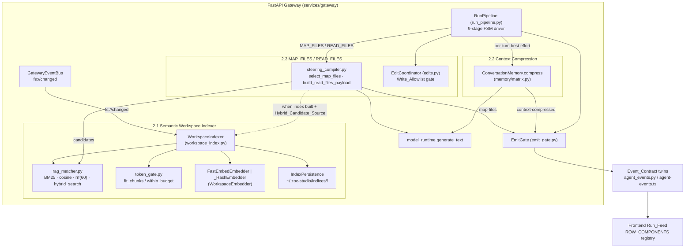
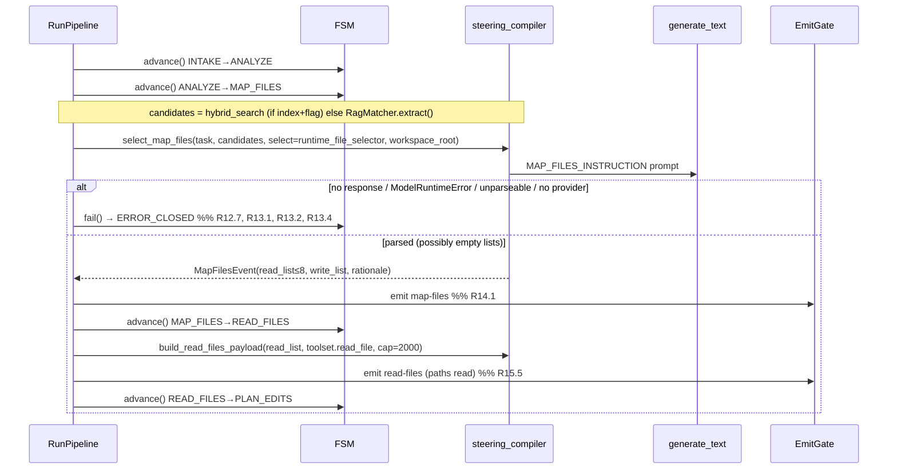
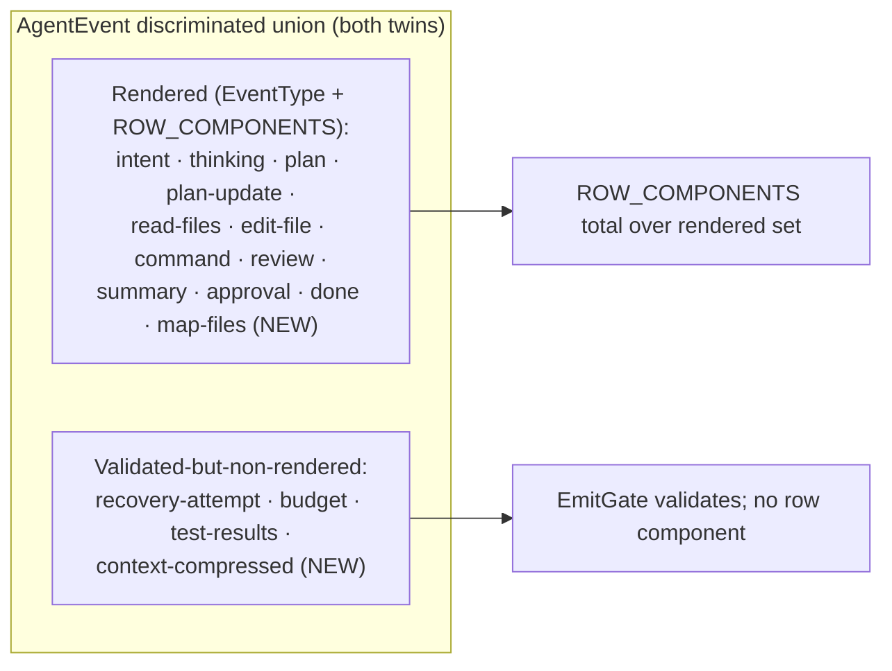

# Design Document — Advanced Context Engine (Part 2)

## Overview

This design turns the three Part-2 context capabilities from requirements into a concrete build plan over the existing FastAPI gateway (`services/gateway/src/zocai_gateway/`). It is deliberately **refactor-first**: most of the machinery already exists and is unit-tested, so the design is explicit about what is *already present and only refined* versus what is *net-new*.

The three capabilities share the retrieval stack, the Event_Contract, and the Agent-Mode FSM, but each ships independently:

- **2.1 Semantic Workspace Indexer** (`workspace_index.py`, `context/rag_matcher.py`, `context/token_gate.py`) — the dominant net-new work is a real local embedding model (`fastembed` `BAAI/bge-small-en-v1.5`) and on-disk persistence/versioning under `~/.zoc-studio/indices/<workspace_hash>/`, layered onto the already-working in-memory hybrid indexer without breaking its API.
- **2.2 Intelligent Context Compression** (`memory/matrix.py`) — the compression algorithm already exists; the net-new work is wiring `ConversationMemory.compress` into the live Run as a best-effort step and adding the `context-compressed` Event_Contract kind.
- **2.3 File-Level Context Steering / MAP_FILES** (`context/steering_compiler.py`) — the selection/injection logic already exists but is unwired; the net-new work is wiring MAP_FILES / READ_FILES into the FSM, the fail-closed model path, the READ_FILES token cap, the APPLY_EDITS write-allowlist gate, and the `map-files` Event_Contract kind.

### What already exists vs. what is net-new

| Area | Already exists (refine) | Net-new (this spec) |
|------|-------------------------|---------------------|
| 2.1 ranking | `BM25Index`, `cosine_sim`, `rrf` (k=60), `hybrid_rank`, `hybrid_search` in `rag_matcher.py` | RRF tie-break/determinism assertions surfaced as properties (no code change expected) |
| 2.1 index | `WorkspaceIndexer`, chunking (`IndexChunk`), `WorkspaceEmbedder` protocol, `_HashEmbedder`, 2s-debounced incremental updates on `fs://changed`, `query()` | `FastEmbedEmbedder`, `EmbedderInfo` population for the real model, off-loop embedding (already `asyncio.to_thread`), disk persistence + `IndexManifest` + `Workspace_Hash`, load-vs-rebuild gating, cold-start/lazy-index |
| 2.1 budget | `fit_chunks`, `hybrid_search_within_budget` in `token_gate.py` | none (properties only) |
| 2.2 | `ConversationMemory.compress`, `ContextCompressedEvent`, tiktoken + 4-char counting, preserve/summarize/idempotence | runtime summarizer over `model_runtime.generate_text`, best-effort wiring in `RunPipeline`, `context-compressed` contract kind |
| 2.3 | `MAP_FILES_INSTRUCTION`, `MapFilesEvent`, `select_map_files`, `build_read_files_payload`, `preapproved_writes`, `is_write_preapproved` | FSM wiring (replace bare `fsm.advance()`), runtime File_Selector (fail-closed), candidate-source selection, READ_FILES injection, APPLY_EDITS write-allowlist gate, `map-files` contract kind |
| Cross-cutting | `emit_gate.py`, `agent_events.py` + `agent-events.ts`, `ROW_COMPONENTS` | add `map-files` + `context-compressed` to both twins; add `map-files` MapFiles row; keep totality + discriminated union intact |

### Resolved decisions honored by this design

- **Independently-shippable seams.** 2.1 is usable without 2.3; 2.3 works without 2.1 by sourcing candidates from `RagMatcher.extract()`. These are called out as explicit boundaries in Architecture.
- **Model call path.** MAP_FILES selection and §2.2 summarization go through `model_runtime.generate_text` (the same path `think`/`structured_plan`/`edit_plan` use), **not** the `ModelInterface` tier stubs.
- **Fail-closed MAP_FILES / best-effort compression.** MAP_FILES failures move the Run to `ERROR_CLOSED`; compression failures continue the Run uncompressed.
- **Persistence location.** Semantic index artifacts live under `~/.zoc-studio/indices/`, distinct from the workspace-relative `.zocai/` memory matrix (unchanged here).
- **`context-compressed` rendering.** This design renders `map-files` as a dedicated row and treats `context-compressed` as a validated-but-non-rendered informational kind (mirroring the existing `budget`, `recovery-attempt`, and `test-results` precedent), while still adding it to both language twins. Rationale in Data Models.

## Architecture

### System context



### Independently-shippable seams (explicit boundaries)

1. **2.1 without 2.3.** The `WorkspaceIndexer` (real embedder + persistence) is consumed by `query()` for any caller. It does not depend on MAP_FILES.
2. **2.3 without 2.1.** MAP_FILES sources `Candidate_Fragments` from `RagMatcher.extract()` by default. Only *when* a built index exists for the Run's workspace *and* the `Hybrid_Candidate_Source` flag is enabled does it switch to `Hybrid_Search`. With 2.1 absent, MAP_FILES still functions.
3. **2.2 is orthogonal.** Compression touches only the conversation history the pipeline feeds the model; it neither reads the index nor participates in MAP_FILES.

The one shared coupling is the Event_Contract: both new kinds land in the same PR-safe additive change (R17). No existing kind is modified.

### Key design decisions and rationale

- **Persistence keyed by `Workspace_Hash`, retrieval keyed by session.** The in-memory `_indexes` dict stays session-keyed (no API break). A new `IndexPersistence` component owns disk I/O keyed by `Workspace_Hash` derived from the absolute `Workspace_Root`. `rebuild()` derives the hash, tries a gated load, and only builds+persists on miss/mismatch/corruption. This keeps 2.1 additive.
- **`embeddings.npy` stored at native dtype (float64 where the embedder emits it).** R2.8 requires *identical* ranking after a persist→load round-trip. Storing the exact vectors (no lossy dtype narrowing) guarantees `cosine_sim` reproduces bit-identical scores, so `hybrid_search` reproduces the exact order. `fastembed` emits float32; the hash fallback emits float64; `.npy` preserves both losslessly.
- **`fastembed` and `numpy` are optional/soft dependencies.** `numpy` is required for `.npy` persistence; `fastembed` is best-effort. If `fastembed` cannot be imported or the model cannot be loaded, the indexer falls back to `_HashEmbedder` and sets `EmbedderInfo.is_fallback = True` (R1.3) — never a hard failure (mirrors the deliberate tiktoken 4-char fallback in §2.2).
- **Runtime adapters, not `ModelInterface`.** Both the §2.2 Summarizer and the §2.3 File_Selector are thin adapters over `generate_text` (the resolved model-call decision). The existing `model_summarizer`/`model_file_selector` (over `ModelInterface`) remain for tests but are not the live path.
- **Fail-closed vs. best-effort split.** MAP_FILES is load-bearing for correctness (wrong files → wrong edits), so it fails the Run closed. Compression is an optimization, so it degrades to the uncompressed history.

## Components and Interfaces

### 2.1 Semantic Workspace Indexer

#### `WorkspaceEmbedder` implementations (`workspace_index.py`)

**Already exists (refine):** the `WorkspaceEmbedder` Protocol (`info`, `embed_documents`, `embed_query`), `_HashEmbedder` (dim 256, `is_fallback=True`), and `_validate_embeddings` (count + dimension + finiteness guard, already raises on mismatch → R1.6).

**Net-new:** `FastEmbedEmbedder` implementing `WorkspaceEmbedder`:

```python
class FastEmbedEmbedder:
    """Local, no-API-key embedder over fastembed BAAI/bge-small-en-v1.5 (R1.1)."""
    MODEL_ID = "BAAI/bge-small-en-v1.5"
    DIMENSION = 384

    @property
    def info(self) -> EmbedderInfo:
        return EmbedderInfo(kind="fastembed", model=self.MODEL_ID, dim=self.DIMENSION, is_fallback=False)

    def embed_documents(self, documents: Sequence[str]) -> Sequence[Sequence[float]]: ...
    def embed_query(self, query: str) -> Sequence[float]: ...
```

- Loaded lazily via a `load_embedder()` factory: try `FastEmbedEmbedder`; on any import/load error, return `_HashEmbedder()` (R1.3). The factory records which one was chosen so `EmbedderInfo` reflects reality (R1.4).
- Embedding runs off the event loop: `WorkspaceIndexer._rebuild_locked` and `_replace_changed_file_chunks` already call `await asyncio.to_thread(self._embedder.embed_documents, ...)` (R1.5) — no change needed.
- Dimension mismatch: `_validate_embeddings` already raises `ValueError` when a returned vector's dimension ≠ `embedder.info.dim`; the existing `except` publishes `index.error` and re-raises, so no `IndexedWorkspace` is stored (R1.6). This behavior is preserved and asserted by a property.

#### `IndexPersistence` (net-new, `workspace_index.py` or `context/index_store.py`)

Owns the on-disk layout and the load-vs-rebuild gate.

```python
INDICES_ROOT = Path.home() / ".zoc-studio" / "indices"
INDEX_SCHEMA_VERSION = 1

def workspace_hash(workspace_root: Path | str) -> str:
    """Deterministic id from the absolute Workspace_Root (R2.1)."""
    absolute = str(Path(workspace_root).expanduser().resolve())
    return hashlib.sha256(absolute.encode("utf-8")).hexdigest()[:32]

@dataclass(frozen=True, slots=True)
class IndexManifest:
    schema_version: int
    embedder: EmbedderInfo          # kind, model, dim, is_fallback
    chunk_count: int
    created_at: str

class IndexPersistence:
    def dir_for(self, workspace_root) -> Path: ...          # INDICES_ROOT / workspace_hash(...)
    def save(self, workspace_root, chunks, embeddings, bm25_index, manifest) -> None: ...
    def load(self, workspace_root, *, current_embedder: EmbedderInfo) -> LoadedIndex | None: ...
```

- **`save`** writes `embeddings.npy` (numpy, native dtype), `bm25.pkl` (pickled `BM25Index`), `chunks.json` (the ordered `IndexChunk` list — needed to reconstruct positional alignment and to serve results), and `manifest.json` (`IndexManifest`). Writes go through a temp file + atomic `os.replace` so a crash mid-write cannot leave a torn artifact. All paths are confined under `INDICES_ROOT` (R2.4); the directory name is the `Workspace_Hash` only.
- **`load`** returns `None` (→ caller rebuilds) when: the manifest is absent/unparseable; `manifest.schema_version != INDEX_SCHEMA_VERSION` or `manifest.embedder != current_embedder` (R2.6); or any artifact fails to read/parse (`FileNotFoundError`, `OSError`, `pickle.UnpicklingError`, malformed `.npy`, chunk/embedding count disagreement) (R2.7). On a clean match it returns the reconstructed `chunks`, `embeddings` (as tuples), and `BM25Index` (R2.5).
- **Security note.** `bm25.pkl` uses `pickle`. The store is confined to the user-owned `~/.zoc-studio/indices/` and is only ever loaded after the manifest gate matches the current configuration; any unpickling error is caught and downgraded to a rebuild (R2.7). We treat these artifacts as local, user-owned cache, not as data crossing a trust boundary.

#### `WorkspaceIndexer` integration (refine `workspace_index.py`)

- `__init__` gains an injectable `persistence: IndexPersistence | None` and `lazy: bool = False` (the `Lazy_Index_Option`, R6.2). `embedder` defaults to `load_embedder()` instead of `_HashEmbedder()`.
- `rebuild(session_id, workspace_root)` becomes load-then-build:
  1. If `persistence` is set, try `persistence.load(workspace_root, current_embedder=self._embedder.info)`.
  2. On a hit, populate `_indexes[session_id]` from the loaded artifacts and publish `index.completed` (no scan). (R2.5)
  3. On a miss, run the existing build path, then `persistence.save(...)` (R2.2, R2.3).
- Incremental updates (`_replace_changed_file_chunks`) already keep chunks and embeddings positionally aligned and rebuild the BM25 index over the combined set (R4.5). Net-new: after recomputing, call `persistence.save(...)` for the workspace so the persisted `embeddings.npy`/`bm25.pkl` track the update (R4.7). Path confinement for changed paths is already enforced by `_resolve_changed_files` (R4.6). Incremental failure already leaves the prior in-memory index untouched and publishes `index.error` (R4.8) — preserved.
- **Cold start / lazy / in-progress (R6).** A small per-workspace build-state map (`idle | building | ready`) guards retrieval:
  - `query()` returns `[]` when there is no in-memory index and (lazy) no build has completed — no raise, no block (R6.1, R6.4).
  - When `lazy` is enabled, startup skips load/build (R6.2); the first `query()` for a workspace with no build yet started triggers exactly one background build (R6.3), guarded by the existing per-session `asyncio.Lock` so concurrent first-queries do not double-build.
  - When `lazy` is disabled, startup loads-or-builds eagerly (R6.5).
  - `index.started` / `index.progress` / `index.completed` frames are already published during a build (R6.6); `index.error` on failure with the prior index left intact (R6.7).

#### Ranking + budget (refine only)

`rag_matcher.py` and `token_gate.py` need **no code changes**. `rrf(k=60)` already excludes non-positive scores and breaks ties by ascending index (R3.2, R3.4, R3.5); `hybrid_rank`/`hybrid_search` already cap at `limit` (default 20) and return `[]` for `limit <= 0` (R3.3, R3.8) and raise on embedding/query dimension mismatch via `cosine_sim` (R3.7). `fit_chunks` already enforces the budget as a ranking-order prefix and returns empty for non-positive budgets (R5). These are captured as properties, not new code.

### 2.2 Intelligent Context Compression

**Already exists (refine):** `ConversationMemory.compress(max_tokens)`, `count_tokens` / `count_history_tokens` (tiktoken `cl100k_base` with 4-char fallback, R7), the preserve/summarize algorithm (R8, R9.2–9.4), idempotence (R10), and `ContextCompressedEvent` with the ratio (R11.1, R11.2). No change to the algorithm.

**Net-new — runtime summarizer adapter (`memory/matrix.py` or `run_pipeline.py`):**

```python
def runtime_summarizer(request: AgentRunRequest) -> Summarizer:
    """A Summarizer backed by model_runtime.generate_text (R9.1), not ModelInterface."""
    def _summarise(prompt: str) -> str:
        text = generate_text(request.model_copy(update={"prompt": prompt}), timeout=60.0)
        if not text:                       # no provider configured / empty
            raise CompressionError("summarizer produced no text")
        return text
    return _summarise
```

**Net-new — best-effort wiring in `RunPipeline`.** The pipeline gains an explicit conversation substrate — a `ConversationMemory` seeded at run start with the system prompt (`Role.SYSTEM`) and the expanded user prompt (`Role.USER`), and appended to as stages produce assistant/tool_result messages (the `think` scratchpad, the structured/edit-plan reasoning, and RUN_CHECKS output, each tagged with its `Stage`). Before each provider-backed brain call the pipeline runs a best-effort compression:

```python
def _maybe_compress(self, memory: ConversationMemory, window: int) -> None:
    if self._provider_configured():
        memory.summarizer = runtime_summarizer(self.request)   # else leave None
    try:
        event = memory.compress(window)          # window = allocation.context_window
    except (CompressionError, ModelRuntimeError):
        return                                    # R9.5 — continue with uncompressed history
    if event is not None:
        self._emit(_context_compressed_event(self.run_id, event))   # R11
```

- No provider configured → `summarizer` left `None` → `compress` raises `CompressionError` → caught → uncompressed history (R9.5). This maps "compression unavailable" cleanly to the best-effort path.
- Summarizer returns a summary → `compress` mutates the history in place and returns the event → the Run continues with the compressed history (R9.6) and the pipeline emits the contract event.
- Trigger threshold, preservation, and idempotence are unchanged (already implemented and unit-tested).

### 2.3 File-Level Context Steering (MAP_FILES)

**Already exists (refine):** `MAP_FILES_INSTRUCTION`, `select_map_files` (parse `read`/`write`/`rationale`, workspace confinement, `MAX_READ_FILES=8` cap, raises `MapFilesError` on unparseable JSON), `build_read_files_payload` (`=== FILE: {path} ===` framing, `PER_FILE_TOKEN_CAP=2000`, `TRUNCATION_MARKER`, skips unreadable files), `preapproved_writes`, `is_write_preapproved`. None are called by `run_pipeline.py` today.

**Net-new — runtime File_Selector (fail-closed):**

```python
def runtime_file_selector(request: AgentRunRequest) -> FileSelector:
    def _select(prompt: str) -> str:
        text = generate_text(request.model_copy(update={"prompt": prompt}), timeout=120.0)
        if not text:
            raise MapFilesError("file-selection produced no response")  # R12.7 / R13.4
        return text
    return _select
```

**Net-new — FSM wiring in `RunPipeline._run_agent`.** The current loop that walks INTAKE→ANALYZE→MAP_FILES→READ_FILES→PLAN_EDITS as four bare `fsm.advance()` calls is replaced with explicit stage bodies:



- **Candidate source (R12.2, R12.3).** A helper picks the source: if `Hybrid_Candidate_Source` is enabled *and* a built index exists for the Run's workspace, use `WorkspaceIndexer.query(...)` results; otherwise use `self.rag_matcher.extract(prompt)`. Both yield objects with a `path` attribute, which `select_map_files` already accepts.
- **READ_FILES injection (R15).** `build_read_files_payload` reads each `read_list` path through the confined `FullToolset.read_file`, frames it, and caps each file at 2000 tokens with the truncation marker. The payload is threaded into the PLAN_EDITS system prompt via `RunContext` (a new `read_files_payload: str` field consumed by `_agent_system_prompt`/`_structured_plan_system_prompt`) (R15.6). Unreadable paths are skipped (R15.4). A failure to emit `read-files` does not stop the Run advancing to PLAN_EDITS (R15.7).
- **Write-allowlist gate (R16), `edits.py`.** `EditCoordinator` gains an injectable `write_allowlist: frozenset[str]` (from `preapproved_writes(map_files_event)`) and a `wait_for_approval` waiter mirroring the existing `_wait_for_review_decision` pattern. `apply_edits` is extended:
  - change path ∈ allowlist → write (R16.2);
  - change path ∉ allowlist → halt before writing, retain already-applied changes, emit an `ApprovalEvent` naming the exact path, and wait (R16.3, R16.4);
  - approve → write the named change and resume the remaining plan (R16.5);
  - reject → the pipeline transitions the Run to `PAUSED` (R16.6).

  This reuses the existing halt-and-retain shape of `ApplyOutcome` (already used for R3.9), extended with a "needs approval / rejected" outcome the pipeline maps onto the wait/resume/PAUSED transitions.

### Cross-cutting: Event_Contract + Row_Registry (R11, R14, R17)

- **Python (`agent_events.py`):** add `"map-files"` to the `EventType` literal; add two `BaseEvent` subclasses `MapFilesEvent` and `ContextCompressedEvent`; add both to the `AgentEvent` discriminated union and `__all__`. (Naming note: the internal dataclasses `steering_compiler.MapFilesEvent` and `matrix.ContextCompressedEvent` keep their names; where the pipeline needs both, the contract classes are imported under aliases, e.g. `MapFilesEvent as MapFilesRow`. The pipeline converts the domain object → the contract model before emitting, exactly as it already does for other events.)
- **TypeScript (`agent-events.ts`):** add the twin `MapFilesEvent` and `ContextCompressedEvent` interfaces with identical field names (camelCase) and discriminators, add both to the `AgentEvent` union, and add `"map-files"` to the `EventType` union (R17.1). No existing kind is touched (R17.2).
- **Frontend (`rows.tsx` + `AgentRunFeed`):** add a dedicated `MapFilesRow` (renders `read_list`, `write_list`, `rationale`) tagged `data-event-type="map-files"`, and register it in `ROW_COMPONENTS` under `"map-files"` (R14.3, R14.4). `context-compressed` is **not** added to `ROW_COMPONENTS` (validated-but-non-rendered, like `budget`/`recovery-attempt`/`test-results`), so the registry stays total over the rendered `EventType` set (R11.6 is conditional — "WHERE rendered"). The dispatch property test's `EVENT_TYPES` pin gains `"map-files"` to keep totality exact.
- **Emit gate (`emit_gate.py`):** no change — `AgentEventModel.model_validate` admits the two new conforming kinds and rejects malformed ones, recording a violation naming the `type` and keeping the stream open (R11.4, R11.5, R17.3).

## Data Models

### 2.1 index artifacts

**Already exists:** `EmbedderInfo(kind, model, dim, is_fallback)`, `IndexChunk(id, file, start_line, end_line, symbol?, text)`, `IndexStatus`, `WorkspaceIndexProgress`, `IndexQueryResult` (all in `shared_schema/models.py`), and the in-memory `IndexedWorkspace` (in `workspace_index.py`).

**Net-new — on-disk layout** under `~/.zoc-studio/indices/<workspace_hash>/`:

| File | Content | Notes |
|------|---------|-------|
| `embeddings.npy` | `Embedding_Matrix`, one row per chunk, native dtype | numpy `.npy`; positionally aligned with `chunks.json` / BM25 docs (R1.2, R2.2) |
| `bm25.pkl` | pickled `BM25Index` | user-owned cache, gated load (R2.2, R2.7) |
| `chunks.json` | ordered `list[IndexChunk]` | reconstructs alignment + serves results |
| `manifest.json` | `IndexManifest` | `schema_version`, `EmbedderInfo`, `chunk_count`, `created_at` (R2.3) |

**Net-new — `IndexManifest`** (Pydantic model, mirrored into the TS `models` twin per repo convention): `schema_version: int`, `embedder: EmbedderInfo`, `chunk_count: int`, `created_at: str`. The load gate compares `(schema_version, embedder)` for equality against the current configuration (R2.5, R2.6).

- **`Workspace_Hash`** = first 32 hex chars of `sha256(abs_workspace_root)` — a pure function of the absolute path (R2.1).
- **Alignment invariant.** `len(embeddings) == len(chunks) == bm25_index.document_count`, and `embeddings[N]` is the embedding of `chunks[N]`, which is BM25 document `N` (R1.2, R4.5).

### 2.2 event

**`context-compressed` (both twins).** Fields (snake_case Python attr / camelCase wire alias): `original_tokens`/`originalTokens: int` (> 0), `compressed_tokens`/`compressedTokens: int` (0 ≤ x ≤ original), `compression_ratio`/`compressionRatio: float` (0..1). Plus the inherited `seq`, `runId`, `ts`, and `type: "context-compressed"` (R11.1, R11.3).

### 2.3 event

**`map-files` (both twins).** Fields: `read_list`/`readList: list[str]` (≤ 8, workspace-relative), `write_list`/`writeList: list[str]` (workspace-relative), `rationale: str`, plus inherited base fields and `type: "map-files"` (R14.2). This is the wire projection of `steering_compiler.MapFilesEvent`.

### Event union membership (rendered vs. validated-only)



## Correctness Properties

*A property is a characteristic or behavior that should hold true across all valid executions of a system — essentially, a formal statement about what the system should do. Properties serve as the bridge between human-readable specifications and machine-verifiable correctness guarantees.*

Each property below is universally quantified and traces to the acceptance criteria it validates. Properties are the output of the prework analysis after a redundancy-reduction pass (e.g. the two alignment criteria R1.2 and R4.5 are consolidated into Property 4; the RRF determinism, tie-break, and non-positive-exclusion criteria R3.2/R3.4/R3.5 are consolidated into Property 7; the compression idempotence criteria R10.1/R10.3 into Property 14). Properties marked *(already implemented)* assert behavior of existing code that this spec relies on; the rest cover net-new behavior.

**2.1 Semantic Workspace Indexer**

### Property 1: Workspace hash is a deterministic function of the absolute path

*For any* two workspace-root path spellings that resolve to the same absolute path, `workspace_hash` yields the same identifier; *for any* two distinct absolute paths it yields distinct identifiers.

**Validates: Requirements 2.1**

### Property 2: Dimension mismatch aborts the build and rejects the search

*For any* embedder that returns a vector whose dimension differs from its recorded `EmbedderInfo.dim`, building the index raises a dimension error and stores no `IndexedWorkspace`; and *for any* query embedding whose dimension differs from the `Embedding_Matrix` dimension, the search is rejected with a dimension-mismatch error.

**Validates: Requirements 1.6, 3.7**

### Property 3: Every persisted index file is confined to the indices root

*For any* workspace root, every artifact path written by `IndexPersistence.save` resolves within `~/.zoc-studio/indices/`.

**Validates: Requirements 2.4**

### Property 4: Chunks and embeddings stay positionally aligned

*For any* built index, and *for any* sequence of incremental change/delete updates applied to it, `len(embeddings) == len(chunks) == bm25_index.document_count`, the embedding at position N is the embedding of chunk N (BM25 document N), and no chunk of a deleted or emptied file remains.

**Validates: Requirements 1.2, 4.5**

### Property 5: Load-vs-rebuild gate matches on embedder and schema

*For any* persisted manifest state, `IndexPersistence.load` returns a loaded index **iff** the manifest's `EmbedderInfo` and schema version both equal the current configuration **and** every artifact reads and parses; in every other case (mismatch, absent, unreadable, or unparseable artifact) it returns `None`, signalling a rebuild, without raising.

**Validates: Requirements 2.5, 2.6, 2.7**

### Property 6: Persistence round-trip preserves ranking order

*For any* built index and *for any* query, persisting the `Embedding_Matrix` and `BM25_Index` and then loading them reconstructs an index whose `Hybrid_Search` result ordering is identical to the pre-persistence index's ordering over the same chunk set.

**Validates: Requirements 2.8**

### Property 7: Reciprocal rank fusion is deterministic and excludes non-positive scores *(already implemented)*

*For any* pair of score lists of equal length, `rrf` with fusion constant 60 produces the same fused ordering on repeated calls, ranks only positions with a positive, finite score in at least one list, and breaks equal fused scores by ascending index.

**Validates: Requirements 3.2, 3.4, 3.5**

### Property 8: Hybrid search returns a bounded, descending, deterministic prefix *(already implemented)*

*For any* index and *for any* requested count `k`, `hybrid_search` returns at most `k` chunks (defaulting to 20 when unspecified) ordered by non-increasing fused score with an ascending-index tie-break, and returns an empty result when `k <= 0`.

**Validates: Requirements 3.3, 3.8**

### Property 9: Incremental updates exclude paths outside the workspace

*For any* set of changed paths, every path that resolves outside the `Workspace_Root` (via `..` traversal or an absolute path elsewhere) is excluded from the resolved incremental change set.

**Validates: Requirements 4.6**

### Property 10: The token gate keeps a ranking-order prefix within budget *(already implemented)*

*For any* ranked chunk list and *for any* `Context_Budget`, the retained chunks are a prefix of the ranking order, their total token count equals the sum of their per-chunk estimates and never exceeds the budget, admission stops at the first chunk that would overflow (so no lower-ranked chunk is admitted after it), and a non-positive budget or empty input yields an empty list with total 0.

**Validates: Requirements 5.2, 5.3, 5.4, 5.5, 5.6, 5.7**

**2.2 Intelligent Context Compression**

### Property 11: Local token counting is char/4 rounded up and additive over the history *(already implemented)*

*For any* string, the LOCAL token count equals `ceil(len / 4)` and is 0 for empty content; and *for any* message history, the `History_Token_Count` equals the sum of the per-message counts and is 0 for an empty history.

**Validates: Requirements 7.2, 7.4**

### Property 12: Compression triggers exactly at the 0.7 threshold *(already implemented)*

*For any* history and limit, when the `History_Token_Count` is below `0.7 × limit` the history is returned unchanged, and when it is at or above `0.7 × limit` with a non-empty summarizable middle the history is compressed.

**Validates: Requirements 8.1, 8.2**

### Property 13: Compression preserves the prompt, recent turns, and current-stage tool results *(already implemented)*

*For any* history that is compressed, the result is exactly: the leading `System_Prompt` messages, then a single system message beginning with the `Compressed_History_Marker`, then the preserved messages — every current-`Stage` `tool_result` message and the most recent 4 user/assistant turns (or all of them if fewer than 4) — in their original relative order, with all other non-system messages removed.

**Validates: Requirements 8.3, 8.4, 8.5, 8.6**

### Property 14: Compression is idempotent *(already implemented)*

*For any* history that already contains a `Compressed_History_Marker` system message, compression returns an identical history (same messages, same order, same content) and emits no `Context_Compressed_Event`; and *for any* history, compressing the output of a previous compression performed with the same limit returns a history identical to that previous output.

**Validates: Requirements 10.1, 10.2, 10.3**

### Property 15: The compression event reports consistent, bounded counts *(already implemented)*

*For any* compression, the emitted `Context_Compressed_Event` carries `original_tokens > 0`, `0 <= compressed_tokens <= original_tokens`, and `compression_ratio == compressed_tokens / original_tokens` within `[0, 1]`.

**Validates: Requirements 11.1, 11.2**

**2.3 File-Level Context Steering (MAP_FILES)**

### Property 16: File selection confines paths to the workspace and caps the read list

*For any* File_Selector response, every path retained in the `Read_List` and `Write_List` resolves within the `Workspace_Root` (paths escaping via `..` or absolute-elsewhere are dropped), and the validated `Read_List` contains at most 8 paths.

**Validates: Requirements 12.5, 12.6**

### Property 17: READ_FILES injection is framed, per-file capped, and skips unreadable files

*For any* `Read_List` and file contents, each successfully read file is injected as a block beginning `=== FILE: {path} ===` whose content is at most the 2000-token `Per_File_Token_Cap` (with the `Truncation_Marker` appended whenever the original exceeded the cap), and any path that cannot be read contributes no block while the remaining paths are still injected.

**Validates: Requirements 15.2, 15.3, 15.4**

### Property 18: The write allowlist admits declared paths and halts on undeclared ones

*For any* edit plan and `Write_Allowlist` derived from a `Map_Files_Event`, a planned change whose path is a member of the allowlist is written, and the first planned change whose path is not a member halts application before writing it — retaining every change already applied and emitting an `Approval_Event` that names the exact halting path — so no undeclared path is written without a developer decision.

**Validates: Requirements 16.2, 16.3**

**Cross-Cutting**

### Property 19: The emit gate forwards a payload iff it conforms to the Event_Contract

*For any* payload (including the new `map-files` and `context-compressed` kinds), the `Emit_Gate` forwards it to the SSE sink iff it validates against the Event_Contract; a non-conforming payload is discarded, a contract-violation entry naming its `type` is recorded, and the stream stays open.

**Validates: Requirements 11.4, 11.5, 17.3**

### Property 20: The row registry is total and injective over rendered kinds, and discards unknown types

*For any* rendered Event_Row kind (the `EventType` set, now including `map-files`), `ROW_COMPONENTS` maps it to exactly one component and no two kinds share a component; and *for any* payload whose `type` is not a registry key, the Run_Feed discards it without altering previously rendered rows.

**Validates: Requirements 14.3, 14.4, 17.4, 17.5**

## Error Handling

### 2.1 Semantic Workspace Indexer

- **Embedding model unavailable (R1.3).** `load_embedder()` catches any `fastembed` import/load error and returns `_HashEmbedder`, setting `EmbedderInfo.is_fallback = True`. Never a hard failure — mirrors the deliberate tiktoken 4-char fallback.
- **Dimension mismatch (R1.6).** `_validate_embeddings` raises `ValueError`; `_rebuild_locked`/`_replace_changed_file_chunks` publish an `index.error` `WorkspaceIndexProgress` frame and re-raise, so no partial `IndexedWorkspace` is stored.
- **Corrupt/missing/mismatched persisted index (R2.6, R2.7).** `IndexPersistence.load` returns `None` for a missing/unparseable manifest, a schema/embedder mismatch, or any artifact that fails to read/parse (including `pickle.UnpicklingError` and malformed `.npy`), so the indexer transparently rebuilds. Writes are atomic (temp + `os.replace`) so a crash cannot leave a torn artifact.
- **Incremental update failure (R4.8).** The existing `except` around `_replace_changed_file_chunks` publishes `index.error` and leaves the previously loaded chunks, `Embedding_Matrix`, and `BM25_Index` unchanged; the persisted artifacts are only overwritten after a successful recompute (R4.7).
- **Cold start / build in progress (R6.1, R6.4).** `query()` returns `[]` (never raises, never blocks) when no index is ready, so a Run is never blocked or crashed by a missing or building index.
- **Build failure (R6.7).** Progress frames continue until the failing build stops, then an `index.error` frame is published and any previously loaded index is retained.

### 2.2 Intelligent Context Compression (best-effort)

- **No summarizer / no provider (R9.4, R9.5).** With no provider configured the pipeline leaves `summarizer = None`, so `compress` raises `CompressionError`; the best-effort wrapper catches it and the Run continues with the uncompressed history.
- **Summarizer call fails (R9.5).** A `ModelRuntimeError` (or any exception) from `generate_text` inside `runtime_summarizer` propagates out of `compress` and is caught by the wrapper; the Run continues uncompressed.
- **Empty middle (R8.7).** `compress` returns `None` and leaves the history unchanged when the preserved prompt/tail/tool-results already cover every message.
- **tiktoken unavailable (R7.3).** GPT-family counting degrades to the 4-char estimate rather than failing.

### 2.3 File-Level Context Steering (fail-closed)

- **No response / model-runtime error / unparseable / no provider (R12.7, R13.1, R13.2, R13.4).** `runtime_file_selector` raises `MapFilesError` on empty/absent output; `generate_text` raises `ModelRuntimeError` on a failed call; `select_map_files` raises `MapFilesError` on non-JSON output. The MAP_FILES stage body catches these and calls `fsm.fail(...)`, transitioning the Run to `ERROR_CLOSED` (no retry) — a deliberate departure from the empty-default fallback used by `think`/`structured_plan`/`edit_plan`.
- **Empty read + write lists (R13.3).** A well-formed response with empty lists is not an error; the Run proceeds with an empty `Read_List`/`Write_List`.
- **Unreadable read path (R15.4).** `build_read_files_payload` skips the path and continues; a failure to emit the `read-files` event does not block the advance to PLAN_EDITS (R15.7).
- **Undeclared write path (R16.3–R16.6).** APPLY_EDITS halts before the first out-of-allowlist write, retains prior applied changes, and emits an `Approval_Event`; approve resumes, reject moves the Run to `PAUSED`.

### Cross-cutting

- **Non-conforming event (R17.3).** The `Emit_Gate` discards it, records a violation naming the `type`, and keeps the SSE stream open — one malformed payload cannot tear down a Run.
- **Unknown row type (R17.5).** `isRecognizedEvent` returns false and the Run_Feed skips the row without altering previously rendered rows.

## Testing Strategy

### Dual approach

- **Property-based tests** verify the universal invariants above across many generated inputs. Python properties use **Hypothesis** (already a dev dependency) with `@settings(max_examples=...)` at **≥ 100 iterations**; frontend properties use **fast-check** (already used by `rows.dispatch.property.test.tsx`) with `{ numRuns: 200 }`. Each property test is tagged with a comment/docstring of the form **`Feature: advanced-context-engine, Property {n}: {property text}`** and references the requirements it validates. Each correctness property is implemented by a single property-based test.
- **Example-based unit tests** cover the specific behaviors, wiring, and edge/error cases classified as EXAMPLE/EDGE_CASE in the prework (embedder-info reporting, fallback on model-load failure, off-loop embedding, debounce coalescing, cold-start/lazy/in-progress emissions, the fail-closed FSM transitions, the approval wait/resume/PAUSED flow, best-effort compression continuation, and the two-twin parity checks).
- **Integration tests** cover the parts that exercise external/environment behavior with 1–3 representative examples: a real `fastembed` load path (skipped when the package is absent), the end-to-end persist→reopen reuse across a fresh `WorkspaceIndexer`, and a full MAP_FILES→READ_FILES→PLAN_EDITS→APPLY_EDITS Run driven through `RunPipeline` with a stubbed provider.

### Property test library and configuration

- Do **not** hand-roll property testing — use Hypothesis (Python) and fast-check (TypeScript).
- Minimum 100 iterations per Python property (200 for the frontend registry property, matching the existing test).
- Deterministic embedders (the `_HashEmbedder` or a small fixed stub) are used in property tests so ranking/round-trip assertions are exact and platform-independent; the real `fastembed` model is exercised only in a skip-if-absent integration test.

### Property-to-test mapping

| Property | Kind | Library | Location (new/extended) |
|----------|------|---------|-------------------------|
| 1 Workspace hash determinism | PBT | Hypothesis | `tests/test_index_persistence_property.py` |
| 2 Dimension mismatch aborts/rejects | PBT | Hypothesis | `tests/test_index_dimension_mismatch_property.py` |
| 3 Persisted files confined | PBT | Hypothesis | `tests/test_index_persistence_property.py` |
| 4 Chunk/embedding alignment | PBT | Hypothesis | `tests/test_index_alignment_property.py` |
| 5 Load-vs-rebuild gate | PBT | Hypothesis | `tests/test_index_persistence_property.py` |
| 6 Persistence round-trip ranking | PBT | Hypothesis | `tests/test_index_roundtrip_property.py` |
| 7 RRF determinism/tie-break | PBT (existing) | Hypothesis | extend `tests/test_rag_matcher*.py` |
| 8 Hybrid result-set contract | PBT (existing) | Hypothesis | extend `tests/test_rag_matcher*.py` |
| 9 Incremental path confinement | PBT | Hypothesis | `tests/test_incremental_confinement_property.py` |
| 10 Token-gate budget prefix | PBT (existing analog) | Hypothesis | extend `tests/test_token_gate_fit_property.py` for `fit_chunks` |
| 11 Local counting/additivity | PBT | Hypothesis | `tests/test_context_compression_property.py` |
| 12 Compression trigger threshold | PBT | Hypothesis | `tests/test_context_compression_property.py` |
| 13 Compression preservation | PBT | Hypothesis | `tests/test_context_compression_property.py` |
| 14 Compression idempotence | PBT | Hypothesis | `tests/test_context_compression_property.py` |
| 15 Compression event bounds | PBT | Hypothesis | `tests/test_context_compression_property.py` |
| 16 MAP_FILES confinement + cap | PBT | Hypothesis | `tests/test_map_files_selection_property.py` |
| 17 READ_FILES cap/framing/skip | PBT | Hypothesis | `tests/test_read_files_injection_property.py` |
| 18 Write-allowlist gate | PBT | Hypothesis | `tests/test_write_allowlist_property.py` |
| 19 Emit-gate conformance | PBT (existing analog) | Hypothesis | extend the emit-gate property test for the two new kinds |
| 20 Row registry totality/discard | PBT (existing) | fast-check | extend `rows.dispatch.property.test.tsx` (add `map-files`) |

### Contract twin parity (R17.1, R17.2)

An example-based test asserts that `map-files` and `context-compressed` appear in both `agent_events.py` and `agent-events.ts` with identical discriminators and field sets, and that every previously existing kind and its fields remain present and unmodified (using the repo's existing schema-generation/parity check).

### Verification

After implementation, run the gateway test suite (`pytest` under `services/gateway`, Hypothesis at ≥100 examples) and the frontend suite (`vitest --run` for the fast-check registry property), plus `ruff`/`mypy` and the TypeScript build, and confirm the two-twin parity check passes. Any new dependency (`numpy` required, `fastembed` optional) is added to `services/gateway/pyproject.toml` with the `fastembed` path guarded so its absence degrades to the hash fallback rather than failing the suite.
