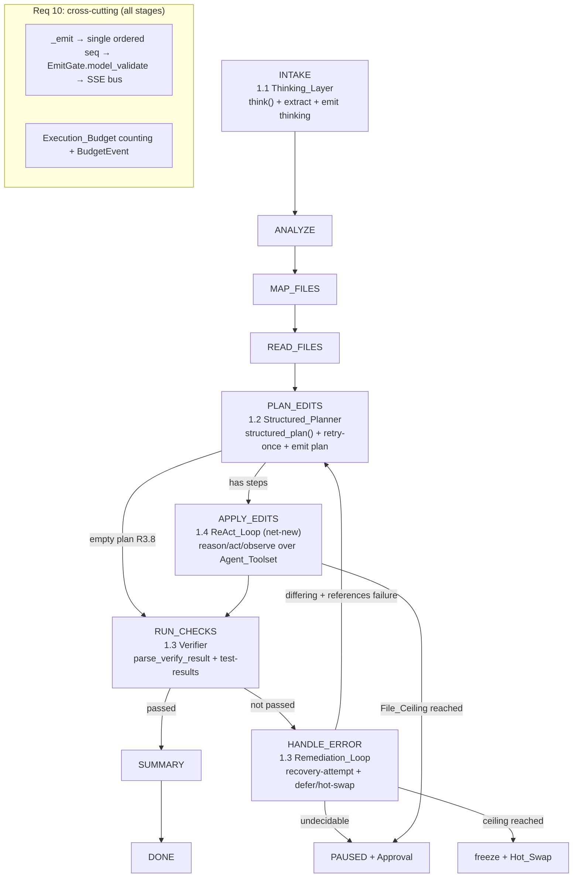
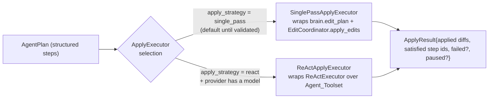
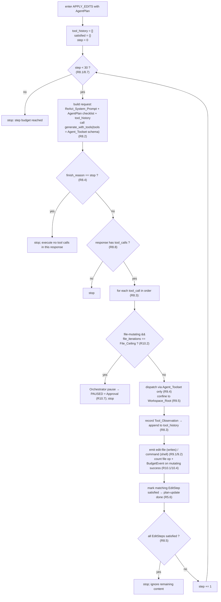
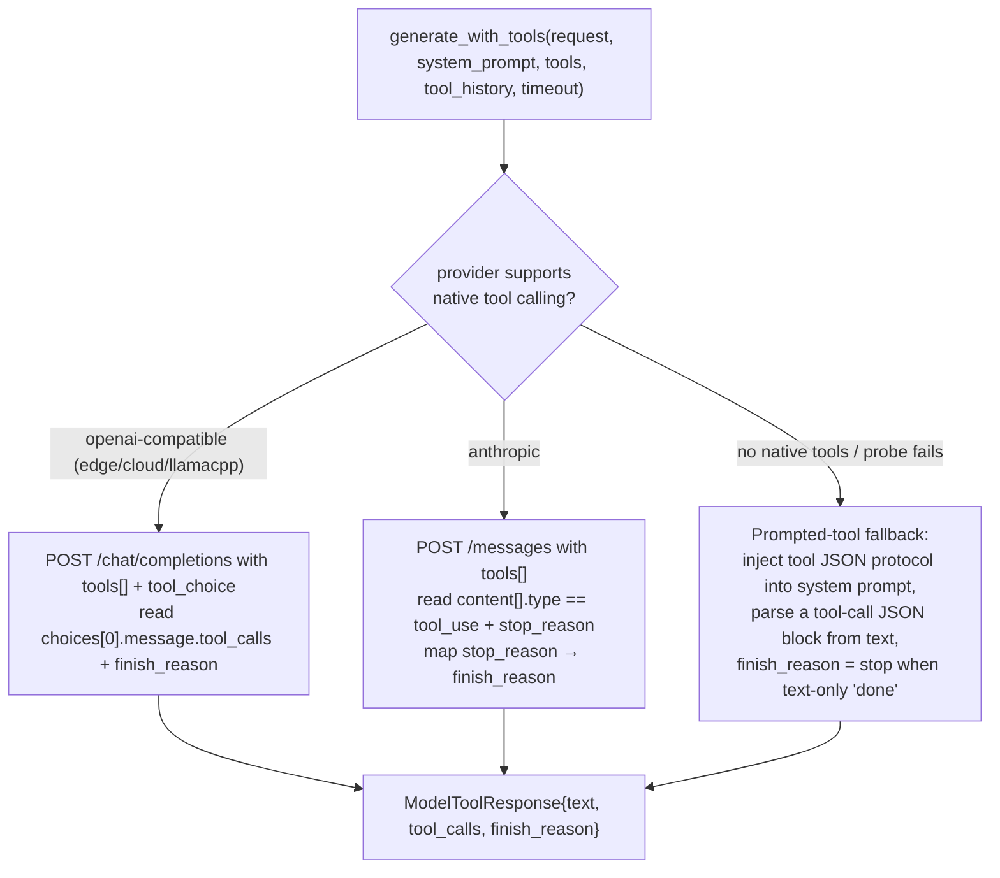

# Design Document

## Overview

This design specifies **Part 1 — Real Reasoning Engine**: four reasoning capabilities layered onto the existing 9-stage Agent-Mode FSM driven by `RunPipeline._run_agent()` in `services/gateway/src/zocai_gateway/run_pipeline.py`. It is a *requirements-first* design that must satisfy all ten requirements in `requirements.md` while honoring the scope boundaries fixed during requirements clarification.

The four capabilities and their current state in the repository:

| # | Capability | Stage | State | Primary modules |
|---|-----------|-------|-------|-----------------|
| 1.1 | Chain-of-Thought Scratchpad | INTAKE | **Built** | `RuntimeAgentBrain.think`, `_extract_thinking`, `_thinking_system_prompt`, `_run_agent` |
| 1.2 | Structured Plan Output | PLAN_EDITS | **Built** | `RuntimeAgentBrain.structured_plan`, `plan.py`, `_emit_plan` |
| 1.3 | Self-Verification Loop | RUN_CHECKS / HANDLE_ERROR | **Built** | `verification.py`, `remediation.py`, `project_tests.py`, `orchestrator.py`, `hot_swap.py` |
| 1.4 | Multi-Step Reasoning (ReAct) | APPLY_EDITS | **Net-new** | `edits.py` (single-pass today), `model_runtime.py` (no tool surface today), `toolsets.py` |

The dominant engineering effort is **capability 1.4**: replacing the single-shot `EditCoordinator.apply_edits` write pass with an iterative reason/act/observe loop that drives the `FullToolset`, and giving `model_runtime.generate_text` a **tool-calling surface** it does not have today. Capabilities 1.1–1.3 already exist; this design captures their intended behavior as verifiable requirements and specifies the small refinements needed to close gaps against the requirements.

### Design principles (from the scope boundaries)

- **Minimal contract change.** No new event kinds, no new fields on existing events. ReAct tool activity reuses `edit-file` and `command`; the structured plan reuses `plan`/`PlanItem`.
- **Reuse existing seams.** The single ordered emit boundary (`RunPipeline._emit`), the FSM transition table (`fsm.py`), the `Budget`/Execution_Budget (`orchestrator.py`), the `RemediationLoop`, and the `EmitGate` are reused as-is. The ReAct loop plugs in at APPLY_EDITS behind a strategy seam.
- **Budget owned by the Orchestrator.** File-iteration and recovery ceilings stay on `Budget`; the recovery count is surfaced via the existing `BudgetEvent`. No standalone `budget.py`.
- **Fail closed.** Malformed thinking, an unrecoverable invalid plan, and unrecoverable apply failures terminate at `ERROR_CLOSED`; budget ceilings and undecidable remediation pause at `PAUSED` with an `Approval_Event`.
- **Privacy.** Raw model reasoning is exposed only as the collapsible `thinking` row and the internal planning scratchpad; it never reaches the summary.

## Architecture

### Where each capability sits in the run



Every event, from every producer (FSM, ReAct loop, remediation, orchestrator, hot-swap), travels through the one `RunPipeline._emit` boundary, which re-stamps a single monotonic `seq` and pushes the payload through the run's `EmitGate` before it can reach the SSE bus. This is the invariant surface for Requirement 10 (seq monotonicity, contract validation, budget emission).

### The APPLY_EDITS strategy seam (coexistence of single-pass and ReAct)

Today `_plan_check_loop` calls `self.brain.edit_plan(...)` to get an `EditPlan` of full-file `PlannedChange`s and applies it in one deterministic pass via `EditCoordinator.apply_edits`. The ReAct loop replaces that pass. To let the two coexist and to make the change safely reversible, APPLY_EDITS is factored behind an `ApplyExecutor` protocol:



Selection rules:
- An **empty** `AgentPlan` (no steps — the DefaultAgentBrain / no-provider path) always skips APPLY_EDITS via `FSM.plan_complete(has_changes=False)` (R3.8). Neither executor runs, preserving existing behavior.
- The `react` strategy runs only when a provider/model is configured (a real `RuntimeAgentBrain`). With no provider, ReAct has no tool-calling model to drive, so the single-pass path (or the empty-plan skip) is used.
- The selection is a constructor-level flag (`RunPipeline(..., apply_strategy=ApplyStrategy.SINGLE_PASS | ApplyStrategy.REACT)`) defaulting to `SINGLE_PASS` so the net-new loop can be enabled per-run/per-environment and rolled back instantly, then promoted to default once validated.

Both executors return a uniform `ApplyResult` so `_plan_check_loop` is unchanged below the seam: it still records applied diffs, emits `plan-update` for satisfied steps, advances APPLY_EDITS→RUN_CHECKS, and runs verification exactly as today.

### The ReAct loop (net-new, Req 8/9)



The loop drives the model with the **structured `AgentPlan` as a checklist** (not the `EditPlan`); in ReAct mode `brain.edit_plan` is bypassed and file content is produced by `write_file` tool calls. Every effect goes through the `FullToolset`, and every observable effect is surfaced only as `edit-file` or `command`.

### Model runtime tool-calling surface (net-new, Req 8)

`model_runtime.generate_text` has no `tools`/`tool_calls`/`finish_reason` today. A sibling function `generate_with_tools` adds that surface without disturbing the existing text/stream paths (which structured planning and Ask still use).



Tier/provider capability matrix:

| Model_Tier | Provider examples | Native tool calling | Path |
|-----------|-------------------|---------------------|------|
| cloud | openai-compatible cloud, `anthropic` | Yes | OpenAI `tools` / Anthropic `tools` |
| edge | openai-compatible edge server | Yes (assumed) | OpenAI `tools` |
| local-slm | `llamacpp` | Model-dependent | Attempt OpenAI `tools`; on `ModelRuntimeError` fall back to prompted protocol |

The fallback mirrors the existing `structured_plan` pattern (try native `response_format`, catch `ModelRuntimeError`, retry with the schema embedded in the prompt): `generate_with_tools` attempts native tool calling, and on a capability error (or a configured `provider` known to lack tool support) it uses the **prompted-tool protocol**, where the model is instructed to emit a single JSON object describing a tool call, which is parsed back into a `ToolCall`. In the fallback, `finish_reason` is `stop` when the model returns a text-only "done" message with no tool block, and `tool_calls` otherwise. This keeps the ReAct loop provider-agnostic: it always receives a normalized `ModelToolResponse`.

## Components and Interfaces

### 1.1 Thinking_Layer (built; small refinement)

- **`RuntimeAgentBrain.think(request, context) -> str`** issues one `generate_text` call with `request.model_copy(update={"max_tokens": 1024})` (R1.1), the `THINKING_SYSTEM_PROMPT` (R1.1), and `timeout=60.0` (R2.5), separate from planning/execution requests (R1.2). It returns `""` when the provider is unset (empty response, R1.7) and raises when a non-empty response contains no scratchpad (R2.4).
- **`_extract_thinking(text) -> str`** applies `<think>(.*?)</think>` (first match, IGNORECASE|DOTALL) and returns the block content, discarding everything else (R1.3, R2.3).
- **`_run_agent` wiring**: `think()` runs inside a `try/except` that routes any exception to `FSM.fail(...)` → `ERROR_CLOSED` (R2.4, R2.5). On a non-empty scratchpad it sets `context.scratchpad` (injected into the planning prompt, R1.4) and calls `_emit_scratchpad(scratchpad, elapsed_ms)` which emits a `ThinkingEvent` with `collapsible=True`, `gist="Private task analysis"`, and `elapsed_ms = max(0, int((monotonic()-start)*1000))` (R1.5) before the four `fsm.advance()` calls carry INTAKE→ANALYZE→…→PLAN_EDITS (R1.6, R1.8).

**Refinement (R1.3/R2.4 boundary):** `think()` must distinguish "no complete `<think>` block" (fail closed, R2.4) from "a complete but empty/whitespace block" (a valid extraction that yields no scratchpad → no `ThinkingEvent`, proceed to ANALYZE). Today it raises whenever the extracted scratchpad is empty, which conflates the two. The fix: fail only when no complete block is present in a non-empty response; an empty block proceeds like the no-scratchpad path.

### 1.2 Structured_Planner (built)

- **`RuntimeAgentBrain.structured_plan(request, context) -> AgentPlan`** requests a plan against `AgentPlan.model_json_schema()` (R3.1). When the provider supports it (`provider != "anthropic"`), the schema is passed as `response_format` (R3.2); otherwise it is embedded in the system prompt and the response validated (R3.3). A `ValidationError` triggers exactly one retry with the error appended to the prompt (R4.1); a second failure or empty retry raises → `ERROR_CLOSED` (R4.2). An empty initial response (no provider) yields `AgentPlan(steps=[], confidence=1.0)` (R4.3). Schema constraints (ordered `EditStep`s, optional `verification_command`, `confidence` in [0,1]; each `EditStep` = workspace-relative `file`, `action` enum, `rationale`, optional `search_replace`; path rejection for empty/absolute/`..`) are enforced by the `plan.py` pydantic models (R3.4, R3.5, R3.6).

### 1.2 Plan → PlanEvent mapping (built; refinement for R5.2)

- **`RunPipeline._emit_plan(plan, structured_plan)`** emits one `PlanEvent` before any change is applied (R5.1). Each `EditStep` maps to exactly one `PlanItem` with `id = f"edit-{index}"` (1-based, unique within the event), listed in `AgentPlan` order, `status="pending"` (R5.2), and `label = f"{Action} {file}: {Rationale}"`, or `f"{Action} {file}"` when the rationale is blank (R5.4, R5.5). It uses the existing `PlanEvent` contract with no added fields (R5.3).
- **`_emit_plan_update(id, "done")`** is emitted for a step's `edit-{index}` id when — and only when — that step is successfully applied (R5.6, R5.7).

**Refinement (R5.2):** the current `_emit_plan` interleaves scaffold items (`analyze`, `plan`, `apply`, `validate`, `review`, `summary`) with the per-step `edit-{index}` items. The per-step mapping already satisfies R5.2/5.4/5.5; the design keeps the scaffold items as UI affordances but treats the `edit-{index}` items as the authoritative per-EditStep representation the requirements constrain, and the ReAct executor drives their `plan-update`s.

### 1.3 Verifier + Remediation (built)

- **`verification.parse_verify_result(command, output, exit_code) -> VerifyResult`** is total (R6.1): `passed = (exit_code == 0)` with empty failures (R6.2); on non-zero it collects up to 50 distinct failure lines from pytest/jest/cargo/go patterns (R6.3), falling back to one generic `"{command} exited with code {exit_code}"` when none match (R6.4).
- **`project_tests.detect_project_test_command` / `run_project_tests`** are invoked only when `wrote_code` is true; when a command is detected, `_emit_test_results` emits a `TestResultsEvent` (`status = pass iff exit_code == 0`, plus command/source/passed/failed/exitCode/outputTail/durationMs/timedOut) (R6.5). No detected command → no event (R6.6).
- **`remediation.RemediationLoop.on_checks_complete(exit_code, command, log, prior_plan)`** transitions RUN_CHECKS→SUMMARY on pass (R7.1); on failure with `recoveries < ERROR_CEILING` it enters HANDLE_ERROR and increments recoveries via `on_recovery` (R7.2), captures a `FailureRecord{command, exit_code, log}` (R7.3), builds the fix context from task + applied steps + output truncated to 2000 chars (R7.4, in `RuntimeAgentBrain.remediation_plan`), and accepts a corrective plan only if `diff_plans(prior, candidate).differs` **and** `plan_references_failure(candidate, failure)` (R7.5), else pauses → `PAUSED` + `ApprovalEvent` (R7.7). `_plan_check_loop` emits a `RecoveryAttemptEvent{attempt = recoveries+1, failures}` on each HANDLE_ERROR entry (R7.6). At the recovery ceiling, `_preserve_and_swap` serializes state and drives `HotSwapCoordinator` to upshift the Model_Tier (R7.8).

### 1.4 Agent_Toolset extension (net-new, Req 8/9/10)

`FullToolset` today exposes `read_file`, `write_file`, `make_dir`, `run_shell`, all confined via `_resolve_within_workspace` which raises `ReadOnlyViolation` on escape. To let the ReAct loop satisfy and count all four `EditStep` actions (`create`, `modify`, `delete`, `rename`; R8.5, R10.1), the toolset gains two confined operations:

```python
class FullToolset(Toolset):
    def delete_file(self, rel_path) -> None: ...        # confined; R8.5/R10.1 delete
    def move_file(self, src_rel, dst_rel) -> None: ...   # confined both ends; R8.5/R10.1 rename
```

Both resolve source and destination through `_resolve_within_workspace` so an out-of-workspace target raises `ReadOnlyViolation` (R9.5) exactly like the existing operations.

### 1.4 Model runtime tool surface (net-new, Req 8)

New in `model_runtime.py`, additive to the existing functions:

```python
@dataclass(frozen=True)
class ToolSpec:
    name: str
    description: str
    parameters: Mapping[str, Any]          # JSON Schema for the tool arguments

@dataclass(frozen=True)
class ToolCall:
    id: str
    name: str
    arguments: Mapping[str, Any]

@dataclass(frozen=True)
class ModelToolResponse:
    text: str
    tool_calls: tuple[ToolCall, ...]
    finish_reason: Literal["stop", "tool_calls", "length", "error"]

def generate_with_tools(
    request: AgentRunRequest,
    *,
    system_prompt: str | None,
    tools: Sequence[ToolSpec],
    tool_history: Sequence[Mapping[str, Any]],   # prior assistant tool_calls + tool results
    timeout: float = 120.0,
) -> ModelToolResponse: ...
```

- **OpenAI-compatible** (`edge`/`cloud`/`llamacpp`): send `tools=[{"type":"function","function":{...}}]` and `tool_choice="auto"`, plus the `tool_history` as prior `assistant`/`tool` messages; read `choices[0].message.tool_calls` and `choices[0].finish_reason` (`"tool_calls"` vs `"stop"`).
- **Anthropic**: send `tools=[{name, description, input_schema}]`; read `content` blocks with `type == "tool_use"` and map `stop_reason` (`"tool_use"` → `tool_calls`, `"end_turn"` → `stop`).
- **No native tools / probe fails**: prompted-tool fallback (single JSON tool-call block parsed from text; `finish_reason = stop` on a text-only "done").

A capability constant `PROVIDER_NATIVE_TOOLS: dict[str, bool]` plus a runtime `ModelRuntimeError` fallback selects the path. `generate_with_tools` never returns raw provider payloads to the loop — only the normalized `ModelToolResponse`.

### 1.4 ReActExecutor (net-new, Req 8/9/10)

A new module `services/gateway/src/zocai_gateway/react.py`:

```python
@dataclass(slots=True)
class ReActExecutor:
    toolset: FullToolset
    orchestrator: Orchestrator          # budget gate (R10.1/10.2/10.7)
    plan: AgentPlan                     # the checklist (R8.2/8.5)
    request: AgentRunRequest
    context: RunContext
    emit: EmitSink                      # single ordered boundary (RunPipeline._emit)
    run_with_tools: ToolModelFn = generate_with_tools   # injectable seam for tests
    MAX_STEPS: ClassVar[int] = 30

    def run(self) -> ReActOutcome: ...
```

Responsibilities:
- Iterate at most `MAX_STEPS = 30` (R8.1); each iteration is one `run_with_tools` call plus execution of the tool calls it returns (R8.7 stops at the 30th without a further request).
- Build every request from the `ReAct_System_Prompt` (reason-before-call, use previous observation, text-only when done, present `AgentPlan` steps as a checklist — R8.6), the `AgentPlan`, and the accumulated `tool_history` (R8.2).
- On `finish_reason == "stop"`, stop and execute no tool calls from that response (R8.4).
- On `finish_reason != "stop"` with tool calls, execute each in order via `_dispatch` and append each observation to `tool_history` (R8.3); with no tool calls, stop (R8.8).
- `_dispatch(tool_call)` routes **only** through the `FullToolset` (R9.4): `write_file`/`make_dir`/`delete_file`/`move_file` for mutations, `run_shell` for commands, `read_file` for reads. A `ReadOnlyViolation` (out-of-workspace, R9.5) or any other operation error (R9.6) is caught and returned as the `Tool_Observation`; the loop continues.
- Emits `edit-file` for file-writing/mutating tool calls (path + computed diff, R9.1) and `command` for shell tool calls (command + pass/fail + output tail, R9.2). Reads produce an observation but no visible row (R9.3 limits surfaced tool activity to `edit-file`/`command`).
- On each **successful file-mutating** tool call: gate on `orchestrator.budget.before_file_op()` **before** executing the next mutation (R10.2) — when the ceiling is reached the orchestrator pauses (FSM→PAUSED) and emits an `ApprovalEvent` (R10.7) and the loop stops; on success `orchestrator.budget.count_file_op()` (R10.1) and a `BudgetEvent` is emitted (R10.4).
- Tracks satisfied `EditStep`s by matching `(action, file)` of successful tool calls; emits `plan-update{edit-{index}, done}` when a step becomes satisfied (R5.6); stops when all steps are satisfied, ignoring remaining response content (R8.5).

`ReActOutcome` carries the applied diffs, the satisfied step ids, and terminal flags (`paused`, `step_budget_exhausted`, `stopped_reason`) so `_plan_check_loop` maps it onto the existing post-apply handling (advance to RUN_CHECKS, or PAUSED).

### Emit boundary, budget, and gate (Req 10, cross-cutting)

- **`RunPipeline._emit`** re-stamps every event with `self._next_seq()` (an `itertools.count`) so the stream carries a single strictly-increasing `seq` (R10.6) across all producers, then routes through the mode channel to `EmitGate.emit`.
- **`EmitGate.emit`** validates each payload with `AgentEventModel.model_validate` (R10.5); a conforming payload is re-serialized to canonical camelCase wire form and forwarded; a non-conforming payload is discarded and recorded as a `ContractViolation`, never reaching the sink (R10.8).
- **Context-budget** accounting (`tokens_used`) is seeded from the prompt + agent system prompt and grows with plan/edit tokens; the Thinking_Request/Response tokens are never added (R10.3). `_emit_budget` emits a `BudgetEvent{tokensUsed, tokenLimit = allocation.context_window, iterations, recoveries}` whenever any counter changes (R10.4).

## Data Models

### Reused (no changes)

- **`plan.AgentPlan`** = `steps: list[EditStep]`, `verification_command: str | None`, `confidence: float ∈ [0,1]`. **`plan.EditStep`** = `file` (workspace-relative validator), `action ∈ {create, modify, delete, rename}`, `rationale`, `search_replace: list[SearchReplace] | None`. (R3.4, R3.5, R3.6)
- **`edits.EditPlan` / `PlannedChange` / `ApplyOutcome`** — used by `SinglePassApplyExecutor` and by `RemediationLoop` plan diffing (R5.5/7.5). Unchanged.
- **`verification.VerifyResult`** = `passed: bool`, `failures: list[str]` (≤50, distinct), `output: str`. (R6)
- **`memory.state_wrapper.FailureRecord`** = `command`, `exit_code`, `log` (truncated to 65,536). (R7.3)
- **`orchestrator.Budget`** = `file_iterations`, `error_recoveries`, `FILE_CEILING=20`, `ERROR_CEILING=3`, effective ceilings + `before_file_op`/`before_recovery`/`count_file_op`/`count_recovery`. (R10.1, R10.2, R7.2)
- **Event_Contract** (`shared_schema.agent_events`) — `ThinkingEvent`, `PlanEvent`/`PlanItem`, `PlanUpdateEvent`, `EditFileEvent`, `CommandEvent`, `RecoveryAttemptEvent`, `BudgetEvent`, `TestResultsEvent`, `ApprovalEvent`, `SummaryEvent`, `DoneEvent`, unified by `AgentEventModel`. No new kinds, no new fields. (R5.3, R9.3, R10.5)

### Net-new (ReAct)

| Type | Module | Purpose | Requirements |
|------|--------|---------|--------------|
| `ToolSpec` | `model_runtime.py` | JSON-schema tool declaration sent to the provider | R8.2 |
| `ToolCall` | `model_runtime.py` | A model-requested tool invocation (`id`, `name`, `arguments`) | R8.3 |
| `ModelToolResponse` | `model_runtime.py` | Normalized `{text, tool_calls, finish_reason}` across providers | R8.1, R8.3, R8.4, R8.8 |
| `ToolObservation` | `react.py` | Recorded result of one tool call (`tool_call_id`, `ok`, `content`) | R8.3, R9.5, R9.6 |
| `ToolHistory` | `react.py` | Ordered accumulation of tool calls + observations for one APPLY_EDITS run | R8.2, R8.3 |
| `ReActOutcome` | `react.py` | Terminal result (`applied_diffs`, `satisfied_step_ids`, `paused`, `step_budget_exhausted`, `stopped_reason`) | R8.5, R8.7, R10.2 |
| `ApplyStrategy` (enum) + `ApplyExecutor` (protocol) + `ApplyResult` | `run_pipeline.py` | Coexistence seam between single-pass and ReAct apply | R8, R3.7–R3.9 |
| `delete_file`, `move_file` | `toolsets.py` | Confined delete/rename to satisfy + count all four EditStep actions | R8.5, R9.5, R10.1 |

### Tool → event → step mapping

| Tool call | Effector (Agent_Toolset) | Emitted event | Counts file op? | Satisfies EditStep action |
|-----------|--------------------------|---------------|-----------------|---------------------------|
| `write_file(path, content)` | `write_file` | `edit-file` (path, diff, adds/dels) | Yes (R10.1) | `create`, `modify` |
| `delete_file(path)` | `delete_file` | `edit-file` (path, deletion diff) | Yes (R10.1) | `delete` |
| `move_file(src, dst)` | `move_file` | `edit-file` (rename diff) | Yes (R10.1) | `rename` |
| `make_dir(path)` | `make_dir` | `edit-file` (dir created) | No (dir, not a file) | — |
| `run_shell(argv)` | `run_shell` | `command` (cmd, pass/fail, output) | No | — |
| `read_file(path)` | `read_file` | none (observation only, R9.3) | No | — |

An out-of-workspace target for any of these raises `ReadOnlyViolation` before any effect, becomes the `Tool_Observation`, and the loop continues (R9.5); an in-workspace operational failure surfaces the underlying error as the observation and continues (R9.6).

## Correctness Properties

*A property is a characteristic or behavior that should hold true across all valid executions of a system — essentially, a formal statement about what the system should do. Properties serve as the bridge between human-readable specifications and machine-verifiable correctness guarantees.*

Each property below is universally quantified and is validated by a single property-based test (minimum 100 iterations). Acceptance criteria that are not universally quantifiable (fixed scenarios, single-shot control flow, infrastructure/hot-swap sequences) are covered by unit and integration tests in the Testing Strategy rather than by properties.

### Property 1: Scratchpad extraction isolates the first think block

*For any* response text, extraction returns exactly the content between the first `<think>` tag and the first `</think>` that follows it, discarding all surrounding text and any later blocks; if no complete block is present, extraction returns empty.

**Validates: Requirements 1.3, 2.3**

### Property 2: Raw thinking never leaks beyond the thinking row

*For any* extracted scratchpad, no emitted event other than the `thinking` row carries the raw scratchpad text, and in particular the `summary` event text never contains the scratchpad or the raw thinking response.

**Validates: Requirements 2.1, 2.2**

### Property 3: Malformed thinking fails closed

*For any* non-empty thinking response that contains no complete `<think>...</think>` block (including an opening `<think>` with no matching closing tag), the run transitions to the `ERROR_CLOSED` stage.

**Validates: Requirements 2.4**

### Property 4: Scratchpad is injected into the planning prompt

*For any* non-empty scratchpad, the PLAN_EDITS planning system prompt built for that run contains the scratchpad text.

**Validates: Requirements 1.4**

### Property 5: Thinking event fidelity

*For any* extracted non-empty scratchpad, the emitted `thinking` event carries that scratchpad text, has `collapsible` true and a non-negative `elapsedMs`, and is emitted before the ANALYZE stage event of the same run.

**Validates: Requirements 1.5, 1.6**

### Property 6: AgentPlan schema and path safety enforcement

*For any* candidate plan, AgentPlan validation accepts it only when its confidence lies in [0,1], its steps are an ordered list of well-formed EditSteps (valid action, present rationale), and every EditStep file path is a non-empty, non-whitespace, relative path with no parent-directory (`..`) segment; a plan violating any of these is rejected.

**Validates: Requirements 3.4, 3.5, 3.6**

### Property 7: Structured plan maps one-to-one onto plan items

*For any* AgentPlan with N steps, the emitted plan row contains exactly one PlanItem per EditStep in the same order, each with an id that uniquely identifies its step within the event and an initial status of `pending`, and each item's label contains the step's action and file — and additionally its rationale when the rationale is not blank.

**Validates: Requirements 5.2, 5.4, 5.5**

### Property 8: The plan row precedes any edit

*For any* AgentPlan, the single `plan` event is emitted before any `edit-file` event of the same run (its sequence number is lower than every edit-file sequence number).

**Validates: Requirements 5.1**

### Property 9: Plan-update done is emitted exactly for applied steps

*For any* AgentPlan whose steps are applied in some subset, a `plan-update` event with status `done` carrying a step's PlanItem id is emitted if and only if that step was successfully applied.

**Validates: Requirements 5.6, 5.7**

### Property 10: Verify result totality and pass semantics

*For any* command, output, and exit code, parsing produces a VerifyResult that preserves the output and whose `passed` flag is true if and only if the exit code is zero; when passed the failures list is empty, and when not passed the failures list is non-empty, holds distinct entries, and contains at most 50 entries.

**Validates: Requirements 6.1, 6.2, 6.3, 6.4**

### Property 11: Test-results event reflects the outcome

*For any* project test result surfaced after edits, the emitted `test-results` event has status `pass` if and only if the result's exit code is zero, and carries the command, source, passed and failed counts, exit code, output tail, duration, and timed-out flag from that result.

**Validates: Requirements 6.5**

### Property 12: Verification outcome routes the run

*For any* verify result, a passing result transitions RUN_CHECKS to SUMMARY, and a non-passing result with the error-recovery count below the ceiling transitions RUN_CHECKS to HANDLE_ERROR and increments the recovery count by exactly one.

**Validates: Requirements 7.1, 7.2**

### Property 13: Failure capture fidelity

*For any* failed verification, the captured failure record preserves the failed command and its exit code and retains the command output (truncated only at the record's fixed maximum length).

**Validates: Requirements 7.3**

### Property 14: Fix context bounds the verification output

*For any* verification output, the remediation fix context includes at most the last 2000 characters of that output.

**Validates: Requirements 7.4**

### Property 15: Remediation is accepted only when it differs and references the failure, else defers

*For any* prior plan, captured failure, and candidate corrective plan, the run transitions HANDLE_ERROR to PLAN_EDITS if and only if the candidate differs from the prior plan by at least one edit operation and references the captured failure; otherwise the run transitions to PAUSED and emits an `approval` event deferring to the developer.

**Validates: Requirements 7.5, 7.7**

### Property 16: Recovery-attempt event reports the attempt

*For any* entry into HANDLE_ERROR, a `recovery-attempt` event is emitted whose attempt number is at least one and equals the current error-recovery count, carrying the verify result's failures list.

**Validates: Requirements 7.6**

### Property 17: ReAct never exceeds thirty steps

*For any* ReAct execution, the number of model requests issued never exceeds 30, and no further model request is issued once the 30th step completes without all steps satisfied and without a stop finish reason.

**Validates: Requirements 8.1, 8.7**

### Property 18: Tool history accumulates in order

*For any* ReAct execution, each executed tool call's observation is appended to the tool history in execution order, and every model request after the first includes the full accumulated tool history built to that point.

**Validates: Requirements 8.2, 8.3**

### Property 19: A stop response executes no tools

*For any* model response whose finish reason is stop, the ReAct loop stops iterating and executes none of the tool calls contained in that response.

**Validates: Requirements 8.4**

### Property 20: The loop terminates on satisfaction or on a non-tool response

*For any* ReAct execution, the loop stops as soon as every EditStep is satisfied (ignoring any remaining content in the current response), and it also stops on any non-stop response that contains no tool call.

**Validates: Requirements 8.5, 8.8**

### Property 21: ReAct tool activity surfaces only as edit-file and command events

*For any* executed tool call, a file-mutating call emits exactly one `edit-file` event carrying the target path and a diff, a shell call emits exactly one `command` event carrying the command and its success/failure with output, and no other event kind is emitted to surface tool activity.

**Validates: Requirements 9.1, 9.2, 9.3, 9.4**

### Property 22: Tool calls are confined to the workspace and never abort the run

*For any* tool call whose target resolves outside the Workspace_Root, the toolset performs no read, write, or command execution on that target; the rejection (and, for an in-workspace operation that fails for any other reason, the underlying error) is surfaced as the tool observation, and the ReAct loop continues without aborting the run.

**Validates: Requirements 9.5, 9.6**

### Property 23: File iterations are counted and bounded by the ceiling

*For any* sequence of successful file-mutating tool calls, the file-iteration count increases by exactly one per call, and the count never reaches the File_Ceiling of 20 and then applies a further mutating call without the run first entering PAUSED and emitting an `approval` event.

**Validates: Requirements 10.1, 10.2, 10.7**

### Property 24: Thinking tokens are excluded from the context budget

*For any* run, the tokens-used value carried by every emitted `budget` event excludes the tokens consumed by the Thinking_Request and Thinking_Response (varying the thinking response size does not change tokens-used).

**Validates: Requirements 10.3**

### Property 25: Budget events mirror the live counters and window

*For any* change to the run's token usage, file-iteration count, or error-recovery count, a `budget` event is emitted whose token limit equals the allocated context window and whose iterations and recoveries equal the current counters.

**Validates: Requirements 10.4**

### Property 26: The emit gate admits an event if and only if it conforms

*For any* payload passed to the emit gate, it is forwarded to the SSE sink if and only if it validates against the Event_Contract discriminated union; a non-conforming payload is blocked (never reaches the sink) and recorded as a contract violation.

**Validates: Requirements 10.5, 10.8**

### Property 27: Sequence numbers are strictly increasing

*For any* run, every emitted event carries a sequence number strictly greater than the previously emitted event's sequence number on the single ordered stream.

**Validates: Requirements 10.6**

## Error Handling

The reasoning engine has two terminal error modes and two pause modes, all reached through existing FSM seams.

### Fail-closed to ERROR_CLOSED (`FSM.fail`)

| Trigger | Requirement | Handling |
|---------|-------------|----------|
| Non-empty thinking response with no complete `<think>` block | R2.4 | `think()` signals failure; `_run_agent` catches and calls `fsm.fail(...)` → `ERROR_CLOSED`. |
| Thinking model-runtime error or 60s timeout | R2.5 | `generate_text` raises `ModelRuntimeError`; wrapped and routed to `fsm.fail(...)`. |
| Invalid structured plan after the single retry, or empty retry | R4.2 | `structured_plan` raises `RuntimeError`; `_plan_check_loop` catches and calls `fsm.fail(...)`. |
| Single-pass apply failure (SinglePassApplyExecutor) | R3.9 | `ApplyOutcome.failed` set; `fsm.fail(outcome.error)` → `ERROR_CLOSED` (existing behavior, unchanged). |

**Thinking boundary refinement (R1.3 vs R2.4):** a complete-but-empty `<think></think>` block is a valid extraction yielding no scratchpad, so the run proceeds to ANALYZE with no `thinking` event (like the no-provider path); only the *absence* of a complete block in a non-empty response fails closed. `think()` must therefore distinguish "no complete block" (raise) from "empty block" (return empty), rather than treating any empty extraction as a failure.

### Pause to PAUSED with an Approval_Event

| Trigger | Requirement | Handling |
|---------|-------------|----------|
| File-iteration ceiling (20) reached before the next mutating tool call | R10.2, R10.7 | ReAct executor checks `budget.before_file_op()`; on false the Orchestrator pauses (`FSM.pause`) and emits an `ApprovalEvent`; the loop stops with `paused=True`. |
| Remediation cannot produce a differing, failure-referencing plan | R7.7 | `RemediationLoop` pauses and emits the defer `ApprovalEvent`. |

### Recovery ceiling → freeze and hot-swap

At `error_recoveries == ERROR_CEILING` with a still-failing verify result (R7.8), `_preserve_and_swap` serializes the run-resumable state (stage, active file markers, patch diffs) to the `StateWrapper` and drives `HotSwapCoordinator.trigger`, which upshifts to the next Model_Tier (or continues on Cloud). This is unchanged from the current pipeline.

### ReAct in-loop errors never abort the run (R9.5, R9.6)

Unlike single-pass apply, which halts on the first write failure, the ReAct loop treats tool failures as observations:
- **Out-of-workspace target** → `ReadOnlyViolation` caught; the observation records the rejected operation; no filesystem effect; loop continues (R9.5).
- **In-workspace operational failure** (e.g., `OSError`, deleting a missing file, moving onto an existing path) → the underlying error is caught and surfaced as the observation; loop continues (R9.6).
- **Model tool-call error** (`ModelRuntimeError` from `generate_with_tools`, or an unparseable tool call in the prompted-tool fallback) → treated as a terminating condition for the step budget; the loop stops after recording the error, and RUN_CHECKS proceeds so verification can drive remediation.

### Contract violations are contained (R10.8)

A non-conforming payload is discarded by `EmitGate.emit` (recorded as a `ContractViolation`) and never reaches the SSE bus; the stream stays open so one bad payload cannot tear down the run. `RunPipeline._emit` logs the drop with the offending type and seq.

## Testing Strategy

### Dual approach

- **Property-based tests** validate the 27 universal properties above (minimum 100 iterations each), using the repository's existing Hypothesis style (see `services/gateway/tests/test_empty_plan_skip_property.py`): real collaborators over temp workspaces, no mocks where a real `FullToolset`/`FSM`/`EmitGate` can be driven, and injectable seams (`run_with_tools`, `emit`, `next_seq`) for the model boundary.
- **Unit and integration tests** cover the fixed-scenario and control-flow criteria that are not universally quantifiable.

### Property-based testing

- **Library:** Hypothesis (already a test dependency; used by `test_empty_plan_skip_property.py`). Do not hand-roll generators for logic Hypothesis can drive.
- **Iterations:** `@settings(max_examples=200)` (≥100) per property; `deadline=None` for properties that touch the filesystem.
- **Tagging:** each property test carries a comment tag **`Feature: agent-reasoning-engine, Property {number}: {property_text}`** and a `**Validates: Requirements X.Y**` line, matching the existing property-test docstring convention.
- **One test per property:** each of Properties 1–27 is implemented by a single property-based test.
- **Model boundary:** the ReAct properties (17–23) inject a scripted fake `run_with_tools` returning deterministic `ModelToolResponse` sequences (varying tool-call order, finish reasons, and satisfaction timing) so the loop's control flow is exercised without a live provider; the `FullToolset` runs against a real temp workspace so confinement (Property 22) and counting (Property 23) are genuine.

Property → primary module under test:

| Properties | Module(s) |
|-----------|-----------|
| 1, 3 | `run_pipeline._extract_thinking`, `RuntimeAgentBrain.think`, `_run_agent` |
| 2, 4, 5 | `run_pipeline` thinking wiring + `_structured_plan_system_prompt`/`_agent_system_prompt` |
| 6 | `plan.AgentPlan` / `EditStep` validators |
| 7, 8, 9 | `run_pipeline._emit_plan` / `_emit_plan_update` + ReAct step satisfaction |
| 10 | `verification.parse_verify_result` |
| 11 | `run_pipeline._emit_test_results` |
| 12, 13, 15, 16 | `remediation.RemediationLoop` (+ `RuntimeAgentBrain.remediation_plan` for 14) |
| 14 | `RuntimeAgentBrain.remediation_plan` fix-context builder |
| 17–23 | `react.ReActExecutor` + extended `FullToolset` + `orchestrator.Budget` |
| 24, 25 | `run_pipeline._emit_budget` / token accounting |
| 26 | `emit_gate.EmitGate` |
| 27 | `run_pipeline._emit` sequence stamping |

### Unit and integration tests

- **Thinking (R1.1, R1.2, R1.7, R1.8, R2.5):** request bound of 1024 tokens and the thinking prompt; thinking issued as a separate call; no-provider yields no scratchpad/event and still advances INTAKE→ANALYZE; model error and timeout both reach ERROR_CLOSED. (Extends `test_reasoning_engine.py`.)
- **Structured planning (R3.1, R3.2, R3.3, R4.1, R4.2, R4.3):** schema passed as response format vs embedded in prompt; exactly-one retry with the error appended; double-failure → ERROR_CLOSED; no-provider → empty plan with confidence 1. (Extends `test_reasoning_engine.py`.)
- **Verification omission (R6.6):** a workspace with no detected test command emits no `test-results` event.
- **Hot-swap at the recovery ceiling (R7.8):** force `error_recoveries` to the ceiling with a still-failing check; assert the run freezes, retains state, and hot-swaps to a higher tier (state-equality is already property-covered inside `hot_swap`).
- **ReAct system prompt content (R8.6):** the `ReAct_System_Prompt` instructs reason-before-call, use-previous-observation, text-only-when-done, and presents the plan as a checklist.
- **Model tool surface (R8, capability matrix):** `generate_with_tools` builds correct OpenAI `tools`/`tool_choice` and Anthropic `tools` payloads, parses `tool_calls`/`finish_reason` (and Anthropic `stop_reason`), and falls back to the prompted-tool protocol on a capability error — mirroring the existing `structured_plan` response-format fallback tests. HTTP is faked as in the current `model_runtime` tests.
- **End-to-end ReAct apply:** a scripted tool model that writes files, runs a shell check, and finishes with `stop` drives a full INTAKE→…→DONE run through the `REACT` strategy, asserting `edit-file`/`command`/`plan-update`/`budget` rows and correct final stage; a companion run with the `SINGLE_PASS` strategy asserts unchanged legacy behavior (coexistence).

### Regression alignment

Existing suites must continue to pass unchanged under the default `SINGLE_PASS` strategy: `test_reasoning_engine.py`, `test_edits.py`, `test_empty_plan_skip_property.py`, and `test_run_pipeline.py`. The ReAct path is additive and gated behind `ApplyStrategy.REACT`.

## Out-of-Scope Follow-up: Event_Contract TS-twin drift

The frontend is **not in scope** for this spec (which covers only the four gateway reasoning capabilities), but the design surfaces a real contract drift to track:

The Python `EventType` literal alias and its TypeScript twin (`packages/shared-types/typescript/src/agent-events.ts`) both omit `"recovery-attempt"`, `"budget"`, and `"test-results"`, even though those three kinds exist as interfaces and are members of the `AgentEvent` discriminated union in both twins. Because the Emit_Gate validates against `AgentEventModel` (the union), emitting these events already works and every property above holds; the drift only affects frontend code that switches on the narrower `EventType` alias. This should be resolved by a schema regeneration (`pnpm schema:generate`) that adds the three kinds to `EventType` in both twins, tracked as a follow-up in the frontend/shared-types spec rather than here.
