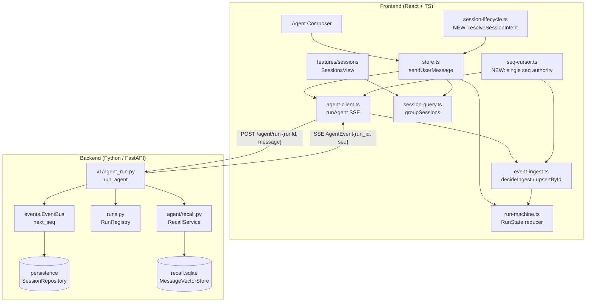
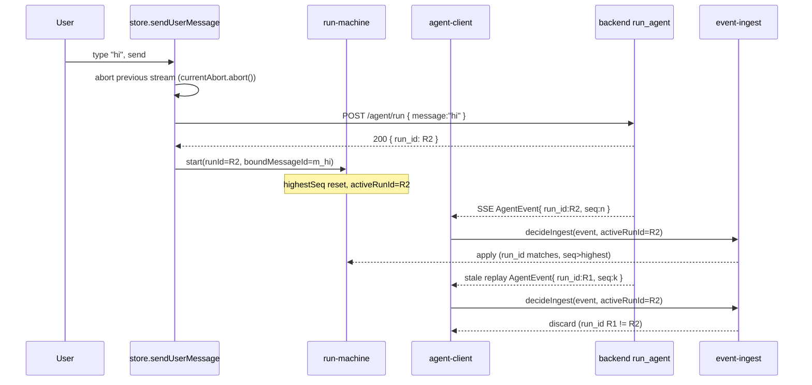
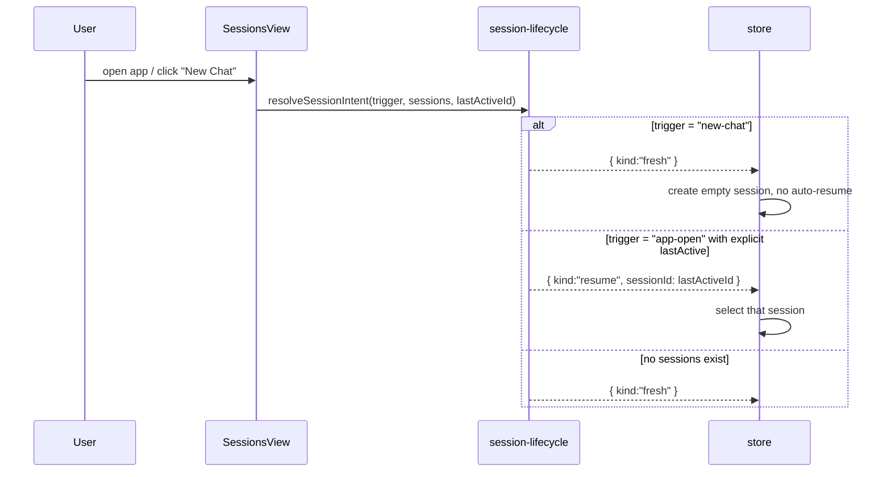

# Design Document: Chat Memory & Session System

## Overview

Zoc AI ("Llama Studio") is a Tauri/React + Python agent IDE that streams agent
runs over SSE. A cluster of high-impact defects all stem from the same missing
abstraction: there is no single, authoritative association between **a user
message**, **the run it triggered**, and **the events that run emits**. Three
independent sequence cursors (`RunState.highestSeq` in `run-machine.ts`,
`IngestState.highestSeq` in `event-ingest.ts`, and the per-session `lastSeq`
map in `agent-client.ts`) drift apart, so a fresh run can re-apply a previous
run's events — the agent appears to answer an old message ("hello") instead of
the one just typed ("hi"). The same gap lets a brand-new chat auto-resume the
most-recent prior session (`loadSessions` always selects `sessions[0]`), and a
UTC-vs-local day-bucketing mismatch in `session-query.ts` mislabels Today /
Yesterday.

This design introduces a **Chat Memory & Session Lifecycle System** with three
cohesive parts:

1. **Run/Message Association** — every run is keyed by a `runId` that the
   backend mints and echoes on every `AgentEvent`. A run answers exactly the
   user message bound to it at start, and the frontend discards any event whose
   `run_id` does not match the active run. A single seq authority replaces the
   three drifting cursors.
2. **Session Lifecycle** — an explicit `SessionIntent` (`resume` vs `fresh`)
   that makes "open a new chat" deterministic: a fresh session never
   auto-resumes a prior one, and auto-resume only happens on an explicit
   `resume` intent.
3. **Time & Memory Consistency** — day-bucketing computed in the display
   timezone, and a clarified contract for the existing `RecallService` /
   `MessageVectorStore` so recalled context is scoped to the active session and
   never bleeds across sessions or runs.

This spec is scoped to the **coherent core** described above. The user noted
100+ bugs across the frontend, backend, and Rust crates plus a broader memory
overhaul; that wider cleanup is explicitly **out of scope** and will be handled
in follow-up specs (see *Out of Scope*). Everything here is grounded in the
existing modules and types and is structured so the correctness rules can be
exercised with property-based tests (fast-check on the frontend, hypothesis /
pytest on the backend).

## Architecture



The change is deliberately **additive and local**: it threads a `run_id`
through the existing `AgentEvent` envelope, replaces the three frontend seq
cursors with one authority, adds a small pure `session-lifecycle.ts` module, and
fixes `dayIndex` to honor the display timezone. No new services, no schema
rewrites.

### Sequence flow: send a message (the wrong-message fix)



### Sequence flow: resume vs fresh session (the auto-connect fix)



## Components and Interfaces

### Component 1: Run/Message Association (frontend `run-machine.ts`)

**Purpose**: Bind each run to the exact user message that triggered it and to a
backend-issued `runId`, so a started run is the single active run and answers
only its bound message.

**Interface** (extends the existing `RunState` / `RunAction`):

```typescript
// run-machine.ts — additions to existing RunState
export interface RunState {
  lifecycle: RunLifecycle;
  runId: string | null;            // now the BACKEND-issued run id (was client-only)
  boundMessageId: string | null;   // NEW: the user Message.id this run answers
  startedAt: number | null;
  config: RunConfig;
  highestSeq: number;
  error: string | null;
  queuedMessage: string | null;    // retained (R4.11)
}

// start now carries the bound message id and the backend run id
export type RunAction =
  | { type: "start"; runId: string; boundMessageId: string; at: number; config?: Partial<RunConfig> }
  | /* ...all existing actions unchanged... */;
```

**Responsibilities**:
- On `start`, set `runId` to the backend id, record `boundMessageId`, and reset
  `highestSeq` to 0 (existing behavior) — but the seq authority is now shared
  (see Component 3) so the reset cannot strand stale events as "new".
- Guarantee the post-condition that a started run is the single active run
  (existing Property 24) and additionally that it carries a non-null
  `boundMessageId`.

### Component 2: Session Lifecycle (frontend `session-lifecycle.ts`, NEW)

**Purpose**: Make session connection deterministic and intent-driven, removing
the "always select `sessions[0]`" auto-resume.

**Interface**:

```typescript
// session-lifecycle.ts (NEW) — pure functions, no I/O
import type { Session } from "@llama-studio/shared-types";

export type LifecycleTrigger = "app-open" | "new-chat" | "select" | "delete-active";

export type SessionIntent =
  | { kind: "fresh" }                       // start a clean session, never resume
  | { kind: "resume"; sessionId: string }   // resume an explicit prior session
  | { kind: "select"; sessionId: string };  // user explicitly chose one

export interface LifecycleInput {
  trigger: LifecycleTrigger;
  sessions: Session[];
  lastActiveId: string | null;   // persisted, explicit "last active" pointer
  selectedId?: string | null;    // for trigger="select"/"delete-active"
}

export function resolveSessionIntent(input: LifecycleInput): SessionIntent;
```

**Responsibilities**:
- `new-chat` always yields `{ kind: "fresh" }` regardless of existing sessions.
- `app-open` yields `resume` **only** when `lastActiveId` names an existing
  session; otherwise `fresh`. (Fixes the auto-connect bug.)
- `select` yields `{ kind: "select", sessionId }` for an existing id.
- Pure and deterministic so it is directly PBT-able.

### Component 3: Seq Cursor Authority (frontend `seq-cursor.ts`, NEW)

**Purpose**: Replace the three independent seq trackers with one per-session
authority so ingestion, the run machine, and the SSE resubscribe cursor never
disagree.

**Interface**:

```typescript
// seq-cursor.ts (NEW)
export interface SeqCursor {
  /** Highest seq durably processed for the session (monotonic, never resets). */
  highestSeq: number;
  /** The active backend run id; events from other runs are stale. */
  activeRunId: string | null;
}

export function initialCursor(): SeqCursor;

/** On run start: adopt the new run id; the seq floor is preserved, NOT reset. */
export function onRunStart(cursor: SeqCursor, runId: string): SeqCursor;

/** Advance after applying an event; monotonic non-decreasing. */
export function advance(cursor: SeqCursor, seq: number): SeqCursor;

/** The since_seq cursor for a (re)subscription (mirrors reconnect.ts). */
export function subscribeCursor(cursor: SeqCursor): number;
```

**Responsibilities**:
- Provide the single `highestSeq` consumed by `decideIngest`, the run reducer,
  and `agent-client`'s `openEventsSse` `since_seq`.
- Preserve the seq floor across run starts (the bug today is that the run
  reducer resets `highestSeq` to 0 while `agent-client`'s `lastSeq` map keeps
  the old value — making stale low-seq events look new).

### Component 4: Event Ingestion (frontend `event-ingest.ts`, EXTENDED)

**Purpose**: Discard events that do not belong to the active run, in addition
to the existing duplicate/stale/paused/stopped rules.

**Interface** (extends existing `decideIngest`):

```typescript
export interface IngestState {
  highestSeq: number;          // from the single SeqCursor authority
  paused: boolean;
  stopped: boolean;
  activeRunId: string | null;  // NEW
}

/** Decide how to handle an event:
 *  - discard if event.run_id is set and != activeRunId  (NEW, fixes bug #1)
 *  - discard if seq <= highestSeq (duplicate/stale)      (R8.7)
 *  - discard if stopped                                  (R8.8)
 *  - buffer if paused                                    (R7.3)
 *  - otherwise apply
 */
export function decideIngest(event: AgentEvent, st: IngestState): IngestDecision;
```

### Component 5: Backend Run Identity (`v1/agent_run.py`, `events.py`)

**Purpose**: Mint a `run_id` for every run (not just isolated/review runs) and
stamp it on every emitted `AgentEvent`, so the frontend can correlate events to
runs.

**Interface** (Python):

```python
# v1/agent_run.py — run_agent gains an explicit run id for ALL runs
async def run_agent(payload: RunAgentRequest, session: Session, state: AppState) -> dict:
    run_id: str = (payload.run_id or uuid4().hex)  # NEW: accept client id or mint one
    # ... existing validation ...
    # every event published on state.bus for this run carries run_id
    return {"run_id": run_id, "status": ...}
```

```python
# events.py — AgentEvent envelope carries the owning run id
@dataclass
class AgentEventEnvelope:
    session_id: UUID
    seq: int
    run_id: str | None   # NEW: which run produced this event
    type: str
    payload: dict
```

**Responsibilities**:
- Return `run_id` synchronously from `POST /agent/run` so the store can bind it
  before consuming the stream.
- Ensure `EventBus.next_seq(session_id)` remains the monotonic seq source (it
  already is, seeded from `repo.max_event_seq`); `run_id` is orthogonal to seq.

### Component 6: Session-scoped Recall (`agent/recall.py`, clarified contract)

**Purpose**: Document and enforce that recalled memory is scoped to the active
session. The existing `MessageVectorStore` already keys rows by
`(session_id, message_id)`; this design adds the explicit correctness contract
and the run-scoped exclusion of the current turn's messages.

No interface change is required — `RecallService.recall(...)` and
`MessageVectorStore.query(... exclude_message_ids=...)` already support it. The
design records the properties they must satisfy (see Correctness Properties).

## Data Models

### Model 1: `AgentEvent` (extended)

The shared event type gains an optional `run_id`. Existing events without it are
treated as belonging to the active run (backward compatible).

```typescript
// @llama-studio/shared-types — AgentEventBase gains run_id
export interface AgentEventBase {
  session_id: string;
  seq: number;
  run_id?: string | null;   // NEW
}
```

**Validation Rules**:
- `seq` is a positive integer, monotonically increasing per session.
- `run_id`, when present, is a stable hex id matching the run that produced it.
- An event with `run_id` absent/null is accepted by the active run (legacy).

### Model 2: `Session` (unchanged) + `SessionIntent` (new, frontend-only)

`Session` from `@llama-studio/shared-types` is unchanged (`id`, `title`,
`status`, `workspace_root`, `created_at`, `updated_at`, `messages`, …). The new
`SessionIntent` is a pure frontend discriminated union (Component 2). A
persisted `lastActiveId: string | null` is stored in `localStorage` (alongside
the existing `PINNED_SESSIONS_KEY` pattern in `store.ts`).

**Validation Rules**:
- `lastActiveId` is honored only if it names a session in the current list.
- `updated_at` is an ISO-8601 timestamp; day-bucketing parses it via
  `Date.parse` and groups it in the **display timezone** (see Model 3).

### Model 3: Day-bucketing (`session-query.ts`, corrected)

```typescript
// dayIndex must bucket by LOCAL (display) calendar day, not UTC.
function localDayIndex(iso: string, tzOffsetMinutes: number): number {
  const t = Date.parse(iso);
  if (Number.isNaN(t)) return Number.NEGATIVE_INFINITY;
  // Shift epoch ms by the display tz offset before flooring to a day.
  return Math.floor((t - tzOffsetMinutes * 60_000) / MS_PER_DAY);
}
```

**Validation Rules**:
- `now`'s day index is computed with the **same** offset as each session's, so
  Today/Yesterday/Earlier are consistent with the wall clock shown to the user.
- The offset is injected (not read from `Date` inside the function) so the
  function stays pure and deterministic for tests.

## Algorithmic Pseudocode

### Algorithm: bind run to message and stream (store.sendUserMessage, corrected)

```typescript
async function sendUserMessage(content: string): Promise<void> {
  if (!content.trim()) return;

  // 1. Record the user message FIRST with a stable id.
  const userMsg: Message = { id: `local-${Date.now()}`, role: "user",
                             content, created_at: new Date().toISOString() };
  appendMessage(userMsg);

  // 2. Abort the previous in-flight stream BEFORE binding the new run
  //    (existing bug #4 fix — keep it).
  currentAbort?.abort();
  const abort = new AbortController();
  currentAbort = abort;

  // 3. POST /agent/run; backend returns the authoritative run_id.
  const { run_id } = await client.startRun(sessionId, { message: content }, abort.signal);

  // 4. Bind the run to THIS message and adopt the run id WITHOUT resetting
  //    the seq floor (Component 3).
  dispatch({ type: "start", runId: run_id, boundMessageId: userMsg.id, at: Date.now() });

  // 5. Consume the stream; ingestion discards events whose run_id != run_id.
  for await (const ev of client.streamRun(sessionId, run_id, abort.signal)) {
    if (decideIngest(ev, ingestState()) === "apply") applyAgentEvent(ev);
  }
}
```

**Preconditions**: a valid active session exists; `content` is non-empty.
**Postconditions**: exactly one active run; its `boundMessageId` equals the id
of the just-appended user message; no event from a prior run is applied.
**Loop invariant**: every applied event satisfies
`ev.run_id == state.runId && ev.seq > priorHighestSeq`, and `highestSeq` is
non-decreasing.

### Algorithm: resolveSessionIntent (session-lifecycle, the auto-connect fix)

```typescript
function resolveSessionIntent(input: LifecycleInput): SessionIntent {
  const exists = (id: string | null) =>
    id != null && input.sessions.some((s) => s.id === id);

  switch (input.trigger) {
    case "new-chat":
      return { kind: "fresh" };                          // never resume
    case "select":
      return exists(input.selectedId ?? null)
        ? { kind: "select", sessionId: input.selectedId! }
        : { kind: "fresh" };
    case "delete-active":
      // After deleting the active session, do NOT auto-jump into another.
      return { kind: "fresh" };
    case "app-open":
      return exists(input.lastActiveId)
        ? { kind: "resume", sessionId: input.lastActiveId! }
        : { kind: "fresh" };
  }
}
```

**Preconditions**: `sessions` is a finite list (possibly empty).
**Postconditions**: result is `fresh` whenever the trigger is `new-chat`, or
whenever the referenced id is absent; `resume` is produced **only** for
`app-open` with an existing `lastActiveId`.

### Algorithm: decideIngest (event-ingest, extended)

```typescript
function decideIngest(event: AgentEvent, st: IngestState): IngestDecision {
  if (event.run_id != null && st.activeRunId != null &&
      event.run_id !== st.activeRunId) return "discard";   // NEW: cross-run
  if (event.seq <= st.highestSeq) return "discard";        // R8.7
  if (st.stopped) return "discard";                        // R8.8
  if (st.paused) return "buffer";                          // R7.3
  return "apply";
}
```

**Loop invariant** (over a stream): after each `apply`, `highestSeq` equals the
max seq applied so far and every applied event's `run_id` is null or equals
`activeRunId`.

## Key Functions with Formal Specifications

### `onRunStart(cursor, runId)` — seq-cursor.ts

```typescript
function onRunStart(cursor: SeqCursor, runId: string): SeqCursor
```
**Preconditions**: `runId` is a non-empty string.
**Postconditions**: returns `{ highestSeq: cursor.highestSeq, activeRunId: runId }`
— the seq floor is **preserved** (never reset to 0).
**Loop invariants**: N/A.

### `advance(cursor, seq)` — seq-cursor.ts

```typescript
function advance(cursor: SeqCursor, seq: number): SeqCursor
```
**Preconditions**: `seq` is an integer.
**Postconditions**: `result.highestSeq === Math.max(cursor.highestSeq, seq)`;
`activeRunId` unchanged. Monotonic non-decreasing.

### `localDayIndex(iso, tzOffsetMinutes)` — session-query.ts

```typescript
function localDayIndex(iso: string, tzOffsetMinutes: number): number
```
**Preconditions**: `iso` is a string; `tzOffsetMinutes` is a finite number.
**Postconditions**: equal inputs yield equal outputs (deterministic); two
timestamps on the same local calendar day yield the same index; consecutive
local days differ by exactly 1.

### `RecallService.recall(session_id, query, …)` — recall.py (existing)

```python
async def recall(self, session_id: UUID, query: str, *,
                 cfg: RecallConfig | None = None,
                 exclude_message_ids: set[UUID] | None = None) -> list[RecallHit]
```
**Preconditions**: `query` may be empty (returns `[]`).
**Postconditions**: every returned `RecallHit` was stored under `session_id`
(no cross-session leakage); no hit's `message_id` is in `exclude_message_ids`;
all hits have `score >= cfg.min_score`; at most `cfg.top_k` hits, sorted by
descending score.

## Example Usage

```typescript
// Fresh chat never resumes a prior session
const intent = resolveSessionIntent({
  trigger: "new-chat",
  sessions: existingSessions,     // even when many exist
  lastActiveId: "sess-old-123",
});
// intent === { kind: "fresh" }

// A started run answers exactly the message just typed
dispatch({ type: "start", runId: "R2", boundMessageId: "local-hi", at: now });
const stale = { type: "message", seq: 5, run_id: "R1", message: {/* "hello" */} };
decideIngest(stale, { highestSeq: 4, paused: false, stopped: false, activeRunId: "R2" });
// === "discard"  → the old "hello" answer is never shown for "hi"

// Day-bucketing matches the user's clock
const tz = -new Date().getTimezoneOffset(); // display offset in minutes
localDayIndex("2024-06-01T23:30:00Z", tz);  // grouped by LOCAL day, not UTC
```

```python
# Recall is scoped to the active session only
hits = await state.recall.recall(active_session_id, prompt,
                                 exclude_message_ids=working_window_ids)
assert all(h.message_id not in working_window_ids for h in hits)
```

## Correctness Properties

These are written for property-based testing (fast-check / hypothesis). Each is
universally quantified over generated inputs.

### Property 1: A started run answers the most-recent user message

For any sequence of sends, after `start`, `RunState.boundMessageId` equals the
id of the last appended user `Message`. ∀ sends:
`state.boundMessageId == lastUserMessage.id`.

**Validates: Requirements 1.1**

### Property 2: Cross-run events are discarded

∀ event `e`, run `r`: if `e.run_id != null ∧ e.run_id != state.activeRunId` then
`decideIngest(e, st) == "discard"`. (Directly kills the wrong-message bug.)

**Validates: Requirements 1.2**

### Property 3: Single active run

∀ action sequences: at most one run is in `running`/`paused` at any time, and
`start` yields exactly that one (preserves existing Property 24).

**Validates: Requirements 1.3**

### Property 4: Seq monotonicity / idempotent ingestion

∀ event streams (including duplicates and reorderings): applying via
`decideIngest` + `advance` is idempotent and `highestSeq` is non-decreasing;
re-delivering an applied event is discarded.

**Validates: Requirements 1.4**

### Property 5: Seq floor preserved across run starts

∀ cursor, runId: `onRunStart(c, runId).highestSeq == c.highestSeq`. (No
reset-to-0 regression.)

**Validates: Requirements 1.5**

### Property 6: A fresh session never auto-resumes a prior session

∀ session lists, `lastActiveId`:
`resolveSessionIntent({trigger:"new-chat", …}).kind == "fresh"`.

**Validates: Requirements 2.1**

### Property 7: Resume only on explicit existing pointer

∀ inputs: `resolveSessionIntent` returns `resume` ⟹ trigger is `app-open` ∧
`lastActiveId` names an existing session.

**Validates: Requirements 2.2**

### Property 8: Day-bucketing consistent with display timezone

∀ iso, offset: `localDayIndex(iso, off)` is deterministic; two timestamps within
the same local day share an index; `now` and sessions use the same offset, so
Today/Yesterday/Earlier partition every non-pinned session exactly once (extends
existing R2.2/R2.3).

**Validates: Requirements 3.1**

### Property 9: upsertById order/identity (retained)

∀ entries, entry: result is ordered ascending by `seq` (ties by id), contains
`entry` exactly once, and replacing by id does not duplicate.

**Validates: Requirements 1.6**

### Property 10: Recall session isolation

∀ stored vectors across ≥2 sessions, query: `recall(s, …)` returns only hits
stored under `s`.

**Validates: Requirements 4.1**

### Property 11: Recall excludes the working window

∀ query, exclusion set X: no returned hit's `message_id ∈ X`, and all scores ≥
`min_score`.

**Validates: Requirements 4.2**

## Error Handling

### Scenario 1: Backend does not return a `run_id` (legacy / older sidecar)
**Condition**: `POST /agent/run` response lacks `run_id`.
**Response**: the store synthesizes a client run id and treats all incoming
events (which will have `run_id == null`) as belonging to the active run.
**Recovery**: behavior degrades to seq-only correlation; P4/P5 still hold.

### Scenario 2: Stream interrupted mid-run
**Condition**: SSE drops before a terminal event.
**Response**: reuse existing `reconnect.ts` policy (`nextReconnect`,
`MAX_RECONNECTS = 5`), resubscribing from `subscribeCursor(cursor)` — now the
single authority, so the resume cursor matches what ingestion has applied.
**Recovery**: on exhaustion, `StreamLostError` → `error` lifecycle (unchanged).

### Scenario 3: `lastActiveId` points at a deleted session
**Condition**: persisted pointer no longer exists.
**Response**: `resolveSessionIntent` falls back to `{ kind: "fresh" }`.
**Recovery**: no stale session is resumed; pointer is overwritten on next select.

### Scenario 4: Unparseable `updated_at`
**Condition**: `Date.parse` returns `NaN`.
**Response**: `localDayIndex` returns `NEGATIVE_INFINITY`, bucketing the session
into `earlier` (never crashes grouping).

## Testing Strategy

### Unit Testing
- `run-machine.ts`: `start` binds `boundMessageId`; terminal transitions clear
  `runId` but the seq floor is owned by the cursor.
- `session-lifecycle.ts`: each trigger → expected intent, including
  deleted-pointer fallback.
- `seq-cursor.ts`: `onRunStart` preserves floor; `advance` is monotonic.
- `session-query.ts`: `localDayIndex` boundary cases around local midnight.

### Property-Based Testing
**Library**: fast-check (frontend, `.test.ts`), hypothesis + pytest (backend).
- Generate randomized **send/event sequences** (interleaving runs R1/R2 with
  duplicate and out-of-order, cross-run-tagged events) to assert P1–P5, P9.
- Generate randomized **session lists + triggers + lastActiveId** for P6–P8.
- Generate randomized **ISO timestamps + tz offsets** for P8.
- Backend: generate multi-session vector stores + queries for P10/P11
  (hypothesis strategies over `Message` lists and exclusion sets).

### Integration Testing
- End-to-end "type hi after hello": drive `store.sendUserMessage` against a
  mock SSE that replays a prior run's `done`/message events; assert the new run
  ignores them and only the "hi" answer is rendered.
- "Open new chat with existing sessions": assert no auto-resume occurs.

## Performance Considerations

All new logic is O(1)/O(n) pure functions over small in-memory lists (sessions,
buffered events) and adds no network round-trips beyond the existing
`POST /agent/run` (which already returns synchronously). The single seq cursor
removes redundant bookkeeping rather than adding it. Recall remains the existing
brute-force cosine scan over a few hundred rows per session.

## Security Considerations

- Recall isolation (P10) is a **data-confidentiality** property: messages from
  one session must never surface in another's context. It is enforced by the
  `(session_id, message_id)` primary key and the `session_id` filter in
  `MessageVectorStore.query`, and asserted by P10.
- `run_id` is an opaque server-minted hex id; it is not a security token and
  carries no authorization meaning — correlation only.
- No new network-exposed endpoints are introduced; the existing loopback
  FastAPI surface is unchanged.

## Dependencies

- **Frontend**: existing `@llama-studio/shared-types`, `zustand` store, fast-check
  (dev) for PBT. New files: `seq-cursor.ts`, `session-lifecycle.ts`.
- **Backend**: existing FastAPI sidecar, `EventBus`, `RunRegistry`,
  `RecallService` / `MessageVectorStore`; hypothesis + pytest (dev) for PBT.
- **No new runtime third-party dependencies.**

## Out of Scope (follow-up specs)

The user reported 100+ bugs and a broader memory overhaul. To keep this spec
coherent and verifiable, the following are explicitly deferred:

- General bug cleanup across frontend/backend/Rust crates unrelated to the
  message↔run association, session lifecycle, and time-bucketing.
- A redesigned long-term memory subsystem beyond clarifying the existing
  `RecallService` contract (e.g., summarization policy, compaction tuning).
- UI/UX redesign of the Sessions view beyond the grouping correctness fix.
- The `awaiting_review` / apply-discard isolated-run pipeline (already present;
  only its `run_id` stamping is touched here).
