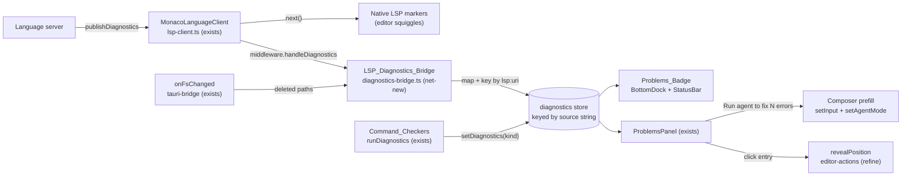

# Design Document

## Overview

This feature completes **Part 3 — LSP / IDE Integration** by adding the two capabilities the completed `monaco-lsp-integration` spec left open:

- **§3.2 — LSP Diagnostics → Problems panel** (Requirements 1–7): a net-new, low-risk *bridge* that intercepts the `textDocument/publishDiagnostics` notifications the language servers already publish (over the LSP client the completed spec built), maps each to the **existing** `Diagnostic` model, and writes them into the **existing** `diagnostics` store so they render in the **existing** `ProblemsPanel` alongside command-checker diagnostics.
- **§3.3 — Inline AI completions** (Requirements 8–16): a fully net-new Monaco `InlineCompletionsProvider` on the frontend and a net-new `POST /v1/completions` Gateway route that builds a fill-in-the-middle (or fallback) prompt, calls the active model through the **existing** `model_runtime`, and streams the result back over SSE.

The design deliberately **reuses** and does **not** re-specify the `monaco-lsp-integration` layer (WebSocket transport, per-server `MonacoLanguageClient`, the `routes/lsp.py` proxy, the loopback + shared-token admission). It plugs into the seams that layer already exposes.

### Two first-class invariants

Two requirements are elevated to design-wide invariants that every component below is checked against:

- **Coexistence invariant (Requirement 2).** LSP diagnostics and command-checker diagnostics live in the same `diagnostics` store, keyed by *source*. LSP entries MUST use a **per-URI** key that is distinct from every command-checker key, so that publishing new diagnostics for one document replaces *only that document's* LSP entry — never another document's LSP entry, and never a checker's entry. This is achieved purely with the existing `setDiagnostics(source, items)` / `clearDiagnostics(source?)` actions; no store shape change is required.
- **Security invariant (Requirement 15).** `POST /v1/completions` is network-exposed and calls the active model. It MUST sit behind the **same** `require_admission` dependency every other Gateway route uses (loopback bind + shared-token admission), and it MUST be provably incapable of invoking `model_runtime` when a request is not admitted or when its parameters are invalid. No new listening interface is introduced.

### "Already exists / refine" vs. "net-new" at a glance

| Area | Already exists (reuse, do not re-spec) | Refine (small, additive change) | Net-new |
| --- | --- | --- | --- |
| §3.2 | `ProblemsPanel.tsx`, `Diagnostic`/`countBySeverity` (`problem-matchers.ts`), `diagnostics` slice (`setDiagnostics`/`clearDiagnostics`), `MonacoLanguageClient` per server (`lsp-client.ts`), `onFsChanged`/`fsStat` (`tauri-bridge.ts`), `openFile`, `input`/`setInput`/`setAgentMode` | `LspClientDeps` (+ `onPublishDiagnostics` hook), `MonacoView` marker mirror (skip `lsp:` sources), `editor-actions` (`revealPosition`), `ProblemsPanel` (per-file action + entry navigation), `BottomDock`/`StatusBar` badge wiring | `lsp/diagnostics-bridge.ts` (mapping + store writes + fs cleanup), `lib/problems-badge.ts` |
| §3.3 | `model_runtime` (`generate_text`/`generate_text_stream`), `auth.py` (`require_admission`/`is_request_admitted`), `app.py` route registration + SSE (`EventSourceResponse`), `MonacoView` Monaco capture | `model_runtime.generate_text_stream` (thread an optional `stop` sequence through), `app.py` (register the router) | `features/editor/inline-completions.ts`, `routes/completions.py` |

## Architecture

### §3.2 — Diagnostics bridge data flow



Key decisions:

- **Interception point (R1).** The bridge intercepts diagnostics through the language client's `clientOptions.middleware.handleDiagnostics(uri, diagnostics, next)` seam, wired in `defaultCreateLanguageClient` (`lsp-client.ts`). This is chosen over a raw `onNotification("textDocument/publishDiagnostics", …)` handler because middleware runs **after** the client has parsed the wire payload into a typed `Diagnostic[]` and a `Uri`, is the officially supported extension point, and does not disturb the existing provider wiring (definition/hover/rename from the completed 3.1). The middleware forwards to the bridge and then calls `next(uri, diagnostics)` so native LSP squiggles still render.
- **No double squiggles (refine).** Because the bridge also writes LSP diagnostics into the `diagnostics` store, and `MonacoView` already mirrors the store into Monaco markers, the `MonacoView` mirror is refined to **skip `lsp:`-prefixed source keys** (native markers via `next` own the LSP squiggles; the store mirror keeps owning command-checker squiggles). This avoids rendering LSP diagnostics twice while leaving 3.1 untouched.
- **Per-URI keying (R2).** The bridge writes under `lsp:<uri>` (see Data Models). New non-empty publish → `setDiagnostics("lsp:"+uri, mapped)` (replace that URI only). Empty publish → `clearDiagnostics("lsp:"+uri)`.
- **Deleted-file cleanup (R5).** The bridge subscribes to `onFsChanged` at start-up; for each reported path it confirms deletion via `fsStat(path).exists === false`, then clears exactly the `lsp:*` entries whose diagnostics' `file` equals a deleted path.

### §3.3 — Inline completions sequence

```mermaid
sequenceDiagram
  participant Ed as Monaco editor
  participant P as InlineCompletionsProvider (net-new)
  participant GW as POST /v1/completions (net-new)
  participant Adm as require_admission (exists)
  participant Ca as Completion_Cache (net-new)
  participant MR as model_runtime (exists)

  Ed->>P: content change (keystroke)
  Note over P: debounce 400ms; cancel prior AbortController
  P->>P: build prefix(≤500)/suffix(≤200), language, path
  P->>GW: POST {prefix,suffix,language,filePath} (fetch, abortable)
  GW->>Adm: admission gate (loopback / token)
  Adm-->>GW: admitted?  (reject → 401, no model call)
  GW->>GW: validate params (invalid → 422, no model call)
  GW->>Ca: lookup (prefix,suffix,model)
  alt fresh (<30s, non-empty)
    Ca-->>GW: cached completion
    GW-->>P: SSE token(s) + done   (no model call)
  else miss / aged
    GW->>MR: generate_text_stream(FIM|fallback, temp 0.1, max 128, stop)
    MR-->>GW: token chunks (on_token)
    GW-->>P: SSE token per chunk, then done
    GW->>Ca: store iff non-empty
  end
  P->>Ed: accumulate ghost text; Tab accepts, typing dismisses
```

Key decisions:

- **Admission first, model last (R15).** `require_admission` is a route dependency, so an unadmitted request is rejected before the handler body runs — `model_runtime` is unreachable on that path. Parameter validation (Pydantic) runs before any model call too (R11.2).
- **FIM capability is known by model identity (R11.3 / R13).** `model_runtime` speaks OpenAI-compatible chat / Anthropic messages and exposes no capability-probe endpoint, so FIM support is inferred from the configured **model id** via a conservative allowlist predicate `model_supports_fim(provider, model)` (default `False` → the confirmed non-FIM fallback prompt). No network probe.
- **Streaming reuses the app.py bridge pattern.** The route runs `generate_text_stream(..., on_token=cb)` in a worker thread (`asyncio.to_thread`) whose `on_token` pushes chunks onto an `asyncio.Queue` via `loop.call_soon_threadsafe` (exactly the `_Run._put` pattern in `app.py`); the SSE generator drains the queue, emitting one token event per chunk and a distinct terminal event.
- **Non-blocking editing (R16.4).** All network work is async `fetch` off the editor's input path; keystrokes are applied synchronously by Monaco regardless of in-flight requests.

## Components and Interfaces

### §3.2 Components

#### 1. `features/editor/lsp/diagnostics-bridge.ts` — **net-new**

The pure mapping core plus the store-writing and fs-cleanup effects. Kept dependency-light (pure functions + injected store actions) so it is unit- and property-testable without Monaco.

```ts
import type { Diagnostic, Severity } from "@/lib/problem-matchers";
import type { ServerName } from "./lsp-registry";

/** A minimal shape of an LSP diagnostic (as parsed by vscode-languageclient). */
export interface LspDiagnostic {
  range: { start: { line: number; character: number }; end?: unknown };
  severity?: 1 | 2 | 3 | 4;      // 1 Error, 2 Warning, 3 Info, 4 Hint
  message: string;
  source?: string;
  code?: string | number | { value: string | number };
}

/** R2.1: the per-URI store key. Distinct from every Command_Checker key. */
export const LSP_SOURCE_PREFIX = "lsp:";
export function lspSourceKey(uri: string): string;   // `lsp:${uri}`
export function isLspSourceKey(key: string): boolean; // key.startsWith("lsp:")

/** R1.2/R1.3: severity map, missing → error. */
export function mapSeverity(sev?: number): Severity;

/** R1.5: file:// URI → absolute filesystem path (inverse of toMonacoModelUri). */
export function uriToFsPath(uri: string): string;

/** R1.1/R1.4/R1.5/R1.6/R1.7: one LSP diagnostic → one Diagnostic_Model entry. */
export function mapLspDiagnostic(
  server: ServerName,
  uri: string,
  d: LspDiagnostic,
): Diagnostic;

/** R1.1: map every diagnostic in a publish notification. */
export function mapPublishedDiagnostics(
  server: ServerName,
  uri: string,
  diags: readonly LspDiagnostic[],
): Diagnostic[];

/**
 * R5.2–R5.4 (pure): given the current store and a set of confirmed-deleted
 * paths, return the `lsp:*` keys to clear (exactly those whose entries' `file`
 * is a deleted path). Never returns a Command_Checker key or a non-deleted key.
 */
export function lspKeysForDeletedFiles(
  diagnostics: Record<string, Diagnostic[]>,
  deletedPaths: ReadonlySet<string>,
): string[];

export interface DiagnosticsBridgeDeps {
  setDiagnostics: (source: string, items: Diagnostic[]) => void;   // store
  clearDiagnostics: (source?: string) => void;                     // store
  getDiagnostics: () => Record<string, Diagnostic[]>;              // store snapshot
  onFsChanged: (cb: (paths: string[]) => void) => Promise<() => void>;
  fsStat: (path: string) => Promise<{ exists: boolean } | null>;
}

export interface DiagnosticsBridge {
  /** Wired as LspClientDeps.onPublishDiagnostics (R1, R2). */
  onPublishDiagnostics(server: ServerName, uri: string, diags: readonly LspDiagnostic[]): void;
  /** R5.5: stop reacting to fs events and leave the store unchanged after. */
  dispose(): void;
}

export function createDiagnosticsBridge(deps: DiagnosticsBridgeDeps): DiagnosticsBridge;
```

Behavior:

- `onPublishDiagnostics` (R2.2/R2.5): if `diags` is non-empty, `setDiagnostics(lspSourceKey(uri), mapPublishedDiagnostics(...))`; if empty, `clearDiagnostics(lspSourceKey(uri))`. Either way, only that URI's entry changes; all other `lsp:*` entries and all checker entries are untouched (R2.3/R2.4) because the store actions operate on a single key.
- fs cleanup (R5): on each `onFsChanged(paths)`, `await fsStat` each path; a path with `exists === false` is a Deleted_File; a path with `exists === true` (or a `null` stat — no desktop runtime, cannot confirm deletion) is left alone (R5.3). Clear the `lsp:*` keys from `lspKeysForDeletedFiles(getDiagnostics(), deleted)` via `clearDiagnostics(key)`. `dispose()` invokes the `onFsChanged` unsubscribe so later events are ignored (R5.5).

#### 2. `features/editor/lsp/lsp-client.ts` — **refine**

Extend `LspClientDeps` with an optional publish hook and wire it as `handleDiagnostics` middleware in `defaultCreateLanguageClient`:

```ts
export interface LspClientDeps {
  // …existing fields unchanged…
  /** Net-new: forward each publishDiagnostics to the bridge (R1). */
  onPublishDiagnostics?: (server: ServerName, uri: string, diags: readonly LspDiagnostic[]) => void;
}
```

In `defaultCreateLanguageClient`, add:

```ts
clientOptions: {
  documentSelector: SERVER_LANGUAGES[server],
  middleware: {
    handleDiagnostics: (uri, diagnostics, next) => {
      try { deps.onPublishDiagnostics?.(server, uri.toString(), diagnostics as LspDiagnostic[]); }
      finally { next(uri, diagnostics); }   // preserve native squiggles
    },
  },
},
```

(The `deps` are threaded into the factory; the singleton/lifecycle logic is unchanged, so the completed 3.1 behavior is preserved.)

#### 3. `features/editor/MonacoView.tsx` — **refine (R3 navigation + no double squiggles)**

- **Marker mirror:** change the diagnostics→marker effect to iterate store *entries* and skip `lsp:` keys, so LSP squiggles come solely from the language client's native markers and are not duplicated:

```ts
const items = Object.entries(diagnostics)
  .filter(([key]) => !key.startsWith("lsp:"))
  .flatMap(([, list]) => list)
  .filter((d) => d.file === file.path || file.path.endsWith(d.file));
```

- **Pending reveal (R3.2/R3.3):** consume a pending navigation target on mount and when the active file changes, so a click that *opens* a not-yet-mounted file still scrolls to and places the caret on the target once the editor is ready (see `editor-actions` below).

#### 4. `lib/editor-actions.ts` — **refine (R3)**

Add an exact-position reveal plus a small pending-target buffer (the active editor registers asynchronously after `openFile` mounts a new `MonacoView`):

```ts
/** R3.2/R3.3: scroll the line into view and place the caret at (line, column),
 *  1-based. Falls back to buffering a pending target when no editor is active
 *  yet (a freshly opened file), which MonacoView flushes on mount. */
export function revealPosition(line: number, column: number): void;
export function requestReveal(path: string, line: number, column: number): void;
export function takePendingReveal(path: string): { line: number; column: number } | null;
```

`revealPosition` calls `active.revealLineInCenter(line)` + `active.setPosition({ lineNumber: line, column })` + `active.focus()`.

#### 5. `features/problems/ProblemsPanel.tsx` — **refine (R3, R6)**

- **Entry click (R3):** the diagnostic-entry handler resolves the absolute path (existing logic), calls `openFile(abs)` (R3.1; when already open this only re-activates without reloading, R3.4), then navigates: if the file is already the active editor, `revealPosition(d.line, d.column)`; otherwise `requestReveal(abs, d.line, d.column)` so `MonacoView` reveals once mounted (R3.2/R3.3).
- **Per-file action (R6):** for each file group whose diagnostics include ≥1 `error`, render a **"Run agent to fix N errors"** button where `N` is that file's error count (R6.1). On click it calls a pure prompt builder, then `setInput(prompt)` (replaces the draft, R6.2), `setAgentMode("agent")` (R6.4), and does nothing else — the draft stays editable (R6.5) and unsent (R6.6).

```ts
/** R6.1/R6.2/R6.3 (pure): a prompt naming the file and enumerating ONLY its
 *  error-severity diagnostics (each with line, column, message). */
export function buildFixErrorsPrompt(file: string, diagnostics: Diagnostic[]): string;
/** R6.1: N = count of error-severity diagnostics for the file. */
export function errorCount(diagnostics: Diagnostic[]): number;
```

#### 6. `lib/problems-badge.ts` — **net-new** (+ `BottomDock`/`StatusBar` **refine**, R4)

A single pure derivation the badge surfaces share, so count/color/visibility are one function of store contents (R4.6 falls out because it is recomputed on every store change):

```ts
export type BadgeColor = "error" | "warning" | "none";
export interface ProblemsBadge { count: number; color: BadgeColor; visible: boolean; }

/** R4.1–R4.5: count = errors+warnings across ALL sources (lsp:* and checkers);
 *  color = error if any error, else warning if any warning, else none;
 *  visible = count > 0. */
export function problemsBadge(diagnostics: Record<string, Diagnostic[]>): ProblemsBadge;
```

`BottomDock` (Problems tab pill) and `StatusBar` (diagnostics indicator) both read `problemsBadge(useApp(s => s.diagnostics))` and render the color/visibility accordingly (the status bar keeps its split error/warning glyphs, driven by the same counts).

### §3.3 Components

#### 7. `features/editor/inline-completions.ts` — **net-new**

Implements `monaco.languages.InlineCompletionsProvider`, registered against the captured Monaco instance in `MonacoView` (R8.1).

```ts
export interface InlineCompletionsDeps {
  /** POST /v1/completions; yields token chunks then completes. AbortSignal
   *  cancels the request (R9.2). */
  streamCompletion(
    body: { prefix: string; suffix: string; language: string; filePath: string },
    onToken: (chunk: string) => void,
    signal: AbortSignal,
  ): Promise<void>;
  debounceMs?: number; // default 400 (R8.2)
  maxPrefix?: number;  // default 500 (R9.1)
  maxSuffix?: number;  // default 200 (R9.1)
}

export function createInlineCompletionsProvider(
  monaco: MonacoNamespace,
  deps: InlineCompletionsDeps,
): { provider: monaco.languages.InlineCompletionsProvider; dispose(): void };
```

Behavior:

- **Debounce & gate (R8.2/R8.3/R8.4):** an automatic trigger (re)starts a 400 ms timer; a keystroke inside the window restarts it and cancels the pending fire, so a burst collapses to exactly one trailing request. If the automatic trigger fires while both prefix and suffix are empty, no request is made (an explicit invoke bypasses this gate).
- **Payload & truncation (R9.1):** prefix = up to the 500 chars immediately before the cursor; suffix = up to the 200 chars immediately after; plus the editor `language` id and the file path.
- **Cancellation & stale discard (R9.2/R9.3):** each request has an `AbortController` and a monotonically increasing `requestSeq`. A context-changing keystroke aborts the in-flight request; any chunk that arrives for an aborted/superseded `requestSeq` is dropped and never rendered (even after the user stops typing).
- **Ghost text streaming (R10.1/R10.2):** tokens are appended to a per-request buffer in arrival order; the first non-empty token renders ghost text at the cursor with a "Tab to accept" hint, and each subsequent token grows the ghost text (via a re-render/re-trigger against the same buffer).
- **Accept / dismiss (R10.3/R10.4):** Tab commits the buffered text (Monaco's inline-suggest accept inserts the text, moves the caret to its end, and dismisses the hint — no literal tab char); typing any other character or moving the cursor dismisses without inserting.
- **Empty / failed (R16.3):** an empty completion (stream ends with no tokens, or a quiet failure) yields no ghost text and no hint.

`MonacoView` (refine) calls `createInlineCompletionsProvider(monaco, deps)` inside `handleMount` after `captureMonaco(monaco)` and registers it with `monaco.languages.registerInlineCompletionsProvider({ pattern: "**" }, provider)` (R8.1), disposing on unmount.

#### 8. `routes/completions.py` — **net-new**

Modeled on `routes/lsp.py`: a FastAPI-free, unit-testable core (pure prompt/cache/streaming helpers over narrow seams) plus registration in `app.py`. The route reuses `require_admission` and `EventSourceResponse`.

```python
class CompletionRequest(BaseModel):
    model_config = ConfigDict(populate_by_name=True, extra="ignore")
    prefix: str                                   # may be "" (R11.1)
    suffix: str                                   # may be "" (R11.1)
    language: str
    file_path: str = Field(alias="filePath")
    # model/provider/credentials come from the active selection (see below)

def model_supports_fim(provider: str | None, model: str | None) -> bool: ...   # R11.3/R13.1
def build_fim_prompt(prefix: str, suffix: str) -> str: ...                      # R11.3  <PRE>{}<SUF>{}<MID>
def build_fallback_prompt(prefix: str, suffix: str, language: str) -> str: ...  # R13.1
def completion_stop_sequences(language: str) -> list[str]: ...                  # R11.4 (≥1)

class CompletionCache:                                                          # R14
    def get(self, key: tuple[str, str, str], now: float) -> str | None: ...     # <30s, non-empty
    def put(self, key: tuple[str, str, str], text: str, now: float) -> None: ...# store iff non-empty
```

Handler flow (`POST /v1/completions`, `dependencies=[Depends(require_admission)]`):

1. Admission is enforced by the dependency (R15.1/R15.2/R15.5); validation by `CompletionRequest` (R11.1/R11.2 — a missing/non-string param yields a 422 naming the field, before any model call).
2. Resolve `model`/`provider`/creds for the active selection (same fields the agent path threads via `AgentRunRequest`).
3. `key = (prefix, suffix, model)`. If `cache.get(key, now)` returns text → stream it (token event(s) + terminal) with **no** model call (R14.3/R14.4).
4. Else choose the prompt: `build_fim_prompt` when `model_supports_fim(provider, model)`, else `build_fallback_prompt` (R11.3/R13.1). Build an `AgentRunRequest(prompt=…, mode=Mode.ASK, provider, model, api_key, base_url, temperature=0.1, max_tokens=128)` (mode is irrelevant to `generate_text_stream` and only satisfies the model's required field).
5. In a worker thread, call `generate_text_stream(req, on_token=push, stop=completion_stop_sequences(language))` (R11.4/R11.5/R13.2). Each `on_token` chunk becomes a token SSE event (R12.1/R12.2); on completion, emit the distinct terminal event (R12.3) and `cache.put(key, full_text, now)` iff non-empty (R14.1/R14.2).
6. Resilience (R16.1/R16.2/R16.5): `generate_text_stream` returning `None` (no provider/model) → immediate terminal, empty (R16.1); a `ModelRuntimeError` before the first token → immediate terminal, empty, no error frame (R16.2); an error after tokens → stop, terminal, no error frame (R16.5). Empty completion → no token event + immediate terminal (R12.4).

#### 9. `model_runtime.generate_text_stream` — **refine (R11.4)**

Thread an optional stop sequence through the existing streaming call — the smallest change consistent with "route through `model_runtime`" (R11.5):

```python
def generate_text_stream(request, *, system_prompt=None, timeout=60.0,
                         on_token=None, on_metrics=None,
                         stop: Sequence[str] | None = None) -> str | None: ...
```

`stop` is forwarded into the OpenAI-compatible payload as `"stop"` (and Anthropic's `stop_sequences` on that provider's bounded non-streaming branch). Existing callers pass nothing and are unaffected.

#### 10. `app.py` — **refine**

Register the completions router/route with `dependencies=[Depends(require_admission)]`, constructing one process-wide `CompletionCache` (like the other registries on `app.state`). No new interface or bind is added (R15.4).

## Data Models

### Diagnostic_Model — **exists, reused unchanged** (`@/lib/problem-matchers.ts`)

```ts
type Severity = "error" | "warning" | "info" | "hint";
interface Diagnostic {
  source: string; file: string; line: number; column: number;
  severity: Severity; message: string; code?: string;
}
```

### LSP → Diagnostic mapping (R1)

| Diagnostic field | Source | Rule |
| --- | --- | --- |
| `severity` | `LspDiagnostic.severity` | `1→error, 2→warning, 3→info, 4→hint`; **missing → `error`** (R1.2/R1.3) |
| `line` | `range.start.line` | `+ 1` (LSP 0-based → 1-based) (R1.4) |
| `column` | `range.start.character` | `+ 1` (R1.4) |
| `file` | notification `uri` | absolute fs path via `uriToFsPath(uri)` (R1.5) |
| `message` | `LspDiagnostic.message` | verbatim (R1.5) |
| `source` | `LspDiagnostic.source` | fallback to **Server_Name** when absent (R1.5/R1.6) |
| `code` | `LspDiagnostic.code` | `String(code)`; **left unset when absent** (R1.5/R1.7) |

### Diagnostics_Store keying (R2) — **exists, reused**

`diagnostics: Record<string, Diagnostic[]>`, keyed by *source string*:

- Command_Checker keys (existing): `"typescript" | "eslint" | "ruff" | "cargo"`.
- LSP keys (net-new): `"lsp:" + <uri>` — one entry **per document URI**, disjoint from every checker key and from every other URI's entry. This is the concrete mechanism for the coexistence invariant: `setDiagnostics("lsp:"+uri, …)` and `clearDiagnostics("lsp:"+uri)` mutate exactly one key.

### Problems_Badge model (R4)

```ts
interface ProblemsBadge { count: number; color: "error" | "warning" | "none"; visible: boolean; }
```

Derived from the store: `count` = number of `error`+`warning` diagnostics across **all** entries; `color` = `error` if any error else `warning` if any warning else `none`; `visible` = `count > 0`.

### Completion request / SSE / cache models (R11, R12, R14)

```ts
// Frontend → Gateway (R11.1)
interface CompletionRequestBody { prefix: string; suffix: string; language: string; filePath: string; }
```

```
SSE frames (Gateway → frontend), R12:
  event: token   data: {"text": "<chunk>"}     # one per model chunk, in order (R12.1/R12.2)
  event: done    data: {}                        # exactly one, distinct terminal (R12.3/R12.4)
```

Token payloads are JSON-wrapped (`{"text": …}`) so completions containing newlines survive SSE line-framing; the terminal `done` event is a distinct event type carrying no token text. The frontend reads the stream via abortable `fetch` + a `ReadableStream` SSE parser (POST cannot use the native `EventSource`).

```python
# Completion_Cache (R14): in-process, per (prefix, suffix, model).
CacheKey  = tuple[str, str, str]            # (prefix, suffix, model)
CacheEntry = tuple[str, float]              # (completion_text, stored_monotonic)
TTL_SECONDS = 30.0                          # fresh iff now - stored < 30 (R14.3/R14.5)
```

### FIM capability & prompts (R11.3, R13.1)

- `model_supports_fim(provider, model)` — pure predicate over a conservative, case-insensitive model-id allowlist (e.g. ids containing `codellama`, `starcoder`, `deepseek-coder`, `qwen…coder`, `codegemma`, `codestral`, `stable-code`, `granite-code`); unknown/omitted → `False`.
- FIM prompt (R11.3): `"<PRE>" + prefix + "<SUF>" + suffix + "<MID>"`.
- Fallback prompt (R13.1): a "complete this code" instruction embedding `language`, the before-cursor code, and the after-cursor code, asking for only the gap text.
- Model params (R11.4/R13.2): `temperature = 0.1`, `max_tokens = 128`, `stop = completion_stop_sequences(language)` (≥1), on both the FIM and fallback paths.

## Correctness Properties

*A property is a characteristic or behavior that should hold true across all valid executions of a system — essentially, a formal statement about what the system should do. Properties serve as the bridge between human-readable specifications and machine-verifiable correctness guarantees.*

The prework analysis classified each acceptance criterion as PROPERTY, EXAMPLE, EDGE_CASE, INTEGRATION, or SMOKE. The universally-quantified properties below cover the PROPERTY/EDGE_CASE criteria (deduplicated); the EXAMPLE criteria (navigation, provider registration, ghost-text accept/dismiss, schema acceptance, structural wiring, no-server rendering) are covered by unit/integration tests in the Testing Strategy.

### §3.2 — Diagnostics bridge (frontend, fast-check)

#### Property 1: LSP → Diagnostic mapping is total and field-faithful

*For any* language server name, document URI, and array of LSP diagnostics, mapping produces exactly one `Diagnostic` per input diagnostic (length preserved), and for each: `line = range.start.line + 1`, `column = range.start.character + 1`, `file = uriToFsPath(uri)`, `message` equals the input message verbatim, `source` equals the diagnostic's `source` or the Server_Name when `source` is absent, and `code` equals `String(code)` when present and is unset when absent.

**Validates: Requirements 1.1, 1.4, 1.5, 1.6, 1.7**

#### Property 2: LSP severity maps by the fixed table, defaulting to error

*For any* LSP diagnostic, the mapped `severity` is `error` for `1`, `warning` for `2`, `info` for `3`, `hint` for `4`, and `error` when the severity is absent.

**Validates: Requirements 1.2, 1.3**

#### Property 3: Per-URI LSP diagnostics replace and isolate

*For any* store state and any sequence of publish notifications, applying a publish for document URI `U` writes the newly mapped diagnostics under the single key `lsp:U` (replacing any prior `lsp:U` entry so no prior diagnostic for `U` remains) when the notification is non-empty and clears `lsp:U` when the notification is empty, while leaving every other `lsp:*` entry and every Command_Checker entry byte-identical; and the key `lsp:U` is never equal to any Command_Checker key nor to any other URI's key.

**Validates: Requirements 2.1, 2.2, 2.3, 2.4, 2.5**

#### Property 4: Problems badge is an exact function of store contents

*For any* diagnostics store (any mix of `lsp:*` and Command_Checker entries), the badge `count` equals the total number of `error`- and `warning`-severity diagnostics across all entries (excluding `info`/`hint`), the badge is `visible` iff `count > 0`, and the badge `color` is `error` when at least one `error` is present, `warning` when at least one `warning` and no `error` is present, and `none` (hidden) when neither is present.

**Validates: Requirements 4.1, 4.2, 4.3, 4.4, 4.5, 4.6**

#### Property 5: Deleted-file cleanup clears only the named deleted LSP entries

*For any* diagnostics store and any set of confirmed-deleted paths, the cleanup clears exactly those `lsp:*` entries whose diagnostics' `file` is one of the deleted paths, and leaves unchanged every `lsp:*` entry for a non-deleted (still-existing) path and every Command_Checker entry.

**Validates: Requirements 5.2, 5.3, 5.4**

#### Property 6: "Run agent to fix N errors" enumerates only errors

*For any* file and its diagnostics, the action is offered iff the file has at least one `error`-severity diagnostic, `N` equals the count of that file's `error`-severity diagnostics, and the generated prompt identifies the file by its `file` path and contains the `line`, `column`, and `message` of every `error`-severity diagnostic and of no `warning`-, `info`-, or `hint`-severity diagnostic.

**Validates: Requirements 6.1, 6.2, 6.3**

### §3.3 — Inline completions (frontend, fast-check)

#### Property 7: Debounce collapses a keystroke burst to one trailing request

*For any* sequence of keystroke timestamps in which at least one of the prefix and suffix is non-empty, the provider issues exactly one completion request, fired 400 ms after the last keystroke, and issues no request for any inter-keystroke interval shorter than 400 ms; and when an automatic trigger fires with both the prefix and the suffix empty, it issues no request.

**Validates: Requirements 8.2, 8.3, 8.4**

#### Property 8: Request payload is bounded to the cursor window

*For any* document content and cursor position, the request prefix is the up-to-500 characters immediately preceding the cursor (all of them when fewer than 500 exist) and the request suffix is the up-to-200 characters immediately following the cursor (all of them when fewer than 200 exist), and the request carries the editor Language_Id and the file path.

**Validates: Requirements 9.1**

#### Property 9: Cancelled or superseded responses never render

*For any* in-flight completion request, a context-changing keystroke before the response cancels that request, and any completion chunk that arrives for a cancelled or superseded request is discarded and produces no Ghost_Text, even after the Developer stops typing.

**Validates: Requirements 9.2, 9.3**

#### Property 10: Ghost text equals the ordered concatenation of received tokens; empty renders nothing

*For any* sequence of streamed token chunks for the current request, the displayed Ghost_Text equals the concatenation of those chunks in arrival order, and when the stream ends with no tokens (an empty completion) no Ghost_Text and no "Tab to accept" hint are shown.

**Validates: Requirements 10.2, 16.3**

### §3.3 — Completions endpoint (gateway, Hypothesis)

#### Property 11: Prompt selection matches model FIM capability

*For any* valid completion request, when the active model supports FIM the constructed prompt is exactly `<PRE>{prefix}<SUF>{suffix}<MID>`, and when it does not the constructed prompt is the fallback "complete this code" prompt (embedding the prefix and suffix) rather than a FIM prompt.

**Validates: Requirements 11.3, 13.1**

#### Property 12: Model is always called with the fixed completion parameters

*For any* valid completion request that reaches the model (on either the FIM or the fallback path), the call passed to `model_runtime` uses temperature `0.1`, a maximum of `128` completion tokens, and at least one stop sequence.

**Validates: Requirements 11.4, 13.2**

#### Property 13: Invalid requests are rejected without calling the model

*For any* request body that omits the prefix, suffix, Language_Id, or file path, or supplies any of them as a non-string value, the endpoint rejects the request with an error identifying the offending parameter and does not invoke `model_runtime`.

**Validates: Requirements 11.2**

#### Property 14: The SSE stream carries ordered token events and exactly one distinct terminal

*For any* sequence of completion token chunks the model emits, the endpoint sends one token Server-Sent Event per chunk in emission order (the first token as its own event, without batching), followed by exactly one end-of-stream event that is distinct from the token events and is the last event; and when the completion has no tokens, the endpoint sends zero token events and the end-of-stream event immediately.

**Validates: Requirements 12.1, 12.2, 12.3, 12.4, 13.3**

#### Property 15: The completion cache returns fresh non-empty entries and never stores empties

*For any* sequence of requests for a `(prefix, suffix, model)` tuple, the endpoint returns the cached completion without calling `model_runtime` iff a stored entry exists that is non-empty and younger than 30 seconds; a cache read does not change the stored entry's age; an empty completion is never stored; and a request whose entry is 30 seconds old or older recomputes via `model_runtime`.

**Validates: Requirements 14.1, 14.2, 14.3, 14.4, 14.5**

#### Property 16: The endpoint invokes the model only for admitted requests

*For any* bind configuration and presented credential, the endpoint admits the request iff the binding is loopback or the presented credential is the valid shared token; a request that is not admitted is rejected and does not invoke `model_runtime`.

**Validates: Requirements 15.2, 15.3, 15.5**

#### Property 17: The endpoint fails quietly to an empty, error-free stream

*For any* model outcome — no configured provider/model, an error raised before the first token, or an error raised after one or more tokens — the endpoint terminates the stream with exactly one end-of-stream event, emits no error event to the client, and emits only the token chunks produced before the failure (zero when the failure precedes the first token).

**Validates: Requirements 16.1, 16.2, 16.5**

## Error Handling

### §3.2 — Diagnostics bridge

- **Unparseable / malformed publish payloads.** The `handleDiagnostics` middleware runs after the language client has parsed the wire message, so the bridge receives typed values. `mapLspDiagnostic` is total: a missing severity defaults to `error` (R1.3), a missing `source` falls back to the Server_Name (R1.6), and a missing `code` is left unset (R1.7). The middleware wraps the bridge call in `try/finally` and always calls `next(uri, diagnostics)`, so a bridge exception can never suppress native LSP markers or break the language client.
- **URI ↔ path conversion.** `uriToFsPath` handles POSIX and Windows (`file:///C:/…`) forms and percent-decoding as the inverse of `toMonacoModelUri`. A non-`file:` URI (or one that cannot be converted) is passed through unchanged as the `file` value so the diagnostic still renders and groups deterministically rather than being dropped.
- **Deleted-file confirmation without a desktop runtime (R5.3).** `fsStat` returns `null` in browser preview. The bridge treats only an explicit `exists === false` as a deletion; a `null` stat is conservatively treated as "cannot confirm deleted" and leaves the store unchanged, so preview never wrongly clears diagnostics.
- **Unsubscribe safety (R5.5).** `dispose()` invokes the `onFsChanged` unsubscribe (a no-op function in preview) and clears the internal reference; any fs event delivered after `dispose()` is ignored and leaves the store unchanged.
- **Navigation to a not-yet-mounted editor (R3).** When a click opens a previously-unopened file, the active editor is not registered yet; `requestReveal` buffers the `(path, line, column)` target and `MonacoView` flushes it on mount for the matching path, so the scroll/caret still lands. A stale pending target for a different path is discarded.

### §3.3 — Inline completions (frontend)

- **Network / abort errors are silent (R16).** `streamCompletion` rejections and `AbortError`s are swallowed: the provider renders no Ghost_Text and surfaces no error UI, so an unavailable Gateway never interrupts typing (R16.3, R16.4).
- **Stale responses (R9.3).** Chunks tagged with a superseded `requestSeq` or belonging to an aborted controller are dropped before touching the buffer, so a late response from a cancelled request can never flash Ghost_Text.
- **Non-blocking guarantee (R16.4).** All fetching is asynchronous and off the editor input path; the provider never awaits inside Monaco's synchronous keystroke handling.

### §3.3 — Completions endpoint (gateway)

- **Admission failures (R15).** `require_admission` raises `401` before the handler body, so an unadmitted request is rejected and `model_runtime` is never reached (R15.2, R15.5).
- **Validation failures (R11.2).** `CompletionRequest` validation raises `422` naming the missing/mistyped field before any model call.
- **Model errors are converted to a quiet empty stream (R16.1/R16.2/R16.5).** The worker-thread call to `generate_text_stream` is wrapped so that: a `None` return (no provider/model) yields an immediate terminal with no tokens; a `ModelRuntimeError` before the first token yields an immediate empty terminal; and an error after tokens stops production and emits the terminal. In every failure case the client receives a well-formed `token*` + `done` stream and **no** error event.
- **Stream teardown.** The SSE generator always emits the single `done` terminal in a `finally` block, even if the queue drain is interrupted, so the client's reader always sees a clean end-of-stream.
- **Cache safety.** The cache stores only non-empty completions (R14.2) and is read under the 30 s freshness check; a read never rewrites the stored timestamp (R14.4). The cache is process-local (like the other `app.state` registries) and bounded by natural key churn; entries older than the TTL are recomputed rather than served.

## Testing Strategy

### Dual approach

- **Property tests** verify the universal invariants above across generated inputs.
- **Unit / integration / example tests** cover the EXAMPLE and structural criteria: R3 navigation, R6.4–R6.6 store effects, R7 no-server rendering and empty state, R8.1 provider registration, R10.1/R10.3/R10.4 ghost-text accept/dismiss, R11.1/R11.5 schema acceptance and call path, and R15.1/R15.4 admission wiring and single-bind deployment.

Unit tests stay focused on concrete examples, integration points, and edge/error conditions; broad input coverage is delegated to the property tests so the suite does not over-index on hand-written cases.

### Libraries and conventions

- **Frontend (Properties 1–10):** [`fast-check`](https://github.com/dubzzz/fast-check) with the existing Vitest runner. Pure targets (`diagnostics-bridge.ts`, `problems-badge.ts`, the prompt builder, the debounce/truncation/accumulation helpers) are tested directly; store interactions use the real Zustand store or injected `setDiagnostics`/`clearDiagnostics` spies; timer-based properties (Property 7) use Vitest fake timers.
- **Gateway (Properties 11–17):** [`Hypothesis`](https://hypothesis.readthedocs.io/) with `pytest`, matching the repo convention in `python/**/tests/test_*_property.py`. The FIM/fallback prompt selection, params, cache, and admission properties test the pure helpers directly; the SSE-protocol and resilience properties drive the route with a **spy/fake `model_runtime`** (an injected token generator or one that raises) so no real model is called, and admission reuses the existing `is_request_admitted` policy.

### Property test configuration

- Each property test runs a **minimum of 100 iterations** (fast-check `numRuns: 100`; Hypothesis default ≥100 examples, with explicit boundary examples for the 30 s cache TTL and the 500/200 truncation limits).
- Each property test is tagged with a comment referencing its design property, in the form:
  **Feature: editor-diagnostics-completions, Property {number}: {property_text}**
- Each correctness property is implemented by a **single** property-based test.
- No property-based testing is implemented from scratch; the two chosen libraries are used.

### Representative example / integration tests (non-property)

- **Diagnostics coexistence rendering (R2.6):** seed the store with an `lsp:<uri>` entry and a `typescript` checker entry sharing a `file`; assert the `ProblemsPanel` renders one file group containing both, each showing its own `source`.
- **Navigation (R3.1–R3.4):** click a diagnostic entry; assert `openFile` is called, `revealLineInCenter(line)` and `setPosition({lineNumber: line, column})` fire, and an already-open file is re-activated without re-reading its content.
- **Composer prefill effects (R6.4–R6.6):** activate the action; assert `setInput` replaced the draft, `setAgentMode("agent")` was called, and no run/send was dispatched.
- **No-server behavior (R7.1–R7.4):** with no connected server, assert no `lsp:*` keys are created, checker entries are untouched, the panel lists checker diagnostics, and the empty state shows when the store is empty.
- **Provider registration (R8.1):** mount `MonacoView`; assert `registerInlineCompletionsProvider` is called once against the captured Monaco instance.
- **Ghost-text accept/dismiss (R10.1/R10.3/R10.4):** with ghost text shown, Tab inserts the buffered text (caret at end, hint dismissed, no tab char) and typing another character dismisses without inserting.
- **Admission wiring (R15.1/R15.4):** assert `POST /v1/completions` declares `Depends(require_admission)` and is served on the existing app with no additional listener; a loopback request is admitted and a non-loopback request without a token is rejected end-to-end.
- **End-to-end streaming (R12/R13.3):** drive the route with a fake token generator and assert the client receives ordered `token` events then one `done`, on both the FIM and fallback paths.
