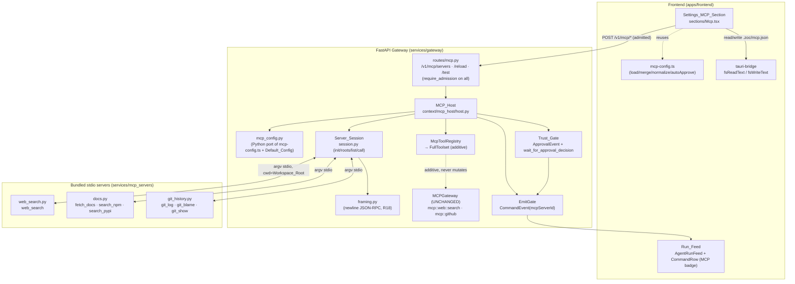
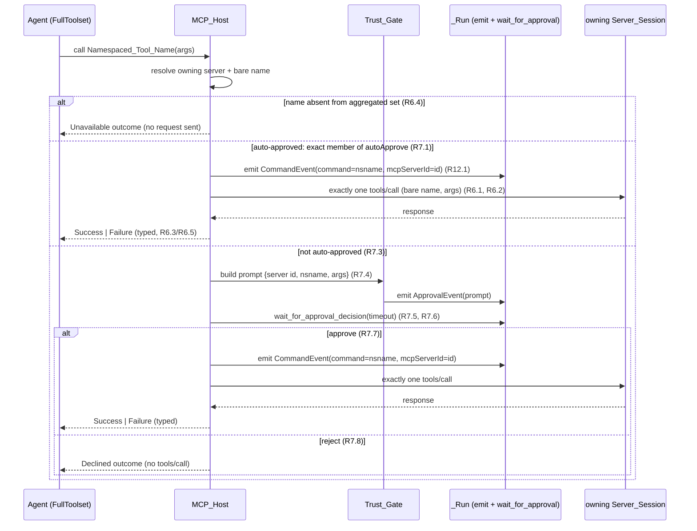

# Design Document — MCP Host and Servers (Part 4)

## Overview

This design turns the 18 requirements into a concrete build plan for **Part 4 — MCP Integration** over the existing FastAPI gateway (`services/gateway/src/zocai_gateway/`) and the preserved frontend (`apps/frontend/`). It delivers two coherent pieces:

- **4.1 — MCP_Host**: a generic, configuration-driven Model Context Protocol host that lives in the Gateway, starts enabled stdio servers, completes MCP initialization, discovers and aggregates tools under collision-free names, proxies tool calls through the existing approval gate, contains per-server crashes, exposes live server state, and surfaces MCP calls in the run feed.
- **4.2 — Bundled servers**: three net-new stdio MCP servers (`services/mcp_servers/web_search.py`, `docs.py`, `git_history.py`) registered in a shipped default configuration with their tools auto-approved per tool.

The whole feature is **additive**. The fixed `mcp::web::search` / `mcp::github` surface owned by `MCPGateway` (`context/mcp_gateway.py`) is neither modified nor removed; MCP_Host is a second, generic surface that coexists with it (R5.6, R5.7, R17.9).

### What already exists vs. what is net-new

| Area | Already exists (reuse) | Net-new (this spec) |
|------|------------------------|---------------------|
| Config model | `loadMcpServers` / `mergeMcpServers` / `parseMcpConfig` / `normalizeServer` / `detectTransport` / `isToolAutoApproved` in `apps/frontend/src/lib/mcp-config.ts` (workspace-over-user merge by `id`, per-tool `autoApprove`, `scope`, `disabled`) | A **Python port** of that normalization/merge in `context/mcp_host/mcp_config.py`, plus a built-in **Default_Config** base layer for the three bundled servers |
| Subprocess transport | `routes/lsp.py`: argv-only stdio spawn, `cwd` pinned to workspace, bidirectional JSON-RPC pump, `Protocol` seams (`LspProcess`/`LspWebSocket`/reader/writer), `SpawnProcess` factory, terminate+reap on close | `context/mcp_host/framing.py` (newline JSON-RPC framing, R18) and `context/mcp_host/session.py` (MCP `initialize`/`initialized`/`roots`/`tools/list`/`tools/call` over the same seam pattern) |
| Toolset seam | `Toolset` / `ReadOnlyToolset` / `FullToolset` in `toolsets.py` (workspace-confined native tools) | An `McpToolRegistry` attached additively to `FullToolset`; native entries untouched (R5.4) |
| Typed tool outcomes | `MCPError` / `MCPErrorKind` / result-or-error unions + `subprocess_web_search_spawner` seam in `context/mcp_gateway.py` | Parallel `ToolCallOutcome` / `TestOutcome` unions for the generic host (same "never raise, return a typed outcome" contract) |
| Approval path | `_Run.record_decision` / `_Run.wait_for_approval_decision` + `POST /v1/agent/decision` (`kind:"approval"`, `decision:"approve"|"reject"`) + `ApprovalEvent` twin + `ApprovalRow` | The MCP **Trust_Gate** that emits an `ApprovalEvent` and blocks on the existing waiter before a non-auto-approved `tools/call` |
| Admission | `require_admission` / `is_request_admitted` / `extract_credential` in `auth.py`, applied per route in `app.py` | A `routes/mcp.py` router with `Depends(require_admission)` on **every** `/v1/mcp/*` route |
| Run feed | `CommandEvent` twins (`agent_events.py` / `agent-events.ts`), `CommandRow` registered under `command` in `ROW_COMPONENTS` | Optional/nullable `mcp_server_id` / `mcpServerId` on both twins + an MCP badge on `CommandRow`; no new event kind |
| Settings | `features/settings/sections/Mcp.tsx` read-only preview; `tauri-bridge` `fsReadText`/`fsWriteText`; `gateway-client` `postJson` | Live status + add/edit/enable-disable/auto-approve/reload/test management in the same section |
| Bundled servers | none | `services/mcp_servers/{web_search,docs,git_history}.py` + a shared `_mcp.py` stdio-server scaffold |

### Resolved decisions honored by this design

- **Additive coexistence.** `MCPGateway` and its two fixed tools keep their exact result/timeout/termination/typed-error behavior; MCP_Host adds generic entries to `FullToolset` and never mutates non-MCP entries (R5.4–R5.7, R17.9).
- **One config model.** The existing `.zoc/mcp.json` `mcpServers` shape, workspace-over-user precedence by `id`, per-tool `autoApprove`, `scope`, and `disabled` are reused verbatim; there is **no** per-server `trusted` bypass and **no** adoption of `~/.zoc-studio/mcp_servers.json` (R1, R7.10, R7.11).
- **One approval channel.** Non-auto-approved calls reuse `ApprovalEvent` + `POST /v1/agent/decision` + `_Run.wait_for_approval_decision`; nothing new is added to the decision transport (R7).
- **One run-feed contract.** MCP calls reuse the `command` kind with an optional `mcpServerId`; the Python model is the source of truth and the TS twin is regenerated with `pnpm schema:generate` (R12).
- **stdio-only live v1.** Only enabled `stdio` servers open a live session. `sse`/`http` definitions stay visible with `stopped` status and make zero network attempts (R3).
- **Admission on every MCP route.** `require_admission` guards all `/v1/mcp/*` routes on the existing listener; a rejected request has no side effect (R10).
- **Untrusted output + confinement.** MCP tool output is untrusted tool-result data only; spawns are argv-only; processes are always terminated and reaped; the git server is fail-closed confined to `Workspace_Root` (R9, R16).

## Architecture

### System context



### Module layout (net-new)

```
services/gateway/src/zocai_gateway/
  context/mcp_host/
    __init__.py
    models.py        # ServerDefinition, McpToolRecord, ServerStatus, ToolCallOutcome, TestOutcome
    mcp_config.py    # Python port of mcp-config.ts normalization/merge + Default_Config + validity filter
    framing.py       # encode_message / decode_line / read_message  (newline JSON-RPC, R18)
    session.py       # Server_Session: spawn seam, initialize/initialized/roots/tools/list/tools/call
    registry.py      # McpToolRegistry (atomic per-server tool subset; view for FullToolset)
    trust.py         # is_auto_approved (exact membership) + approval-prompt builder
    host.py          # MCP_Host: load/merge/reload, lifecycle SM, aggregation, proxy, crash isolation, shutdown
  routes/
    mcp.py           # /v1/mcp/servers, /v1/mcp/reload, /v1/mcp/test  (Depends(require_admission))
  toolsets.py        # + optional McpToolRegistry seam on FullToolset (additive)

services/mcp_servers/
  __init__.py
  _mcp.py            # shared stdio MCP server scaffold (server-side framing + init/list/call/roots loop)
  web_search.py      # web_search
  docs.py            # fetch_docs, search_npm, search_pypi
  git_history.py     # git_log, git_blame, git_show
```

### Per-server lifecycle state machine

Each server in MCP_Config owns exactly one runtime state. `Server_Status ∈ {running, stopped, error(reason)}` (R13.18). Transitions are per-server and independent, so one server's failure never moves another (R2.14, R4.9, R8.3).

```mermaid
stateDiagram-v2
    [*] --> stopped
    stopped --> stopped: disabled (R3.2) / sse|http enabled (R3.3, no network R3.6)
    stopped --> spawning: enabled stdio (R3.1)
    spawning --> error: spawn fails (R2.9, category=spawn)
    spawning --> initializing: process created; send initialize (R2.4)
    initializing --> error: invalid/failed handshake (R2.10) or startup timeout (R2.11)
    initializing --> discovering: valid initialize response → notifications/initialized → tools/list (R2.7, R2.8)
    discovering --> running: tools/list ok → aggregate subset (R4.4, R4.5) / empty → clear subset, stay running (R4.6)
    discovering --> error: invalid/failed/timeout list → drop subset + close session (R4.7, R4.8)
    running --> error: Server_Crash (exit / stdout EOF / unrecoverable) → drop only this subset (R8.1, R8.2, R18.5)
    error --> spawning: reload re-enables/replaces (R1.14)
    running --> stopped: reload removes/disables (R1.12); shutdown terminate+reap (R9.3, R9.4)

    note right of error
      On any startup failure: if a process was created,
      terminate + reap it (R2.12) and close every other
      resource for the failed session (R2.13).
    end note
```



### Tool-call request flow (with Trust_Gate)



### Key design decisions and rationale

- **Files remain the source of truth; the host reads them on load/reload.** Settings writes `.zoc/mcp.json` through the Tauri bridge (`fsWriteText`), then calls `POST /v1/mcp/reload`; MCP_Host re-reads User_MCP_Config and Workspace_MCP_Config and recomputes MCP_Config (R1.11, R13.6–R13.12). This preserves the established `mcp.json` model and avoids a second write path.
- **Default_Config is a built-in base layer, not a file mutation.** The three bundled servers are seeded by the host as a base layer beneath User then Workspace (precedence `Workspace > User > Default` by `id`). A workspace entry with the same `id` fully replaces the default (same replace-by-`id` rule as R1.2), so a Developer can disable a bundled server or trim its `autoApprove` without editing shipped files (R17.1–R17.7, R17.6). The bundled definitions are never written into the user's workspace, so upgrades stay in sync.
- **Namespacing is an injective encoding.** `Namespaced_Tool_Name = "mcp::" + esc(server_id) + "::" + esc(bare_name)` where `esc` escapes `\`→`\\` and `:`→`\:`. Because `esc` is reversible, distinct `(server_id, bare_name)` pairs always map to distinct names, which gives collision-freedom by construction even when two servers expose the same bare name (R4.1, R4.2). The generic aggregation is a separate registry from the fixed `MCPGateway` tools, so the fixed names are untouched (R5.6).
- **The Trust_Gate reuses the run channel, not a new one.** MCP_Host holds a per-call context `(emit, wait_for_approval)` bound from the active `_Run` (the same `wait_for_approval_decision` the pipeline already threads into `execute_run`). Auto-approval is decided purely by exact, case-sensitive, whole-string membership in the owning server's `autoApprove` — the Python twin of `isToolAutoApproved` — and a `trusted` field, if present, is ignored (R7.1–R7.3, R7.10, R7.11).
- **Two-level error model.** *Transport/host* failures (spawn, handshake, timeout, crash, unavailable tool, per-call wall-clock timeout) become a typed `ToolCallOutcome` and never raise into the run (R6.5–R6.8, R8). *Tool-level* failures reported by a healthy server (e.g., git non-zero exit, web-search exhausted) come back as a normal `tools/call` response whose MCP result carries `isError`, which the host returns as a Success outcome whose content is the server's error payload (R6.3). This mirrors `MCPGateway`'s "never raise, return an outcome" contract.
- **Newline framing, not Content-Length.** MCP stdio uses one JSON serialization + one `\n` per message (R18.1), unlike the LSP `Content-Length` framing in `lsp.py`; the seam pattern (argv spawn, `Protocol` transport, terminate+reap) is reused but the framing module is MCP-specific.
- **Candidate test is fully isolated.** `POST /v1/mcp/test` runs startup→handshake→discovery on a throwaway session and never touches live config, sessions, statuses, the registry, or `FullToolset`, even when the candidate `id` equals a live server `id` (R11.10, R11.11).

## Components and Interfaces

### `context/mcp_host/framing.py` — stdio JSON-RPC framing (R18)

Pure functions plus a reader over the same `AsyncByteReader` seam shape used by `lsp.py`.

```python
JsonRpcMessage = dict[str, object]  # one JSON object

def encode_message(message: JsonRpcMessage) -> bytes:
    """One compact JSON serialization + one '\n'. json.dumps never emits a raw
    newline (embedded '\n' in strings is escaped as '\\n'), so the framed line
    contains exactly one message and one terminator (R18.1)."""

def decode_line(line: bytes | str) -> JsonRpcMessage | None:
    """Strip the single trailing newline and json.loads the remainder. Returns
    the message only when it decodes to exactly one JSON object; a malformed
    line or a non-object (array/scalar) returns None (R18.2, R18.4)."""

async def read_message(reader: AsyncByteReader) -> JsonRpcMessage | None | EOF:
    """Read one line; EOF (b'') → EOF sentinel (R18.5, drives Server_Crash);
    a line that decode_line rejects → skip and keep reading (R18.4)."""
```

### `context/mcp_host/session.py` — Server_Session (R2, R4, R6, R9, R18)

Owns one live stdio connection. Transport is injected exactly like `lsp.py`'s `SpawnProcess` so tests drive it with an in-process fake process — no real subprocess or network.

```python
SpawnProcess = Callable[[Sequence[str], Path, Mapping[str, str]], Awaitable[McpProcess]]

async def default_spawn(argv, cwd, env) -> McpProcess:
    # asyncio.create_subprocess_exec(*argv, cwd=cwd, env=env,
    #   stdin=PIPE, stdout=PIPE, stderr=DEVNULL); argv is a list, never a shell string (R9.1)

class ServerSession:
    async def start(self) -> None: ...           # spawn (R2.1-2.3); env overlay on os.environ (R2.2)
    async def initialize(self, timeout) -> None:  # send initialize; only after a valid response
        ...                                       # send notifications/initialized then allow tools/list (R2.4-2.8)
    async def handle_roots_request(self) -> list: # answer roots/list with Workspace_Root (R2.6)
        ...
    async def list_tools(self, timeout) -> list[RawTool]: ...   # tools/list (R4)
    async def call_tool(self, bare_name, arguments, timeout) -> JsonRpcMessage: ...  # one tools/call (R6.1)
    async def aclose(self) -> None:               # terminate + reap; idempotent (R9.3)
        ...
```

Ordering guarantee (R2.5): `initialize` sets an internal `initialized` flag only on receipt of the matching valid response; `notifications/initialized` and `tools/list` assert that flag, so neither is sent early. Every wire write goes through `framing.encode_message`; every read through `framing.read_message`, so a malformed server line is discarded and an EOF raises the crash path (R18.4, R18.5).

### `context/mcp_host/mcp_config.py` — config port + Default_Config (R1, R17)

A faithful Python port of `mcp-config.ts` so the two never drift; JSONC comments are stripped the same way (`stripJsonComments` twin).

```python
@dataclass(frozen=True)
class ServerDefinition:
    id: str
    transport: Literal["stdio", "sse", "http"]
    command: str | None
    args: tuple[str, ...]
    env: Mapping[str, str]
    url: str | None
    auto_approve: tuple[str, ...]
    disabled: bool
    scope: Literal["user", "workspace"]

def detect_transport(raw: Mapping) -> str: ...        # explicit type/transport wins; command→stdio; url→sse
def normalize_server(id, raw, scope) -> ServerDefinition | None:
    # stdio requires non-empty command; sse/http require non-empty url; else invalid → None (R1.8)
def parse_config(text, scope) -> list[ServerDefinition]:
    # empty / invalid JSONC / missing or non-object mcpServers / empty map → [] (R1.9)
def merge(user, workspace) -> dict[str, ServerDefinition]:
    # workspace replaces the whole user definition by id (R1.2); disabled kept (R1.5)
def build_mcp_config(default, user_text, workspace_text) -> dict[str, ServerDefinition]:
    # precedence Workspace > User > Default; validity filter drops only invalid entries (R1.8, R1.10)

DEFAULT_CONFIG: tuple[ServerDefinition, ...]  # three bundled stdio servers, enabled, auto-approved (R17.1-R17.4)
def eligible_to_start(cfg) -> list[ServerDefinition]:
    # enabled stdio only; disabled excluded (R1.6); sse/http excluded from live start (R3.3)
```

`DEFAULT_CONFIG` argv for each bundled server is `[<python>, "-m", "mcp_servers.<name>"]`, `disabled=False`, `scope="workspace"`, with `auto_approve` = that server's tool names (R17.2–R17.4). No filesystem MCP server is registered (R17.8).

### `context/mcp_host/registry.py` — `McpToolRegistry` (R4, R5)

The single live view of aggregated tools, mutated atomically per server so a discovery or crash touches only one server's subset (R4.4, R4.6, R4.7, R8.2).

```python
class McpToolRegistry:
    def replace_server_tools(self, server_id, tools: list[McpToolRecord]) -> None: ...  # atomic swap (R4.4)
    def remove_server_tools(self, server_id) -> None: ...                                # atomic drop (R4.7, R8.2)
    def get(self, namespaced_name) -> McpToolRecord | None: ...
    def list(self) -> list[McpToolRecord]: ...   # namespaced name + input schema + description (R5.1, R5.2)
```

### `toolsets.py` — additive MCP seam on `FullToolset` (R5)

`FullToolset` gains an optional `mcp` reference; native methods (`read_file`, `write_file`, `run_shell`, `make_dir`, `delete_file`, `move_file`) are untouched (R5.4). MCP invocation is added **only** on `FullToolset` (the Agent path), matching the existing capability-gate: `ReadOnlyToolset` still physically lacks any action, so Ask Mode cannot invoke MCP tools.

```python
class FullToolset(Toolset):
    def __init__(self, workspace_root=".", *, mcp: McpCallSeam | None = None) -> None: ...
    def mcp_tools(self) -> list[McpToolRecord]:      # enumerate for the model (R5.1, R5.2)
        return self._mcp.list() if self._mcp else []
    async def call_mcp_tool(self, namespaced_name, arguments) -> ToolCallOutcome:
        # delegates to MCP_Host.proxy_tool_call with this run's (emit, wait_for_approval) (R5.5)
```

`McpCallSeam` binds the run channel: `proxy(namespaced_name, arguments) -> ToolCallOutcome`. Adding/removing MCP entries never alters non-MCP entries (R5.4); the fixed `MCPGateway` tools are a separate surface and stay intact (R5.6, R5.7).

### `context/mcp_host/host.py` — `MCP_Host` (R1–R10, R17)

```python
class MCPHost:
    def __init__(self, *, workspace_root, user_config_path, workspace_config_path,
                 registry, spawn=default_spawn, startup_timeout, discovery_timeout,
                 call_timeout): ...
    async def load(self) -> None: ...            # build MCP_Config + start eligible servers (R1.1, R2)
    async def reload(self) -> ReloadReport: ...  # recompute + diff: close removed/disabled/replaced then
                                                 #   start added/enabled; cleanup before replacement start (R1.11-1.14)
    def servers(self) -> list[ServerRuntimeState]:   # id, transport, scope, disabled, autoApprove, status (+reason) (R13.2)
    async def proxy_tool_call(self, namespaced_name, arguments, *, emit, wait_for_approval)
        -> ToolCallOutcome: ...                  # namespacing resolve → Trust_Gate → one tools/call (R6, R7, R12.1)
    async def test_candidate(self, raw_definition) -> TestOutcome: ...  # isolated (R11)
    async def aclose(self) -> None: ...          # terminate + reap every process (R9.4)
```

Startup runs each eligible server independently and concurrently; a failure sets that server's `error` state with a category (`spawn` / `handshake` / `startup-timeout`) and continues others (R2.9–R2.14). A crash detector on each session (process exit or stdout EOF) removes only that server's subset and records the reason (R8, R18.5).

### `routes/mcp.py` — admitted control surface (R10, R11, R13)

A router builder wired in `create_app` with `dependencies=[Depends(require_admission)]` on the router, so **every** `/v1/mcp/*` route is admitted before its handler runs and a rejected request performs no side effect (R10.1–R10.3, R10.5). It serves on the existing listener (no new interface, R10.5).

| Route | Purpose | Requirements |
|-------|---------|--------------|
| `GET /v1/mcp/servers` | List server runtime state for Settings | R13.1, R13.2, R13.18 |
| `POST /v1/mcp/reload` | Recompute MCP_Config and apply lifecycle diffs | R1.11–R1.14, R13.12, R13.13 |
| `POST /v1/mcp/test` | Test one candidate definition in isolation | R11 |

`POST /v1/mcp/test` accepts one raw candidate definition (R11.1); an invalid candidate returns a validation failure with no process/message/network (R11.2); a valid stdio candidate runs startup→handshake→discovery within the endpoint timeout and returns tool count + bare names, then terminates and reaps the candidate before responding (R11.3–R11.6, R11.8, R11.9); an sse/http candidate returns `unsupported-in-v1` with no network (R11.7).

### Shared-type contract change (R12)

`CommandEvent` gains one optional, nullable field. The Python model is the source of truth; the TS twin is regenerated with `pnpm schema:generate` (per `packages/shared-types/scripts/generate_ts.py`).

```python
# packages/shared-types/python/shared_schema/agent_events.py
class CommandEvent(BaseEvent):
    type: Literal["command"] = "command"
    command: str
    command_id: str | None = Field(default=None, alias="commandId")
    mcp_server_id: str | None = Field(default=None, alias="mcpServerId")  # NEW (R12.2)
    ...
```

```typescript
// packages/shared-types/typescript/src/agent-events.ts (regenerated)
export interface CommandEvent extends BaseEvent {
  type: "command";
  command: string;
  commandId?: string | null;
  mcpServerId?: string | null;   // NEW (R12.3)
  ...
}
```

Both twins accept the event when the field is omitted or null (R12.4); `command` stays the only kind for MCP calls, so no discriminator or `ROW_COMPONENTS` entry changes (R12.5, R12.8).

### Frontend — `CommandRow` MCP badge (R12.6, R12.7)

`CommandRow` reads `event.mcpServerId`. When non-null it renders an "MCP" badge plus the exact owning server `id` on the existing row; when omitted or null the native command row is unchanged. No new row component and no registry change (R12.7, R12.8).

### Frontend — `Settings_MCP_Section` management (R13)

The section moves from read-only preview to live management, reusing `mcp-config.ts` for parsing/merge/`autoApprove` and the Tauri bridge for workspace writes:

- **List** every definition in MCP_Config, including disabled and unsupported-live servers, showing `id`, transport, `scope`, `disabled`, `autoApprove`, and live `Server_Status` fetched from `GET /v1/mcp/servers` (R13.1, R13.2, R3.4, R8.8).
- **Add/Edit** form with `id`, transport, `disabled`, `autoApprove` fields; transport-conditional inputs — `command`/`args`/`env` for stdio, `url` for sse/http (R13.3–R13.5).
- **Writes** go only to Workspace_MCP_Config: a new/edited definition replaces only its own entry and preserves the rest; editing a user-scoped definition creates a complete workspace override with the same `id` rather than touching User_MCP_Config (R13.6–R13.9).
- **Enable/disable** and **autoApprove edits** update `disabled` / `autoApprove` in the workspace definition or override (R13.10, R13.11).
- After a successful write, request `POST /v1/mcp/reload` and show the resulting status; on validation/write/reload failure show the failure and do not present status as refreshed (R13.12–R13.14).
- **Test connection** sends the currently displayed definition (including unsaved values) to `POST /v1/mcp/test`, shows the outcome, writes nothing, requests no reload, and leaves every listed status unchanged (R13.15–R13.17).

### Bundled servers (R14, R15, R16) and `_mcp.py` scaffold

`services/mcp_servers/_mcp.py` provides the server side of the same newline JSON-RPC protocol: a blocking stdin/stdout loop that answers `initialize` (declaring capabilities), `notifications/initialized`, `roots/list` (echoing the host-provided workspace root), `tools/list` (from a registered tool table), and `tools/call` (dispatching to a handler). A handler returns either a normal result or an `isError` result (the tool-level failure envelope). All three servers use `httpx` for network and never launch a browser (R14.7, R14.8, R15.8).

- **`web_search.py`** — `web_search(query: str≠"", max_results: int>0 = 5)`: query the DuckDuckGo Instant Answer API first (no key); a usable entry has non-empty `title`, `url`, `snippet`; return ≤ `max_results` entries each with those three fields; on IA failure/parse-failure/zero-usable, fall back to the DuckDuckGo HTML results page parsed with regex; if the fallback also fails/parses-empty, return a typed tool failure naming the query (R14).
- **`docs.py`** — `fetch_docs(url: str)` returns page text with HTML markup removed by regex, or the raw page text unchanged if the regex step raises (R15.2, R15.3); `search_npm(package: str)` returns exactly `version`, `description`, `readme` from the npm registry; `search_pypi(package: str)` returns exactly `version`, `description` from PyPI; retrieval failure or absent package → typed tool failure naming the resource/package (R15.4–R15.9).
- **`git_history.py`** — `git_log(path?: str, n: int>0 = 10)`, `git_blame(file: str, line_start: int>0, line_end: int>0, 1-based inclusive)`, `git_show(sha: str)`: execute the local `git` binary from an argv with `cwd=Workspace_Root` (R16.9); every filesystem-path parameter is canonically resolved against `Workspace_Root` and fails closed if resolution fails or escapes (R16.10–R16.12); `line_start > line_end` → typed failure before invoking git (R16.5); git spawn failure or non-zero exit → typed failure (with git stderr on non-zero), each invocation isolated (R16.13–R16.16); the repository reachable from `Workspace_Root` is inspected without contacting any remote (R16.17). The confinement check mirrors `Toolset._resolve_within_workspace` in `toolsets.py`.

## Data Models

### Normalized server definition (mirrors `McpServer` in `mcp-config.ts`)

| Field | Type | Notes |
|-------|------|-------|
| `id` | `str` | `mcpServers` key; unique after merge |
| `transport` | `"stdio" \| "sse" \| "http"` | via `detect_transport` |
| `command` | `str \| None` | stdio only; non-empty required for validity (R1.8) |
| `args` | `tuple[str, ...]` | order + element boundaries preserved (R2.1) |
| `env` | `Mapping[str, str]` | string entries overlaid on inherited env (R2.2) |
| `url` | `str \| None` | sse/http only; non-empty required for validity (R1.8) |
| `auto_approve` | `tuple[str, ...]` | bare tool names; exact membership (R7.1) |
| `disabled` | `bool` | retained in config, excluded from start (R1.5, R1.6) |
| `scope` | `"user" \| "workspace"` | from source document (R1.4) |

### Tool record

| Field | Type | Notes |
|-------|------|-------|
| `server_id` | `str` | exact owning id (R4.3) |
| `bare_name` | `str` | exact tool name from `tools/list` (R4.3) |
| `namespaced_name` | `str` | `"mcp::"+esc(id)+"::"+esc(bare)`, injective (R4.1, R4.2) |
| `input_schema` | `Mapping[str, object]` | exact JSON schema (R4.3, R5.2) |
| `description` | `str \| None` | exact when server supplies one (R4.3) |

### Server runtime state

| Field | Type | Notes |
|-------|------|-------|
| `definition` | `ServerDefinition` | |
| `status` | `"running" \| "stopped" \| "error"` | only these three (R13.18) |
| `error_reason` | `str \| None` | present iff `error`; names the `id` + category (R2.9–R2.11, R8.1, R8.8) |
| `session` | `ServerSession \| None` | present only while live |

### Typed outcomes (parallel to `MCPError` in `mcp_gateway.py`)

```python
class ToolCallErrorKind(str, Enum):
    UNAVAILABLE = "unavailable"   # name not in aggregated set / session gone (R6.4, R6.6)
    TIMEOUT = "timeout"           # per-call wall-clock budget exceeded (R6.5, R9.2)
    FAILURE = "failure"           # transport failure / session failed mid-call (R6.5, R6.6)
    DECLINED = "declined"         # Trust_Gate rejected (R7.8)

@dataclass(frozen=True)
class ToolCallSuccess:  server_id: str; tool: str; result: Mapping[str, object]  # R6.3
@dataclass(frozen=True)
class ToolCallError:    server_id: str | None; tool: str; kind: ToolCallErrorKind; reason: str  # no partial content (R6.7)

ToolCallOutcome = ToolCallSuccess | ToolCallError
```

### Test outcome (R11)

```python
@dataclass(frozen=True)
class TestSuccess:      tool_count: int; bare_names: tuple[str, ...]   # count may be 0 (R11.4, R11.5)
@dataclass(frozen=True)
class TestValidationFailure: reason: str                              # no process/message/network (R11.2)
@dataclass(frozen=True)
class TestFailure:      reason: str                                   # startup/handshake/discovery/cleanup (R11.6, R11.9)
@dataclass(frozen=True)
class TestUnsupported:  transport: Literal["sse", "http"]             # no network (R11.7)

TestOutcome = TestSuccess | TestValidationFailure | TestFailure | TestUnsupported
```

### Event contract

`CommandEvent` + optional/nullable `mcp_server_id` (alias `mcpServerId`) on both twins; wire key camelCase; kind stays `command` (R12.2–R12.5).

## Correctness Properties

*A property is a characteristic or behavior that should hold true across all valid executions of a system — essentially, a formal statement about what the system should do. Properties serve as the bridge between human-readable specifications and machine-verifiable correctness guarantees.*

These properties are derived from the prework classification of each acceptance criterion. UI-rendering, schema/fixture, one-shot ordering, and integration criteria are covered by example/edge/integration tests in the Testing Strategy rather than by property-based tests; the properties below are the criteria that are genuinely universal over an input space.

### Property 1: Config merge precedence and scope

*For all* pairs of User_MCP_Config and Workspace_MCP_Config documents, the produced MCP_Config replaces the complete user definition for any shared server `id` with the complete workspace definition (no field-level blend), retains valid definitions from both, and labels every definition's `scope` as the document it originated from; recomputing from the same documents (reload) yields the same result.

**Validates: Requirements 1.1, 1.2, 1.4, 1.7, 1.11**

### Property 2: Config validity filtering

*For all* configuration documents — including empty, invalid-JSONC, missing/non-object `mcpServers`, empty `mcpServers`, and documents mixing valid entries with invalid ones (stdio without a non-empty `command`, sse/http without a non-empty `url`) — MCP_Config contains exactly the valid normalized definitions: only invalid entries are dropped, every other valid definition is retained, and two zero-yield documents produce an empty MCP_Config.

**Validates: Requirements 1.8, 1.9, 1.10**

### Property 3: Disabled definitions are retained but never started

*For all* MCP_Config sets, every valid `disabled` definition appears in MCP_Config and never appears in the set eligible to start.

**Validates: Requirements 1.5, 1.6**

### Property 4: Transport-based session classification

*For all* MCP_Config sets, a live session is attempted exactly for enabled `stdio` definitions; every `disabled` definition and every enabled `sse`/`http` definition is assigned `stopped` (never `error`) with no session opened, and zero network connection or request attempts are made for any `sse`/`http` definition.

**Validates: Requirements 3.1, 3.2, 3.3, 3.5, 3.6**

### Property 5: Argv integrity on spawn

*For all* stdio definitions, the spawn argument vector equals `[command, *args]` element-for-element with every element boundary preserved (arguments containing spaces stay single elements) and is passed as a direct executable invocation, never a shell command string.

**Validates: Requirements 2.1, 9.1**

### Property 6: Environment overlay preservation

*For all* inherited process environments and configured `env` maps, the spawned process environment equals the inherited environment updated by the configured string entries, leaving every unrelated inherited entry unchanged.

**Validates: Requirements 2.2**

### Property 7: Initialize-handshake ordering

*For all* timings of a server's `initialize` response, the host sends neither `notifications/initialized` nor `tools/list` on that session until the corresponding valid `initialize` response has been received.

**Validates: Requirements 2.5**

### Property 8: Startup failure leaks no process

*For all* startup failures occurring after a process was created (spawn, handshake, or startup-timeout phase), the host terminates and reaps that process and closes every other resource created for the failed session before completing the failed outcome.

**Validates: Requirements 2.12, 2.13**

### Property 9: Independent per-server startup

*For all* sets of enabled stdio servers containing at least one server that fails to spawn or initialize, the host still attempts and completes startup for every other enabled server.

**Validates: Requirements 2.14**

### Property 10: Namespacing collision-freedom

*For all* distinct pairs of `(server_id, bare_tool_name)`, the assigned Namespaced_Tool_Names are distinct; in particular, equal bare tool names owned by different servers are assigned distinct Namespaced_Tool_Names.

**Validates: Requirements 4.1, 4.2**

### Property 11: Tool record preservation

*For all* discovered tools, the aggregated record preserves the exact owning server `id`, exact bare name, exact input schema, and exact description whenever the server supplies one.

**Validates: Requirements 4.3**

### Property 12: Aggregation atomicity and isolation

*For all* multi-server registry states and successful discovery results (including an empty tool list), the discovery replaces only the owning server's aggregated subset — an empty result clears that subset while the status stays `running`, a non-empty result sets it `running` — and leaves every other server's subset unchanged.

**Validates: Requirements 4.4, 4.5, 4.6, 4.9**

### Property 13: Discovery-failure tool removal and isolation

*For all* discovery faults (invalid response, failure, or discovery-timeout), the host removes every aggregated tool belonging to that server, sets its status `error`, closes its session, and leaves every other server's session, status, and tool subset unchanged.

**Validates: Requirements 4.7, 4.8, 4.9**

### Property 14: Additive toolset exposure and synchronization

*For all* registry states, `FullToolset` exposes exactly the aggregated MCP tools under their Namespaced_Tool_Names with their input schemas; mutating the aggregated set updates only the generic MCP entries and leaves every non-MCP toolset entry unchanged.

**Validates: Requirements 5.1, 5.2, 5.3, 5.4**

### Property 15: Single-owner call routing

*For all* invocations of an available Namespaced_Tool_Name, the host sends exactly one `tools/call` carrying the mapped bare name and supplied arguments to the mapped owning session, sends zero `tools/call` to any other session, and on a valid response returns exactly one success attributed to that owning server and tool.

**Validates: Requirements 6.1, 6.2, 6.3**

### Property 16: No partial result on failure

*For all* invocations that are unavailable, fail, exceed the per-call wall-clock timeout, or lose their owning session (including a crash while in flight), the host resolves the invocation exactly once with a single typed error that carries no partial content from the invocation.

**Validates: Requirements 6.4, 6.5, 6.6, 6.7, 8.6**

### Property 17: Failure containment

*For all* tool-call faults and server crashes, the host returns a typed outcome without raising an unhandled error into the agent run, and the run remains active.

**Validates: Requirements 6.8, 8.5**

### Property 18: AutoApprove exact-match gating

*For all* tools and owning `autoApprove` lists, the host proxies the call without emitting an Approval_Event if and only if the bare tool name is an exact, case-sensitive, whole-string member of the list; otherwise it emits an Approval_Event whose prompt identifies the owning server `id`, the Namespaced_Tool_Name, and the requested arguments, and sends no `tools/call` while the decision is pending. An absent or empty `autoApprove` list matches no tool, and a `trusted` field, if present, never changes this outcome.

**Validates: Requirements 7.1, 7.2, 7.3, 7.4, 7.6, 7.11**

### Property 19: Rejection yields a declined result without a call

*For all* non-auto-approved invocations that receive a `reject` decision, the host returns a typed declined result and sends no `tools/call`.

**Validates: Requirements 7.8**

### Property 20: Crash isolation

*For all* server crashes, the host removes only the affected server's tools and sets only its status to `error`, and leaves every other server's session, status, tools, and previously completed call outcomes unchanged.

**Validates: Requirements 8.2, 8.3, 8.4**

### Property 21: Process termination and reaping

*For all* sets of started sessions, closing a session or stopping the host terminates and reaps every associated process, and the operation is idempotent (reaping an already-finished process is a no-op).

**Validates: Requirements 9.3, 9.4**

### Property 22: MCP output remains untrusted

*For all* MCP tool outputs — including text shaped like an approval, a decision, or an MCP_Host control message, or text suggesting configuration changes, approvals, process spawning, or further tool calls — the Gateway incorporates the output only as untrusted tool-result data attributed to the owning server and tool, and never as a control-plane message or an approval/admission bypass.

**Validates: Requirements 9.6, 9.7**

### Property 23: Rejected admission has no side effect

*For all* `/v1/mcp/*` requests rejected by Request_Admission, no process, MCP request, network request, configuration, session, status, or toolset side effect occurs because of that request.

**Validates: Requirements 10.3**

### Property 24: Candidate test isolation

*For all* candidate definitions — valid stdio, invalid, or sse/http — running the MCP_Test_Endpoint leaves Workspace_MCP_Config, MCP_Config, live Server_Sessions, Server_Status values, aggregated MCP_Tools, and Agent_Toolset unchanged, even when the candidate `id` equals a live server `id`; an invalid candidate performs no process, message, or network attempt, and an sse/http candidate performs no network attempt.

**Validates: Requirements 11.2, 11.7, 11.10, 11.11**

### Property 25: MCP command-event emission

*For all* proxied tool calls, the host emits a Command_Event whose `command` equals the invoked Namespaced_Tool_Name and whose `mcpServerId` equals the exact owning server `id`.

**Validates: Requirements 12.1**

### Property 26: Settings write preservation and override

*For all* workspace configuration documents and any single server change, the write replaces only the targeted Workspace_MCP_Config entry and preserves every other workspace entry unchanged; editing a user-scoped definition writes a complete workspace override with the same server `id` and does not modify User_MCP_Config.

**Validates: Requirements 13.8, 13.9**

### Property 27: Web search result validity and cap

*For all* candidate result sets and `max_results` values, every entry `web_search` returns has a non-empty `title`, `url`, and `snippet`, and the number of returned entries is no greater than `max_results`.

**Validates: Requirements 14.3, 14.4, 14.5**

### Property 28: Docs HTML markup removal

*For all* retrieved pages where regular-expression markup removal succeeds, the text `fetch_docs` returns contains no HTML tags.

**Validates: Requirements 15.2**

### Property 29: Package metadata exact projection

*For all* npm package metadata payloads, `search_npm` returns exactly the `version`, `description`, and `readme` fields; *for all* PyPI package metadata payloads, `search_pypi` returns exactly the `version` and `description` fields.

**Validates: Requirements 15.5, 15.7**

### Property 30: Git argv and workspace confinement

*For all* git tool invocations, git is executed from an argument vector with working directory Workspace_Root, and every filesystem-path parameter is canonically resolved against Workspace_Root before any git process is started; if canonical resolution fails or resolves outside Workspace_Root, the invocation returns a typed tool failure and starts no git process.

**Validates: Requirements 16.2, 16.9, 16.10, 16.11, 16.12**

### Property 31: Git line-range validation before invocation

*For all* `git_blame` invocations where `line_start` exceeds `line_end`, the server returns a typed tool failure and never invokes git.

**Validates: Requirements 16.5**

### Property 32: Git log entry cap

*For all* `git_log` invocations with limit `n`, the server returns no more than `n` commit log entries.

**Validates: Requirements 16.3**

### Property 33: Git per-invocation failure isolation

*For all* sequences of git tool invocations in which one invocation fails (confinement rejection, git spawn failure, or non-zero exit), the availability and outcomes of every other invocation are unaffected.

**Validates: Requirements 16.13, 16.16**

### Property 34: stdio framing round-trip equality

*For all* valid JSON-RPC messages, encoding then decoding produces a message equal to the original under JSON value equality; the encoding is exactly one JSON serialization followed by one newline with no embedded newline, and decoding a complete framed line yields exactly one message.

**Validates: Requirements 18.1, 18.2, 18.3**

### Property 35: Malformed-line discard keeps the session open

*For all* input streams that interleave malformed lines (non-JSON, non-object, or not exactly one valid message) with valid framed lines, the host discards each malformed line, keeps the session open, and still decodes every valid message.

**Validates: Requirements 18.4**

## Error Handling

MCP_Host follows the "never raise into the run; return a typed outcome" contract already established by `MCPGateway`. Errors are handled at two distinct levels.

### Two-level error model

- **Transport / host errors** — spawn failure, handshake failure, startup timeout, discovery fault, per-call wall-clock timeout, crash, and unavailable tool — become a typed value: a `ServerRuntimeState` in `error` status (with a reason naming the server `id` and a category) for lifecycle faults, and a `ToolCallError` for call faults. These never propagate as exceptions into the agent run (Property 16, Property 17).
- **Tool-level errors** — reported by a healthy server through a normal `tools/call` response whose MCP result sets `isError` (e.g., git non-zero exit with stderr, exhausted web-search fallback, absent npm/PyPI package) — are returned to the agent as a `ToolCallSuccess` whose content is the server's error payload attributed to the owning server and tool. The transport succeeded; the tool signalled a domain failure.

### Failure categories and responses

| Failure | Detection | Response | Requirements |
|---------|-----------|----------|--------------|
| Process spawn fails | `default_spawn` raises (e.g. `FileNotFoundError`, `PermissionError`) | Status `error` (category `spawn`) naming `id`; nothing to reap | 2.9, 2.12 |
| Handshake invalid/failed | Invalid `initialize` response before timeout | Status `error` (category `handshake`); terminate+reap process; close resources | 2.10, 2.12, 2.13 |
| Startup timeout | No valid `initialize` response within `startup_timeout` | Status `error` (category `startup-timeout`); terminate+reap; close resources | 2.11, 2.12, 2.13 |
| Discovery invalid/failed/timeout | Bad/failed/late `tools/list` | Remove server subset; status `error`; close session; others unchanged | 4.7, 4.8, 4.9 |
| Unavailable tool | Name not in aggregated set / session gone | `ToolCallError(UNAVAILABLE)`; no request sent | 6.4, 6.6, 8.7 |
| Call fails / times out | Transport error or per-call `call_timeout` exceeded | `ToolCallError(TIMEOUT|FAILURE)` naming owner+tool; no partial content | 6.5, 6.7, 9.2 |
| Rejected approval | `reject` decision | `ToolCallError(DECLINED)`; no `tools/call` | 7.8 |
| Server crash | Process exit / stdout EOF / unrecoverable session | Status `error` (crash category); remove only that subset; run stays active; in-flight call → single typed failure | 8.1–8.6, 18.5 |
| Malformed server line | `decode_line` returns `None` | Discard line; keep session open | 18.4 |
| Admission rejected | `is_request_admitted` false | HTTP 401 before handler; zero side effects | 10.2, 10.3 |
| Invalid candidate | `normalize_server` returns `None` | `TestValidationFailure`; no process/message/network | 11.2 |
| Candidate cleanup fails | terminate/reap raises | `TestFailure` identifying the cleanup failure | 11.9 |
| Git confinement fail | Resolution fails / escapes Workspace_Root | Typed tool failure; git never invoked; other invocations unaffected | 16.11, 16.13 |
| Git spawn/non-zero | Process fails to start / exits non-zero | Typed tool failure (with git stderr on non-zero); other invocations unaffected | 16.14–16.16 |
| Bundled retrieval fail | httpx error / empty parse / absent package | Typed tool failure naming the query/resource/package | 14.9, 15.9 |

### Crash and cleanup isolation

Every process is owned by exactly one `ServerSession`; `aclose()` is idempotent and always terminates then reaps (bounded wait, then kill), mirroring `lsp.py`'s `_terminate` + bounded `wait_for`. Host shutdown closes every session, so no orphan process survives (Property 21). A crash removes only the affected server's registry subset and status, never touching peers (Property 20), and the run continues (Property 17). Cleanup failures during candidate testing surface as a `TestFailure` rather than a leaked process (R11.9).

### Prompt-injection resistance

MCP tool output is always classified as untrusted tool-result data attributed to its owning server and tool. Text that looks like an approval, a decision, or an MCP_Host control message — or that suggests configuration changes, spawning, approvals, or further tool calls — is never interpreted as a control-plane message; any such action still passes the ordinary configuration controls, `require_admission`, and the Trust_Gate (Property 22, R9.5–R9.7).

## Testing Strategy

### Dual approach

- **Property-based tests** verify the 35 universal properties above across generated inputs (config documents, tool sets, argv/env maps, JSON-RPC messages, failure modes, HTML/metadata payloads, git path parameters).
- **Unit / example tests** cover specific scenarios, ordering steps, schema shapes, and error messages that are not universal: the initialize→initialized→tools/list ordering steps (R2.4, R2.7, R2.8), roots answer (R2.6), each startup error category's reason text (R2.9–R2.11), status-`running` on success (R4.5), the fixed-tool coexistence regression (R5.6, R5.7), pending/approve steps (R7.5, R7.7), candidate phase ordering and success/zero-tool/failure outcomes (R11.3–R11.6, R11.9), and the bundled-server fallbacks and error messages (R14.6, R14.9, R15.3, R15.9, R16.14, R16.15).
- **Integration / smoke tests** cover wiring that does not vary with input: admission wiring and 401 on every `/v1/mcp/*` route (R10.1, R10.2, R10.4, R10.5), the single-listener guarantee (R10.5), and Default_Config registration/auto-approval and fixed-tool preservation (R17).
- **Frontend component tests** cover the Settings management surface (R13.1–R13.18) and the `CommandRow` MCP badge (R12.6, R12.7), plus the existing `ROW_COMPONENTS` totality test which must stay green after the additive contract change (R12.5, R12.8).
- **Cross-language contract tests** validate the `CommandEvent` twin: the Python model accepts payloads with and without `mcpServerId` and serializes the camelCase alias (R12.2, R12.4), and the regenerated TypeScript twin declares `mcpServerId?: string | null` (R12.3). A schema-drift check (`pnpm schema:generate` produces no diff) guards against divergence.

### Property-based testing libraries and configuration

- **Python** (MCP_Host, sessions, config, framing, bundled servers): **Hypothesis**. Do not hand-roll generators of randomness; use Hypothesis strategies. Transport, subprocess, network (`httpx`), clock, and git execution are exercised through the injected `SpawnProcess` / client / clock / runner seams with in-process fakes, so property tests make no real subprocess, network, or git calls.
- **Frontend** (`mcp-config.ts` parity checks, Settings write/override logic, `CommandRow`): **fast-check**.
- Each property-based test runs a **minimum of 100 iterations** (Hypothesis `max_examples>=100`; fast-check `{ numRuns: 200 }`).
- Each correctness property is implemented by **exactly one** property-based test, tagged with a comment in the format:
  **Feature: mcp-host-and-servers, Property {number}: {property_text}**
- The stdio framing round trip (Property 34) is the mandatory parser/serializer round-trip test; the config merge/validity properties (1, 2) and the git confinement property (30) are the highest-value host properties and are implemented first.

### Test seams (no real I/O)

- **Subprocess**: the `SpawnProcess` factory returns a fake `McpProcess` with scripted stdout framing, controllable exit/EOF, and recorded argv/cwd/env — the same seam style as `routes/lsp.py` tests.
- **Approval**: a fake `(emit, wait_for_approval)` pair records emitted `ApprovalEvent`/`CommandEvent` payloads and returns scripted decisions, matching `_Run.wait_for_approval_decision`.
- **Network**: bundled-server tests inject a fake `httpx` client returning scripted Instant-Answer / HTML / npm / PyPI payloads; no test hits the network.
- **Git**: the git runner is injected so path resolution and argv/cwd are asserted without a real repository, and confinement, spawn-failure, and non-zero-exit outcomes are scripted.
- **Clock**: startup, discovery, and per-call timeouts use an injected clock so timeout properties are deterministic.

### Requirements-to-design traceability

| Requirement | Design elements | Properties |
|-------------|-----------------|------------|
| 1 Config load/merge/reload | `mcp_config.py` (`build_mcp_config`, `merge`, `parse_config`, `eligible_to_start`); `POST /v1/mcp/reload` | 1, 2, 3 |
| 2 Start/initialize stdio | `session.py` (`start`/`initialize`); `host.py` startup | 5, 6, 7, 8, 9 |
| 3 stdio-only live | `host.py` transport classification | 4 |
| 4 Discover/aggregate | `session.list_tools`; `registry.py` | 10, 11, 12, 13 |
| 5 Additive toolset | `toolsets.FullToolset` + `McpToolRegistry` | 14 |
| 6 Proxy calls | `host.proxy_tool_call`; `ToolCallOutcome` | 15, 16, 17 |
| 7 Approval | `trust.py` + Trust_Gate over `_Run` | 18, 19 |
| 8 Crash containment | `host.py` crash detector | 16, 17, 20 |
| 9 Security boundaries | `default_spawn` (argv); `session.aclose`; untrusted output | 5, 21, 22 |
| 10 Admission | `routes/mcp.py` `Depends(require_admission)` | 23 |
| 11 Candidate test | `host.test_candidate`; `POST /v1/mcp/test` | 24 |
| 12 Command events | `agent_events.py`/`agent-events.ts` `mcpServerId`; `CommandRow` badge | 25 |
| 13 Settings management | `sections/Mcp.tsx`; `tauri-bridge`; `mcp-config.ts` | 26 |
| 14 Web search | `mcp_servers/web_search.py` | 27 |
| 15 Docs | `mcp_servers/docs.py` | 28, 29 |
| 16 Git history | `mcp_servers/git_history.py` | 30, 31, 32, 33 |
| 17 Register/auto-approve | `DEFAULT_CONFIG` | (example/integration; via 18) |
| 18 stdio framing | `framing.py` | 34, 35 |
