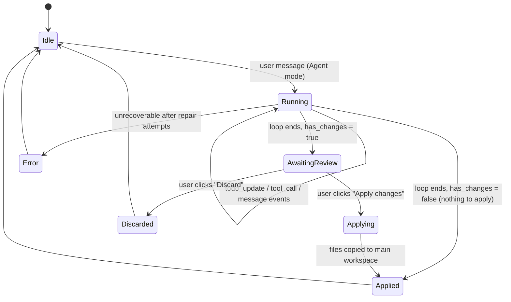
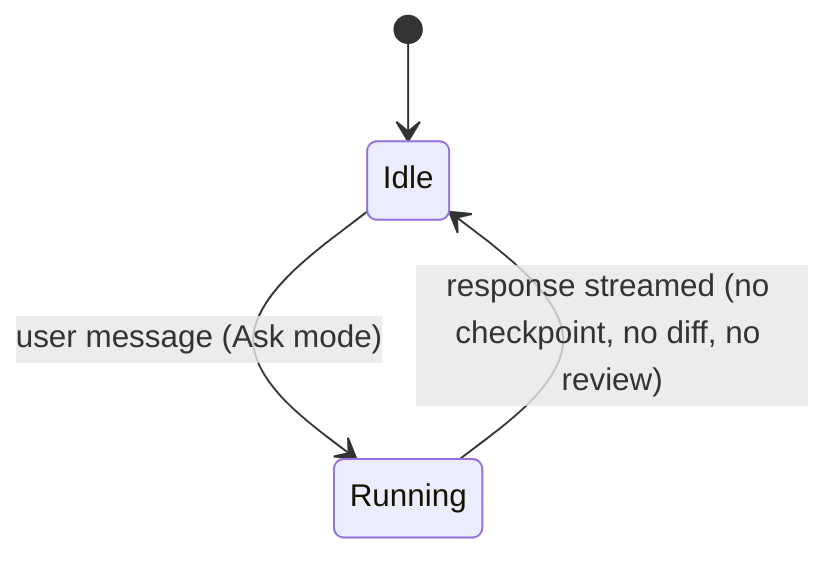

# Llama Studio Agent — Redesign Plan (Cursor / Claude Code Pattern)

**Goal:** Replace the current "Plan CRUD entity + separate Orchestrator loop" design with a single, unified, streaming "Agent Run" — the same mental model Cursor's Agent Mode, Claude Code's `TodoWrite`, and Cline's task list all converged on.

---

## Implementation Status (updated June 13, 2026)

**Rollout Step 1 — DONE (additive, nothing removed yet):**
- ✅ `TodoItem`, `TodoStatus`, `TodoUpdateEvent` added to shared schema (Python + TypeScript)
- ✅ `todo_write` tool schema + interception in `orchestrator._dispatch_tool` — emits `todo_update` SSE event with the full snapshot, never hits the filesystem
- ✅ System prompt nudges the LLM to call `todo_write` first with a request-specific checklist
- ✅ Frontend: `todo_update` handled in `store.consumeStream` → `todos` workflow item
- ✅ Frontend: `TodoListBlock` / `TodoRow` rendered in `AgentTimeline` (✓ completed, ◉ in-progress, ○ pending)

**Earlier fixes folded in (from bug-fix passes):**
- ✅ Plan no longer auto-approves on build verbs (`isBuildRequest` → `autoApprove: false`); only explicit approval phrases approve an existing draft plan
- ✅ Task-progress cards removed from the timeline (`case "task"` returns null)
- ✅ Generic `_task_specs` produces a single implementation task; no-diff gets one retry before failing
- ✅ Session auto-creation hardened (`ensureBackendSession`) — only when the id is genuinely empty, with graceful fallback for partial clients

**Rollout Step (partial) — Ask/Agent mode (DONE):**
- ✅ Backend: `mode="ask"` restricts the orchestrator to a read-only tool allowlist (`ASK_MODE_TOOLS`) — no write_file/apply_patch/run_command/run_tests
- ✅ Frontend: `agentMode: "ask" | "agent"` in the store; `buildRunAgentRequest` sends it as the `mode` param
- ✅ Ask mode short-circuits the plan/build workflow routing — pure read-only Q&A
- ✅ Composer: `[Plan] [Build]` text-prefix toggle replaced with an explicit `[Ask] [Agent]` mode toggle (no more `/plan ` string hack)

**Rollout Step — PR-style diff review (DONE):**
- ✅ Backend: orchestrator emits a `diff` event after every successful `write_file`/`apply_patch` (`_diff_patch_from_result`) — file changes are now visible per run
- ✅ Frontend: consecutive `diff` items group into one **"Review changes"** card (`DiffReviewCard`) with per-file collapsible diffs, total +/− counts, and `Apply changes` / `Discard` buttons wired to the existing patch apply/reject actions
- ✅ Dead code removed: `TaskBlock`, `Metric`, `ProgressBar`, `changedFileCount` (the old task-progress card) deleted from the timeline

**Figma:** MCP server connected and authenticated (`whoami` OK). `generate_figma_design` needs an existing file `fileKey` — awaiting a Figma file URL to generate + implement the visual redesign pixel-matched.

**Rollout Step — Part 3 lifecycle + Part 4 event model (DONE, additive):**
- ✅ Part 3: `run-machine.ts` extended with `awaiting_review → applying → applied` and `discarded` states + `await-review`/`apply`/`applied`/`discard` actions; `applied`/`discarded` are terminal and clear the run id. Existing properties (20/21/23/24/10/11) still hold; 3 new transition tests added.
- ✅ Part 4: new event types added to the shared schema (Python + TypeScript, in the `AgentEvent` union): `RunLifecycleEvent` (`run.started`, `run.context_ready`, `run.awaiting_review`, `run.applied`, `run.discarded`, `run.error`), `CheckpointCreatedEvent`, `DiffReadyEvent`.
- ✅ Orchestrator emits `run.started` / `run.context_ready` / `run.error` and, at run end, branches on whether files changed: `run.awaiting_review` + `diff.ready` (aggregated patches via `_aggregate_run_patches`) when there are changes, else `run.applied`. Emitted additively alongside the legacy `agent.*` events so nothing breaks.
- ✅ Frontend handles the new events as intentional no-ops during migration (the legacy `agent.*`/`diff` handlers still drive the UI) — documented in `applyAgentEvent`, no duplicate cards.

**Rollout Step — Part 5 unified AgentRunCard (DONE):**
- ✅ `groupRuns` second pass in `AgentTimeline` collapses a run's to-do + activity + review feed entries into ONE bordered **`AgentRunCard`** ("Agent run" header), reusing the existing sub-renderers so apply/discard/collapse behavior is unchanged.
- ✅ `FeedEntryView` shared renderer dispatches work/diffreview/run/item entries (used at top level and nested in the card).
- ✅ Conversational turns (messages, summaries, permission, errors) stay top-level; a lone activity row stays ungrouped to avoid noise.

**Verification:** 182 backend tests pass · 112 frontend tests pass · both typecheck clean.

**Still TODO (final collapse — Part 7 steps 5–6):** single `AgentRun` persistence entity replacing `ReplitPlan`/`ReplitTask`; checkpoint-on-first-write + rollback for the main agent run so the review card's **Discard** truly reverts direct writes (needs real `checkpoint.created` backing); then delete `_task_specs`/`_run_task`/`PlanBlock`/`/plans` CRUD and the legacy `agent.*` events once the new path is dogfooded.

---

## Part 1 — Root cause: you have two systems pretending to be one

Your 4 documented bugs aren't 4 separate bugs. They're 4 symptoms of one design flaw.

**System A — `ReplitPlan` / `ReplitTask`.** A CRUD pre-planning layer. `_task_specs()` looks at keywords in the prompt ("website? agent workflow? generic?") and writes out a *fixed template*: "Inspect → Implement → Validate." These are strings in a database row, generated **before** the LLM does anything. They have no connection to what the LLM will actually do.

**System B — `AgentOrchestrator`.** The real LLM tool-use loop. Calls `provider.chat()`, gets tool calls, dispatches `read_file` / `write_file` / etc., loops until the LLM stops calling tools.

The UI renders System A's steps as if they describe System B's execution. They don't. That mismatch is the root cause of all four bugs:

| Bug | Real cause |
|---|---|
| 1. SSE 404 on invalid session | Session lifecycle is owned by two systems at once, each assuming the other already created it |
| 2. Plan auto-approves immediately | The "approve" gate exists because System A *thinks* it's gating something dangerous — but System B already runs in an isolated copy, so there's nothing real to approve. The heuristic guessing "did the user approve?" is solving a problem that shouldn't exist |
| 3. Tasks always fail — "no diff produced" | System A pre-decided there'd be an "Inspect" task that only reads files. System B's validator then checks "did this produce a diff?" — of course not, inspecting was never supposed to write anything. The failure is baked into the template |
| 4. Task progress cards clutter the UI | These cards are System A's view of System B's work — a redundant second timeline |

**The fix:** collapse System A into System B. No separate "plan object" with its own approval lifecycle. One Agent Run. The agent plans *as part of* running, by maintaining its own live to-do list — and that to-do list **is** the UI.

---

## Part 2 — The new mental model

### 2.1 One object: `AgentRun`

Replace `ReplitPlan` + `ReplitTask` + the orchestrator's internal step bookkeeping with:

```
AgentRun
  id
  session_id
  mode: "ask" | "agent"
  status: "running" | "awaiting_review" | "applying" | "applied" | "discarded" | "error"
  todos: [{ id, content, status: "pending" | "in_progress" | "completed" }]   ← live, agent-authored
  activity: [ToolCallEvent...]                                                 ← streaming
  checkpoint_id: <git ref / snapshot id>
  diff: <aggregated unified diff, computed once at end of run>
  workspace: <isolated copy path>
```

### 2.2 Ask vs Agent — replaces the Plan/Build toggle

- **Ask** (read-only): tools = `read_file`, `grep_search`, `list_dir`, `web_search`. No writes, no checkpoint, no diff, no review step. Pure Q&A — Cursor's chat mode.
- **Agent** (full autonomy): runs immediately in an isolated workspace copy, with a checkpoint taken before the first write. All tools available.

This deletes the fragile `isBuildRequest` / approval-phrase string matching that causes Bug 2. There's no more "did the user approve the plan?" classification, because:

- Starting a run in the isolated copy is cheap and non-destructive → no approval needed to **start**.
- Applying results to the real workspace **is** the dangerous action → that's the one approval gate, and it's an explicit `Apply changes` button — never inferred from chat text.

### 2.3 Live, agent-authored to-do list — replaces the planner's static steps

This is the single highest-leverage change. It's Claude Code's `TodoWrite` pattern and Cursor's agent task list:

- The orchestrator exposes a `todo_write` tool to the LLM alongside `read_file` / `write_file` / etc.
- The system prompt nudges the LLM to call `todo_write` on its first turn with a checklist **specific to this request** — not a generic "Inspect/Implement/Validate" template.
- As the LLM works, it updates items (`pending → in_progress → completed`) via the same tool.
- Every `todo_write` call emits a `todo_update` SSE event. The UI just renders the latest `todos[]` snapshot — no separate "plan" rendering path.

For `"hi"` — the LLM's first `todo_write` is just `[{content: "Respond to greeting", status: "in_progress"}]`, immediately followed by a text reply and `completed`. No file diff. No failure — because the **agent itself** declared this needs no files, not a template that assumed otherwise.

For `"add dark mode toggle"` — the LLM might write `[{content: "Find theme provider"}, {content: "Add toggle component"}, {content: "Wire up theme context"}, {content: "Update styles"}]` and tick them off live as it actually does the work.

### 2.4 "No diff" stops being a failure mode

Whether a diff is *expected* is now derived from what actually happened, not asserted by a template:

- Zero `write_file` / `apply_patch` calls in `activity[]` AND no to-do items implied file changes → conversational response, `status: applied` (nothing to apply), no diff card at all.
- Write/patch calls happened but the resulting diff is empty (wrote identical content) → small inline note in the activity feed, **not** a separate red "Task progress: Failed" card.
- The repair loop (2 attempts) stays — scoped to "validation failed," never to "no diff for a step that was never supposed to produce one."

### 2.5 Checkpoints + PR-style diff review (Cursor pattern)

- Before the first `write_file` / `apply_patch` / `run_command` in a run: snapshot the isolated workspace (`git init` if needed → `git add -A` → `git commit -m "checkpoint"`). Cheap — it's already a throwaway copy.
- At end of run: compute one aggregated diff across all changed files (your existing `build_workspace_diff` already does this — just call it once, at the end, not per-task).
- Render as a single **"Review changes"** card: per-file diffs, collapsed by default, with `Apply All` / `Discard` / per-file checkboxes.
- `Apply` = copy changed files from isolated copy → main workspace (your Phase 5 apply logic already exists — just gate it on an explicit click instead of an inferred approval).
- Rollback = restore from the checkpoint commit. This finally makes "Checkpoints let you roll back" (already promised in your composer footer) real.

---

## Part 3 — New lifecycle (state machine)

### Agent mode



### Ask mode



Compare to today: `idle → draft → (auto)approved → queued → running → failed/done` per *task*, repeated 1–3 times per plan, with no single owner of "is this run actually finished?" The new model has exactly one run object with one status field.

---

## Part 4 — New SSE event model

| Old event | New event | Change |
|---|---|---|
| `agent.started` | `run.started` | renamed, now carries `mode` |
| `agent.context.loading` / `agent.context.ready` | `run.context_ready` | collapsed into one |
| `plan` | *(removed)* | no separate plan object |
| `plan_step` | `todo_update` | now carries the full `todos[]` array, agent-authored, fired any time the LLM calls `todo_write` |
| `message` | `message` | unchanged |
| `tool_call` | `tool_call` | unchanged |
| `diff` | `diff.ready` | now fired **once**, at run end, with the aggregated diff — not per task |
| `task.created` | *(removed)* | no `ReplitTask` entities |
| *(new)* | `checkpoint.created` | fired once, right before the first write tool call |
| `agent.completed` | `run.awaiting_review` \| `run.applied` \| `run.discarded` | run end now branches on `has_changes` |
| `done` | `done` | unchanged |
| `error` | `run.error` | renamed for clarity |

---

## Part 5 — New chat UI: one unified `AgentRunCard`

### Ask mode / trivial request ("hi") — no diff card at all

```
┌─────────────────────────────────────────────────────────────────┐
│  🤖 Agent              [Agent ▾]  ⊞ gemma-4-e2b-it.Q8_0 ▾    ⋮  │
├─────────────────────────────────────────────────────────────────┤
│                                          YOU  01:15 PM  👤      │
│                                              ┌──────────┐       │
│                                              │ hi       │       │
│                                              └──────────┘       │
│                                                                  │
│  ┌───────────────────────────────────────────────────────────┐  │
│  │ ● Agent run                              [Running…]        │  │
│  ├───────────────────────────────────────────────────────────┤  │
│  │  TO-DO                                                     │  │
│  │  ◉ Respond to greeting                       in progress   │  │
│  │                                                             │  │
│  │  ACTIVITY                                                  │  │
│  │  ▸ Read README.md                              (collapsed) │  │
│  └───────────────────────────────────────────────────────────┘  │
│                                                                  │
│  Hi! 👋 What would you like to work on?                          │
│                                                                  │
├─────────────────────────────────────────────────────────────────┤
│  Message the agent...                                           │
│  📎   [Ask] [Agent]   gemma-4-e2b-it.Q8_0 ▾   • High      ➤    │
│  Agent can make mistakes. Checkpoints let you roll back.        │
└─────────────────────────────────────────────────────────────────┘
```

The run completes, `todos` shows everything done, **no diff card renders** because `has_changes = false`. This is the exact case that's been failing as "no diff produced."

### Agent mode / real change request — mid-run

```
│  ┌───────────────────────────────────────────────────────────┐  │
│  │ ● Agent run                              [Running…]        │  │
│  ├───────────────────────────────────────────────────────────┤  │
│  │  TO-DO                                                     │  │
│  │  ✓ Find theme provider                                      │  │
│  │  ◉ Add toggle component                     in progress     │  │
│  │  ○ Wire up theme context                                    │  │
│  │  ○ Update styles                                             │  │
│  │                                                             │  │
│  │  ACTIVITY                                                  │  │
│  │  ✓ Read src/theme/ThemeProvider.tsx                         │  │
│  │  ✓ Write src/components/ThemeToggle.tsx           +42 −0    │  │
│  │  ▸ Run: npm run typecheck                   (running…)      │  │
│  └───────────────────────────────────────────────────────────┘  │
```

### Agent mode — run finished, awaiting review (replaces both old "Agent run" + "Task progress" cards)

```
│  ┌───────────────────────────────────────────────────────────┐  │
│  │ ✓ Review changes                       4 files · +86 −12  │  │
│  ├───────────────────────────────────────────────────────────┤  │
│  │  ☑ src/components/ThemeToggle.tsx           +42 −0    ▸   │  │
│  │  ☑ src/theme/ThemeProvider.tsx              +18 −4    ▸   │  │
│  │  ☑ src/styles/globals.css                   +20 −8    ▸   │  │
│  │  ☑ src/App.tsx                               +6 −0    ▸   │  │
│  │                                                             │  │
│  │  VALIDATION    ✓ typecheck   ✓ build   ✓ tests             │  │
│  │                                                             │  │
│  │              [Discard]      [Apply changes (4 files)]      │  │
│  └───────────────────────────────────────────────────────────┘  │
```

Key UI differences from today:
- **One card per run**, not "Agent run" + N "Task progress" cards.
- The TO-DO list *is* the plan — agent-written, live, specific to the request. No "Inspect/Implement/Validate" template ever shown.
- ACTIVITY feed is collapsible tool-call detail (this already exists as `ToolBlock` — reuse it).
- The diff/review card only appears **once**, **only if** changes exist, **after** the run completes — never mid-run, never duplicated.
- `[Plan] [Build]` → `[Ask] [Agent]`. No `/plan` text prefix — mode is an explicit param sent with the message.

---

## Part 6 — Line-by-line implementation plan

### Backend (in this order)

**1. `services/agent/src/llama_studio_agent/agent/orchestrator.py`**
- Add a `TODO_WRITE_TOOL` schema: `{name: "todo_write", input: {todos: [{content, status}]}}`.
- Extend the system prompt: *"Before doing anything else, call `todo_write` with a short checklist specific to this request. Update it as you complete each item."*
- In the dispatch loop, special-case `todo_write`: don't route it to the filesystem tool dispatcher — instead update `run.todos` in memory and emit a `todo_update` SSE event, then return a tool result like `"Todo list updated."` so the LLM continues normally.
- Track `has_changes`: set `True` the first time `write_file` / `apply_patch` / `run_command` (with side effects) is dispatched. On the **first** such call, trigger checkpoint creation (see #3) and emit `checkpoint.created`.
- Remove the call to `build_plan()` / any pre-generated step list — the to-do list now comes from the LLM itself via `todo_write`.

**2. `services/agent/src/llama_studio_agent/v1/agent_run.py`**
- `POST /agent/run`: create one `AgentRun` row (`mode`, `session_id`). For `mode="agent"`, call `prepare_workspace()` once (your existing `shutil.copytree`) to create the isolated copy — do this **before** opening the SSE stream, not per-task.
- On loop end: if `has_changes` → `build_workspace_diff()` once, store on `run.diff`, set `status="awaiting_review"`, emit `diff.ready`. If not → `status="applied"`, emit `run.applied` directly (no review step).
- New endpoint `POST /agent/runs/{run_id}/apply`: copy changed files from isolated copy → main workspace using the diff already computed; set `status="applied"`; emit `run.applied`.
- New endpoint `POST /agent/runs/{run_id}/discard`: `shutil.rmtree(isolated_copy)`; set `status="discarded"`; emit `run.discarded`.
- For `mode="ask"`: skip `prepare_workspace`, checkpoint, and diff entirely — orchestrator runs directly against the main workspace read-only tools.

**3. `services/agent/src/llama_studio_agent/agent/replit_workflow.py`**
- **Delete** `_task_specs()` — the keyword-based "website? agent workflow? generic?" template generator. This is the single biggest source of Bug 3.
- **Delete** `_run_task()` and the per-task `_validate_repair_loop()` — folded into the orchestrator's single end-of-run validation.
- **Keep** `prepare_workspace()`, `build_workspace_diff()`, `run_validation_suite()` — these are good primitives, just called once per run instead of once per task.
- **Add** `create_checkpoint(workspace_path) -> checkpoint_id`: `git init` (if absent) → `git add -A` → `git commit -m "checkpoint"`, return commit SHA.
- **Add** `apply_run(run, main_workspace_path)`: apply `run.diff` to `main_workspace_path` (file copy or `git apply`).
- **Add** `discard_run(run)`: remove the isolated copy.

**4. `services/agent/src/llama_studio_agent/v1/replit_workflow.py`**
- **Remove** the `POST /plans` route and all `ReplitPlan` / `ReplitTask` CRUD.
- Optional: add `GET /sessions/{id}/runs` returning past `AgentRun` summaries (for a run-history view) — repurposes the old plan-history concept without the CRUD/approval lifecycle.

**5. `services/agent/src/llama_studio_agent/agent/planner.py`**
- Either delete entirely, or repurpose its one LLM call as an *optional, non-blocking* Ask/Agent mode suggestion (pre-selects the toggle in the UI based on the prompt — purely cosmetic, never gates execution). Lowest priority; safe to leave for later.

### Frontend (in this order)

**6. `apps/frontend/src/lib/agent-client.ts`**
- Update the SSE handler switch to the new event names from Part 4 (`run.started`, `run.context_ready`, `todo_update`, `message`, `tool_call`, `checkpoint.created`, `diff.ready`, `run.awaiting_review`/`run.applied`/`run.discarded`, `run.error`, `done`).
- Remove handlers for `plan`, `plan_step`, `task.created`.
- Add `applyRun(runId)` and `discardRun(runId)` calling the new endpoints from #2.

**7. `apps/frontend/src/lib/run-machine.ts`**
- New states: `idle → running → (awaiting_review | applied | discarded) → idle`, plus `applying` and `error`. Remove `draft`, `approved`, and any per-task `queued`/`failed` states — there's only ever one run.

**8. `apps/frontend/src/lib/store.ts`**
- In `sendUserMessage(text)`: delete `planMatch` regex, `isBuildRequest`, the approval-phrase list, and `createReplitPlan`. Replace with: `runAgent(text, { mode: currentMode })` where `currentMode` is `"ask" | "agent"` from the Composer toggle — explicit, never inferred from text.
- Add `applyCurrentRun()` and `discardCurrentRun()` actions wired to #6.
- In the `agentItems[]` reducer: `todo_update` replaces `currentRun.todos` wholesale (it's always sent as a full snapshot); remove the `plan` / `plan_step` / `task.created` cases entirely.

**9. `apps/frontend/src/features/agent/AgentTimeline.tsx`**
- Remove `PlanBlock` and the task-progress card component entirely.
- Add `AgentRunCard` (one per run) containing:
  - `TodoList` — renders `todos[]`: `✓` completed, `◉` in_progress (spinner), `○` pending.
  - `ActivityFeed` — reuses the existing `ToolBlock` for each `tool_call`, collapsible.
  - `DiffReviewCard` — renders only when `status === "awaiting_review"`: per-file diffs (collapsed), checkboxes, `Apply changes` / `Discard` buttons calling the store actions from #8.
- Shrink the `AgentWorkflowItem` union to: `user_message`, `agent_message`, `agent_run` (single type covering todos+activity+diff for that run), `error`.

**10. `apps/frontend/src/features/agent/Composer.tsx`**
- Replace the `[Plan] [Build]` toggle with `[Ask] [Agent]`. Remove the `/plan ` text-prefix logic — the selected mode is passed as an explicit parameter to `sendUserMessage`, never encoded in the message string.
- Keep the model selector and effort selector (`• High`) as-is.

---

## Part 7 — Rollout order (additive first, so nothing breaks mid-migration)

1. Backend: add `todo_write` tool + `todo_update` event to the orchestrator, **alongside** the existing plan system (don't remove anything yet). Verify it streams correctly with a debug client.
2. Backend: add checkpoint creation + end-of-run aggregated diff + the new `apply`/`discard` endpoints, feature-flagged off by default.
3. Frontend: add `AgentRunCard` + `TodoList` + `DiffReviewCard` components, rendered **only** when the feature flag is on, so the old `PlanBlock`/task-progress UI keeps working for existing sessions.
4. Flip the feature flag on for new sessions only. Dogfood with real prompts ("hi", a real feature request) and confirm: no-diff conversational replies no longer show as failed, and real changes produce exactly one review card.
5. Once stable, delete `_task_specs`, `_run_task`, `PlanBlock`, the task-progress card, the `/plans` CRUD routes, and the Plan/Build toggle/`/plan` prefix logic.
6. Remove the feature flag.

---

## Part 8 — Bug-by-bug resolution

| Bug | Fixed by |
|---|---|
| 1. SSE 404 (invalid session) | Single `AgentRun` created by `POST /agent/run` owns session lifecycle end-to-end; no second system racing to create/check sessions |
| 2. Plan auto-approves immediately | No approval-to-*start* step exists anymore (isolated copy is safe by default); the only gate is the explicit `Apply changes` button on the review card |
| 3. "No diff produced" failures | To-do list is agent-authored per request, not a template assuming an "Inspect" step must write files; `has_changes=false` is a normal, successful end state, not a failure |
| 4. Task progress card clutter | Collapsed into the single `AgentRunCard` (to-do + activity + optional review card) — one card per run, always |
