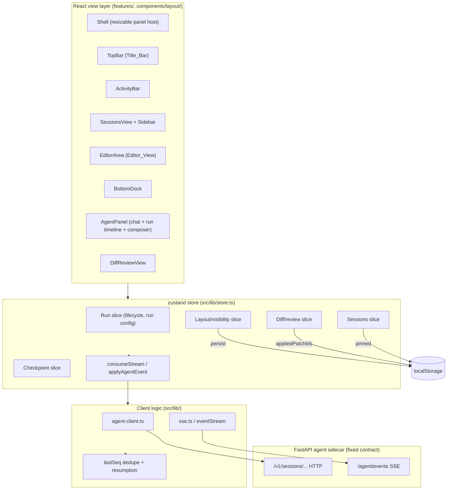
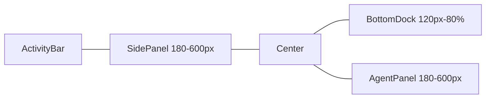

# Design Document

## Overview

This design redesigns the Zoc AI frontend (`apps/frontend`) to render the three Kombai
canvases at high fidelity and to harden the agent run workflow they depict. It is a **frontend +
client-logic** change: the React/Vite/TypeScript/Tailwind/shadcn app and the zustand store and
agent client that back it. The FastAPI agent sidecar contract (over HTTP/SSE to
`127.0.0.1:<port>`) and the `@zoc-studio/shared-types` schemas are treated as fixed inputs; this
design adapts the frontend to consume them correctly rather than changing them.

The work has four pillars, mapped to requirements:

1. **Visual design system** (R1, R2, R3, R5, R12) — promote the canvas colors, fonts, radii, and
   layout into named Design_Tokens and a resizable panel shell.
2. **Agent panel / chat experience** (R3, R4, R9) — a single rich Agent_Panel with run timeline,
   accurate progress, composer, and context indicators.
3. **Motion system** (R6) — formalize the existing CSS keyframes into a Motion_System gated behind
   `prefers-reduced-motion`.
4. **Workflow correctness** (R7, R8, R10, R11) — fix the run lifecycle, SSE ordering/resumption,
   diff apply/undo isolation, and checkpoint rollback.

### Grounding in the current implementation

Key facts established by reading the code, which this design builds on rather than reinventing:

- **State** lives in one zustand store, `src/lib/store.ts` (`useApp`). Run status today is three
  loosely-coupled flags — `streaming`, `isRunning`, `runId` — plus a module-scoped
  `currentAbort: AbortController`. There is no explicit lifecycle, no `paused`, and no discrete
  `error` state.
- **Networking** is in `src/lib/agent-client.ts`. `eventStream()` already opens the SSE connection
  before firing the trigger POST, passes `since_seq=<lastSeenForSession>`, sets a `Last-Event-ID`
  header, and tracks a per-session `lastSeq: Map<string, number>` for dedupe. There is **no**
  reconnection loop yet.
- **SSE parsing** is shared between `agent-client.ts` (inline) and `src/lib/sse.ts` (`sseJson`).
- **Diff state**: `pendingPatches: DiffPatch[]`, per-file `acceptedHunks`, and an
  `appliedPatchIds: Set<string>` persisted to `localStorage` (`zoc-studio.applied-patches.v1`).
  `applyPatch()` writes through the Tauri `applyPatch` command and filters the patch out of
  `pendingPatches` on success.
- **Layout**: `Shell.tsx` uses `react-resizable-panels` (`Group`/`Panel`/`Separator`). Sizes are
  percentages persisted to `localStorage` (`zoc-studio.layout.v2`) via `setLayoutSizes` and
  `sanitizeLayout`. Visibility flags `sidePanelOpen`/`rightPanelOpen`/`bottomDockOpen` are persisted.
- **Tokens**: `globals.css` already defines a `.dark` HSL token set close to the canvas palette, and
  `tailwind.config.ts` maps semantic Tailwind colors to those CSS variables. Many components,
  however, still use hard-coded hex literals (e.g. `#0E0E11`, `#9B6AF1`, `#FB923C` in `AgentPanel`).
- **Motion**: `globals.css` defines the keyframes (`orb-breathe`, `shimmer`, `fade-row`,
  `caret-blink`, `pulse-dot`, `typing-dot`, etc.) but has **no** `prefers-reduced-motion` block.
- **Tests**: vitest + `@testing-library/react` over jsdom, with `src/__tests__/setup.ts` shimming
  `matchMedia` (returns `matches:false`). No property-based testing library is installed yet.

### Confirmed bugs this design fixes

| # | Bug (verified in code) | Location | Fix in this design |
|---|---|---|---|
| 1 | Pause only flips local `isPaused` state; the run/stream keeps consuming events | `AgentPanel.tsx` `useState(isPaused)` | Lift pause/resume/stop into the store; pause gates event consumption (Run slice + buffer) |
| 2 | No `prefers-reduced-motion` handling despite many looping animations | `globals.css` | Motion_System with a reduced-motion media block and static state fallbacks |
| 3 | Autonomy hardcoded `"High"` (and color `#FB923C`); model only partially wired | `AgentPanel.tsx` run-control bar | Read Autonomy_Level and model from the active Run config |
| 4 | Run start mutates `runId` **before** aborting the previous controller (ordering bug) | `store.ts` `sendUserMessage` | Terminate the previous stream first, then assign the new run id |

## Architecture

### Layer diagram



### Architectural decisions

- **Single store, sliced by concern.** Rather than splitting `useApp` into multiple stores (which
  would break the existing `consumeStream` closure pattern and every selector call site), we keep
  one store and introduce a cohesive **Run slice** plus a typed `RunLifecycle` state. This is the
  smallest change that makes lifecycle correct (R7) while preserving the existing event-apply path.
- **Lifecycle is a frontend state machine.** The backend SSE contract has no pause/resume verb. So
  `paused` is implemented as **client-side gating**: while paused, incoming Agent_Events are buffered
  (not applied) and the highest-processed sequence number is held; resume drains the buffer and
  re-subscribes from `since_seq = highestProcessedSeq`. Stop aborts the controller and marks the
  stream terminated so late events are dropped (R7.3–R7.5, R8.8).
- **Sequence number is the single source of truth for ordering and resumption.** We keep the
  existing per-session `lastSeq` map but make it authoritative: every event carries `seq`; events
  with `seq <= highestProcessed` are discarded (R8.6, R8.7); reconnection always requests
  `since_seq = highestProcessed` (R8.9).
- **Apply/undo operate per file with no cross-file effects.** `applyPatch`/`rejectPatch` already key
  off a single `DiffPatch.id`; the design formalizes the isolation invariant (R10.1, R10.2) and the
  persisted applied-state (R10.6).
- **Tokens before pixels.** All canvas colors/fonts/radii are defined once as CSS variables and
  Tailwind theme tokens; components reference token classes, never raw hex (R1.3). Lint guidance
  flags new hex literals.
- **Motion is centralized and reduced-motion-first.** All animation utilities live in `globals.css`
  and are disabled in a single `@media (prefers-reduced-motion: reduce)` block; a `useReducedMotion`
  hook mirrors the preference into JS for components that swap animated nodes for static ones (R6).

## Components and Interfaces

### Layout shell (R3.1, R12)

`Shell.tsx` continues to host `react-resizable-panels`. Changes:

- **Bounds in pixels.** `Panel.minSize`/`maxSize` for the File_Explorer and Agent_Panel become
  `"180px"`/`"600px"`; the Bottom_Dock becomes `minSize="120px"` and `maxSize="80%"` (R12.7). This
  replaces today's `240px`/`34%`/`52%` values.
- **Visibility toggles** (`toggleSide`, `toggleRight`, `toggleBottom`) already exist and persist;
  toggle buttons in `TopBar` gain an explicit active/inactive visual state bound to the visibility
  flag (R12.5, R12.6). The center editor stays mounted across toggles (already true).
- **Persistence** of sizes (`onLayoutChanged` → `setLayoutSizes` → `persistLayout`) and visibility is
  retained; on restart `loadLayout()` restores both (R12.4, R12.8).



### Title_Bar (`TopBar.tsx`) (R1.4, R1.5, R3.2–R3.4)

- Fixed height becomes `38px` (currently `h-9`/36px) to match R1.4.
- Contains window controls, brand mark, **truncating** workspace path, git branch, centered
  command-palette entry, panel toggles, and the Run/Running control.
- The `RunningPill` reads elapsed time from the **Run slice** (`run.startedAt`) instead of a local
  `Date.now()` baseline, so the timer is accurate across remounts and formats as `HH:MM:SS` (R3.2).
  It ticks on a ≤1s interval (R3.3) and is removed within 1s of leaving `running` (R3.4) because it
  is driven by `run.lifecycle`.

### Agent_Panel (`AgentPanel.tsx`, `AgentTimeline.tsx`, `Composer.tsx`, `ContextBar.tsx`) (R4, R7, R9)

- **Header** (R4.1): agent identity, run-status indicator, overflow menu (`AgentMenu`). Idle shows
  the `ModelPicker` and an idle dot (R4.2); active shows `Planning`/`Building` (R4.3).
- **Run control bar** is rewritten to read the store, not local state:
  - `onPause` → `store.pauseRun()`, `onResume` → `store.resumeRun()`, `onStop` → `store.stopRun()`.
  - Button enabled/disabled and pause↔resume swap derive from `run.lifecycle` (R7.7, R7.8).
  - **Autonomy** badge reads `run.config.autonomy` (`Low|Medium|High`) with a token color, not the
    hardcoded `"High"`/`#FB923C` (R9.4, R9.7).
  - **Model** badge reads `run.config.model` (R9.5, R9.7).
- **Run_Timeline** (`AgentTimeline`) renders Plan steps and tool actions in execution order (R4.4):
  done → checkmark + elapsed seconds (R4.5); in-progress → spinner + shimmer (R4.6, R6.4); queued →
  queued indicator (R4.7); tool calls labeled `pending|running|succeeded|failed` (R8.3). New rows
  fade in (R6.3). Checkpoints appear inline ordered by creation time with a rollback control
  (R11.1).
- **Task summary + progress bar** (R4.8, R9): computed by a pure selector
  `planProgress(plan)` → `{ done, total, ratio }` (see Data Models). The bar fill equals
  `done/total` clamped to [0,1] (R9.2), is 0% with no steps (R9.6), and 100% when all done (R9.3).
- **Composer** (`Composer.tsx`) (R4.9–R4.14): message input bounded 1–10,000 chars; attachments;
  Plan/Build toggle; Autonomy selector (writes `run.config.autonomy`); send. Empty/whitespace send
  is rejected with feedback and no run action (R4.13). Submitting while a run is active stores a
  **pending queued message** rather than starting a run (R4.11); when the run reaches a terminal
  state and a queued message exists, a new run starts and the queue clears (R4.14).
- **Context indicator** (`ContextBar.tsx`) (R4.12, R4.15): shows `consumed/limit` ratio; enters a
  warning state at `consumed/limit >= 0.9`.

### Sessions view (`features/sessions/`) (R2)

- `SessionsView` renders Sessions_Sidebar + Sessions_Dashboard when the Sessions activity is active
  (R2.1).
- **Grouping** (R2.2, R2.3): pure function `groupSessions(sessions, pinned, now)` returns the four
  ordered buckets (Pinned, Today, Yesterday, Earlier this week), always present even when empty.
- **Stat cards** (R2.4) and **filter tabs with counts** (R2.5, R2.6): pure selectors over the
  session list; counts are non-negative integers showing `0` when empty.
- **Search** (R2.7): case-insensitive substring match on title or model metadata, via a pure
  `matchesSearch(session, query)`.
- **Sort** (R2.8): pure `sortSessions(list, option)` producing a deterministic (stable) order for
  identical data.
- **Actions**: Resume opens the workspace view (R2.9) or shows an error and stays on the dashboard
  on failure (R2.10); pin toggles + persists (`togglePinnedSession`, already persisted) (R2.11);
  delete removes + persists with rollback + error on failure (R2.12, R2.13); New session creates and
  activates (R2.14). Empty state when no cards match filter+search (R2.15).

### Diff-review (`DiffReviewView.tsx`) (R5, R10)

- Renders Diff_View, Review_Toolbar, and the File_Explorer change summary (R5.1).
- **Change summary** ("Review Pending"): pure `reviewSummary(patches)` →
  `{ files, adds, dels }` from `parseUnifiedDiff` (R5.2).
- **Diff_View** marks `+`/`−`/context with distinct token backgrounds (added
  `rgba(52,211,153,0.08)`, removed `rgba(248,113,113,0.08)`, active line `rgba(155,106,241,0.08)`)
  (R5.3).
- **Review_Toolbar** shows `Reviewing changes N of M` (1-based) and per-file add/remove counts
  (R5.4). Next/prev move selection and clamp at the ends (R5.5, R5.6, R5.9, R5.10) via pure
  `clampIndex`.
- **Apply file / Undo file** call `store.applyPatch(id)` / `store.rejectPatch(id)`; each removes the
  file from pending reviews and leaves others untouched (R5.7, R5.8, R10.1, R10.2). Apply failure
  retains the file and surfaces an error (R5.11, R10.5). All-reviewed empty state when pending
  becomes empty (R5.12, R10.4).

### Bottom_Dock (`BottomDock.tsx`) (R3.11, R3.12)

- Terminal / Problems / Logs tabs + agent-control toggle; toggle updates agent-control state and
  reflects within 1s (store-driven, synchronous render).

### Client / streaming layer (`agent-client.ts`, `sse.ts`) (R7, R8)

The `eventStream` generator is extended with a **reconnection wrapper** and explicit
**resumption** semantics. Public client interface is unchanged; internals add:

```ts
// agent-client.ts (additions)
interface SubscribeOptions {
  sessionId: string;
  sinceSeq: number;          // highest processed; resume point (R8.6)
  signal?: AbortSignal;
  maxReconnects?: number;    // default 5 (R8.9)
}

// Yields events with seq strictly increasing past sinceSeq; on a mid-run
// drop it re-subscribes from the latest highestProcessed up to maxReconnects,
// then throws a StreamLostError if all attempts fail (R8.9).
async function* resilientEventStream(opts: SubscribeOptions, trigger): AsyncIterable<AgentEvent>;
```

- `lastSeq` remains the per-session resume cursor and is updated only for events that are actually
  **processed** (applied), so buffered-but-not-applied events (during pause) do not advance it
  prematurely.
- Dedupe stays in the stream: any event with `seq <= lastSeq` is dropped before yielding (R8.7).

### Run lifecycle in the store (R7)

New store actions and the closure `currentAbort` are reorganized into a small controller:

```ts
type RunLifecycle = "idle" | "running" | "paused" | "stopped" | "completed" | "error";

interface RunState {
  lifecycle: RunLifecycle;
  runId: string | null;
  startedAt: number | null;          // ms epoch for elapsed time
  config: RunConfig;                 // autonomy + model (R9.4, R9.5)
  highestSeq: number;                // highest processed seq (R8.6)
  pausedBuffer: AgentEvent[];        // events received while paused (R7.3, R7.4)
  error: string | null;
}

interface RunActions {
  startRun(message: string): Promise<void>; // terminates previous first (R7.9, bug #4)
  pauseRun(): void;                          // gate consumption (R7.3, bug #1)
  resumeRun(): Promise<void>;                // drain buffer + re-subscribe (R7.4)
  stopRun(): void;                           // abort + mark terminated (R7.5, R8.8)
}
```

`startRun` ordering (fixes bug #4): **(1)** abort the previous controller and mark its stream
terminated; **(2)** set lifecycle `running` and assign a fresh `runId`; **(3)** open the stream.
This guarantees the previous run is `stopped` before the new id exists (R7.9).

## Data Models

These are frontend models. Backend types (`AgentEvent`, `Plan`, `PlanStep`, `Session`, `DiffPatch`,
`ReplitCheckpoint`, `ContextStatus`) come unchanged from `@zoc-studio/shared-types`.

### Run configuration and lifecycle

```ts
type AutonomyLevel = "Low" | "Medium" | "High";

interface RunConfig {
  autonomy: AutonomyLevel;   // R9.4 — replaces hardcoded "High"
  model: string;             // R9.5 — active model identifier
  mode: "plan" | "build";
}
```

### Plan-step status mapping

The shared `PlanStepStatus` is `pending | running | done | failed | repairing | skipped`. The
canvas/requirements vocabulary is `done | in_progress | queued`. The mapping used by the timeline and
progress selectors:

| Requirements term | shared PlanStepStatus | Timeline rendering |
|---|---|---|
| done | `done` | checkmark + elapsed s (R4.5) |
| in_progress | `running`, `repairing` | spinner + shimmer (R4.6) |
| queued | `pending` | queued dot (R4.7) |
| (failed) | `failed` | error icon |
| (skipped) | `skipped` | muted/struck |

`completedCount = steps.filter(s => s.status === "done").length` (R9.1).

### Progress selector (pure)

```ts
interface PlanProgress { done: number; total: number; ratio: number; } // ratio in [0,1]

function planProgress(plan: Plan | null): PlanProgress {
  const steps = plan?.steps ?? [];
  const total = steps.length;
  const done = steps.filter((s) => s.status === "done").length;
  const ratio = total > 0 ? Math.min(1, Math.max(0, done / total)) : 0; // R9.2, R9.6
  return { done, total, ratio };
}
```

### Pending review model

```ts
// pendingPatches: DiffPatch[] (existing)
interface ReviewSummary { files: number; adds: number; dels: number; }
// appliedPatchIds: Set<string> persisted to localStorage (existing, R10.6)
```

### Sessions view models (pure helpers)

```ts
type SessionFilter = "all" | "active" | "pinned" | "archived";
type SortOption = "recent" | "oldest" | "title" | "model";

interface SessionGroups {
  pinned: Session[]; today: Session[]; yesterday: Session[]; earlier: Session[];
}
```

### Pending queued message (R4.11, R4.14)

```ts
interface PendingComposerMessage { text: string; } // held in store while a run is active
```

### Layout / visibility (existing `LayoutState`, persisted)

`sidePanelOpen`, `rightPanelOpen`, `bottomDockOpen`, plus sizes; persisted under
`zoc-studio.layout.v2`. Pixel bounds enforced by the panel host (R12.7).

## Correctness Properties

*A property is a characteristic or behavior that should hold true across all valid executions of a
system — essentially, a formal statement about what the system should do. Properties serve as the
bridge between human-readable specifications and machine-verifiable correctness guarantees.*

The following properties were derived from the prework analysis and consolidated to remove
redundancy. Each targets pure logic (selectors, reducers, the lifecycle state machine, the
stream/dedupe layer, and persistence round-trips) so it can be exercised with generated inputs
independently of the DOM. Render-only, timing, and styling criteria are covered by example and
smoke tests in the Testing Strategy instead.

### Property 1: Session grouping is total and order-preserving

*For any* list of sessions and any set of pinned ids, `groupSessions` returns exactly the four
buckets in the order Pinned, Today, Yesterday, Earlier-this-week (none omitted, even when empty);
every pinned session appears only in the Pinned bucket and never in a recency bucket; and every
non-pinned session appears in exactly one recency bucket.

**Validates: Requirements 2.2, 2.3**

### Property 2: Session statistics and filter counts are non-negative integers matching their predicate

*For any* session data, each of the four stat-card values and each filter-tab count is a
non-negative integer, equals the number of sessions satisfying that card/tab predicate, and is `0`
when no session matches.

**Validates: Requirements 2.4, 2.5**

### Property 3: Filtering and search partition the session set correctly

*For any* session data, filter selection, and search query, the set of displayed Session_Cards
equals exactly the sessions for which `matchesFilter(session, filter)` and `matchesSearch(session,
query)` both hold (search being a case-insensitive substring match on title or model metadata), and
hides all others; when that set is empty the empty-state is shown.

**Validates: Requirements 2.6, 2.7, 2.15**

### Property 4: Sorting is deterministic, idempotent, and a permutation

*For any* session list and sort option, `sortSessions` produces the same output on repeated calls
for identical input, is idempotent (`sort(sort(x)) == sort(x)`), and its output is a permutation of
its input.

**Validates: Requirements 2.8**

### Property 5: Pin persistence round-trips

*For any* session id, toggling its pinned state and then persisting and reloading from storage
yields the inverted membership for that id and leaves all other ids' membership unchanged.

**Validates: Requirements 2.11**

### Property 6: Elapsed-time formatting is correct for any duration

*For any* non-negative millisecond duration, `formatElapsed` returns an `HH:MM:SS` string whose
components correctly decompose the duration (seconds and minutes in `[0,59]`, hours unbounded).

**Validates: Requirements 3.2**

### Property 7: Timeline preserves ascending sequence order with upsert-by-id

*For any* sequence of message and tool-call Agent_Events, applying them to the Run_Timeline appends
an entry when its id is new and updates the existing entry when its id already exists, and the
resulting entries remain ordered ascending by sequence number regardless of arrival interleaving.

**Validates: Requirements 4.4, 8.2**

### Property 8: Plan progress math is correct and bounded

*For any* plan, `planProgress` reports `done` equal to the number of steps with status `done`,
`total` equal to the step count, and `ratio = done/total` clamped to `[0,1]` when `total > 0` and
`ratio = 0` with `done = 0` when there are no steps; when every step is `done`, `ratio = 1` and
`done = total`.

**Validates: Requirements 4.8, 9.1, 9.2, 9.3, 9.6**

### Property 9: Message validation accepts exactly 1–10,000 non-whitespace-trimmed characters

*For any* string, `isValidMessage` returns true if and only if the string's trimmed length is
between 1 and 10,000 inclusive; whitespace-only strings (trimmed length 0) are rejected.

**Validates: Requirements 4.9, 4.13**

### Property 10: Submitting during an active run queues instead of starting

*For any* run state in which the run is active, submitting a valid message stores it as the single
pending queued message and does not start a new run or mutate the active run id.

**Validates: Requirements 4.11**

### Property 11: A queued message starts exactly one run on terminal transition

*For any* pending queued message, when the active run reaches a terminal state (`completed`,
`stopped`, or `error`) a new run is started using exactly that queued text and the pending queued
message is cleared.

**Validates: Requirements 4.14**

### Property 12: Context-usage warning threshold

*For any* non-negative consumed-token count and positive context limit, the context indicator
reports the ratio `consumed/limit` and is in the warning state if and only if `consumed/limit >=
0.9`.

**Validates: Requirements 4.12, 4.15**

### Property 13: Review summary aggregates counts as non-negative integers

*For any* set of pending patches, the "Review Pending" summary reports the number of changed files
and the total added and removed line counts as non-negative integers equal to the sums obtained by
parsing each patch; when the set is empty all three are `0`.

**Validates: Requirements 5.2, 5.4, 10.4**

### Property 14: Change-position navigation clamps within bounds

*For any* number of changes `M >= 1` and any sequence of next/previous actions starting from a valid
index, the 1-based displayed position `N` always satisfies `1 <= N <= M`; next at the last change
keeps `N = M` and previous at the first keeps `N = 1`.

**Validates: Requirements 5.5, 5.6, 5.9, 5.10**

### Property 15: Apply isolates to a single file

*For any* set of pending review files and any chosen file, a successful apply removes exactly that
file from the pending set and leaves every other pending file unchanged.

**Validates: Requirements 5.7, 10.1**

### Property 16: Undo isolates to a single file

*For any* set of pending review files and any chosen file, undo removes exactly that file from the
pending set, discards only that file's changes, and leaves every other pending file unchanged.

**Validates: Requirements 5.8, 10.2**

### Property 17: Applied-state persistence round-trips

*For any* applied patch id, persisting the applied-patch set and reloading from storage reports that
id as applied after restart, and reports ids that were never applied as not applied.

**Validates: Requirements 10.6**

### Property 18: Reduced-motion selects the static variant for every motion token

*For any* motion token, resolving its CSS class with reduced-motion enabled yields a variant
containing no continuous/looping animation, while resolving with reduced-motion disabled yields the
animated variant.

**Validates: Requirements 6.6**

### Property 19: Static state indicators are pairwise distinct

*For any* two distinct run states among active, complete, and error, the reduced-motion static
indicator descriptor (icon plus color cue) differs between them, so each state is distinguishable
without motion.

**Validates: Requirements 6.8**

### Property 20: Run lifecycle transitions are well-defined and clear the run id on terminal states

*For any* starting lifecycle and valid action (start, pause, resume, stop, done), the resulting
lifecycle follows the defined transition (start→running with a fresh run id; pause→paused;
resume→running; stop→stopped; done→completed); and on entering any terminal state (`stopped`,
`completed`, `error`) the active run id is cleared and the status indicator is idle.

**Validates: Requirements 7.1, 7.5, 7.6, 7.10**

### Property 21: A run that fails to start stays idle with no run id

*For any* start attempt that fails, the lifecycle remains `idle`, no run id is assigned, and an error
detail is recorded.

**Validates: Requirements 7.2**

### Property 22: Pausing suspends event consumption; resuming drains in order from the resume cursor

*For any* running run, after pause every subsequently received Agent_Event is buffered and not
applied to the timeline; on resume the buffered events are applied in ascending sequence order and
consumption continues from the event immediately following the highest processed sequence number.

**Validates: Requirements 7.3, 7.4**

### Property 23: Control availability is a pure function of lifecycle

*For any* lifecycle value, the enabled/disabled state of the pause, resume, and stop controls equals
the specification: `idle` disables all three; `running` enables pause and stop and disables resume;
`paused` enables resume and stop and disables pause and shows the resume control in place of pause.

**Validates: Requirements 7.7, 7.8**

### Property 24: Starting a new run terminates the previous run before assigning the new id

*For any* active run, starting a new run transitions the previous run to `stopped` and aborts its
event stream strictly before the new run id is assigned (the previous stream produces no further
applied events).

**Validates: Requirements 7.9**

### Property 25: Tool-call events are labeled with their status

*For any* tool-call Agent_Event, the Run_Timeline labels the action with its status drawn from
`pending`, `running`, `succeeded`, or `failed`, matching the event's status field.

**Validates: Requirements 8.3**

### Property 26: Plan-update events set affected step statuses

*For any* plan-update Agent_Event, after application each affected Plan step's status equals the
value carried in the event and unaffected steps are unchanged.

**Validates: Requirements 8.4**

### Property 27: An error event transitions to error and retains prior timeline content

*For any* Run_Timeline content followed by an error Agent_Event, after application the lifecycle is
`error`, the event's detail is recorded for display, and all previously rendered timeline content is
retained.

**Validates: Requirements 8.5**

### Property 28: Subscription and reconnection always request events after the highest processed sequence

*For any* session whose highest processed sequence number is `h`, a (re)subscription requests
`since_seq = h`; on interruption before a terminal state the stream re-subscribes from the current
highest processed sequence for up to 5 attempts, and transitions to `error` with a stream-lost
detail if all attempts fail.

**Validates: Requirements 8.6, 8.9**

### Property 29: Out-of-order/duplicate events are discarded with no state change

*For any* Agent_Event whose sequence number is less than or equal to the highest processed sequence
number for the session, the event is discarded and the Run_Timeline and Agent_Panel are left
unchanged.

**Validates: Requirements 8.7**

### Property 30: A stopped run applies no further events

*For any* events arriving from a stream after its run has been stopped by the user, none of those
events are applied to the Run_Timeline.

**Validates: Requirements 8.8**

### Property 31: Displayed autonomy and model equal the current run configuration

*For any* run configuration, the Run_Timeline displays the configuration's Autonomy_Level
(constrained to `Low`, `Medium`, or `High`) and active model identifier; after any change to the
configuration's autonomy or model, the displayed values update to match.

**Validates: Requirements 9.4, 9.5, 9.7**

### Property 32: Checkpoint entries are ordered by creation time

*For any* set of checkpoints, the checkpoint entries rendered in the Run_Timeline are ordered by
creation time.

**Validates: Requirements 11.1**

### Property 33: Rollback in progress disables all rollback controls

*For any* state in which a rollback is in progress, every checkpoint's rollback control is disabled
until the rollback resolves.

**Validates: Requirements 11.4**

### Property 34: Panel visibility toggles are involutions

*For any* panel visibility state, activating that panel's toggle inverts its visibility, and
activating the toggle twice returns the original visibility.

**Validates: Requirements 12.1, 12.2, 12.3**

### Property 35: Panel size constraints clamp within bounds

*For any* requested panel size, the resulting size is clamped into the panel's bounds — File_Explorer
and Agent_Panel widths into `[180px, 600px]`, and the Bottom_Dock height into `[120px, 80% of the
available window height]`.

**Validates: Requirements 12.7**

### Property 36: Layout (size + visibility) persistence round-trips

*For any* layout state (panel sizes and the visibility of the File_Explorer, Bottom_Dock, and
Agent_Panel), persisting and then reloading from storage restores the same sizes (after bound
clamping) and the same visibility for all three panels.

**Validates: Requirements 12.4, 12.8**

## Error Handling

Error handling is organized by surface so failures are contained and always communicated.

### Run start and lifecycle (R7.2)

- `startRun` wraps client acquisition and stream opening in try/catch. On failure it leaves
  `lifecycle = "idle"`, leaves `runId = null`, sets `run.error`, and surfaces a toast plus a chat
  error row via the existing `appendErrorChat` path. No run id is ever assigned on the failure path.

### Streaming (R8.5, R8.9)

- **Error events** are mapped to `lifecycle = "error"`, the detail is stored in `run.error` and
  rendered in the Agent_Panel, and previously applied timeline entries are preserved (no clearing).
- **Stream interruption** before a terminal state triggers the reconnection loop in
  `resilientEventStream` (up to 5 attempts, each from `since_seq = highestProcessed`). Exhausting all
  attempts throws `StreamLostError`, which `consumeStream` catches and converts to
  `lifecycle = "error"` with a "stream lost" detail.
- **Abort** (`AbortError`) from user stop or a superseding run is not treated as an error; it resolves
  to the `stopped` path and is reported as `(cancelled)` exactly as today.

### Diff apply/undo (R5.11, R10.5, R10.7)

- `applyPatch` already returns a boolean and only mutates state on success. On the Tauri path a
  failed `applyPatch` command leaves the file in `pendingPatches`, leaves the workspace copy
  unchanged, and the caller surfaces an error toast. Undo is local and cannot fail.
- Apply/undo invoked with an empty pending set makes no workspace change and shows a "no pending
  changes" indication (guarded before any write).

### Sessions (R2.10, R2.13)

- Resume failure keeps the Sessions_Dashboard mounted and shows an error identifying the session.
- Delete uses optimistic update with rollback: on backend failure the session is retained in the
  list (current store already returns `false` and aborts the local removal) and an error is shown.

### Checkpoint rollback (R11.6)

- Rollback sets an in-progress flag (disabling controls), races the backend call against a 10s
  timeout, and on failure or timeout leaves the workspace untouched, clears the in-progress flag,
  records `replitWorkflowError`, and shows an error detail.

### Render isolation

- The existing `AgentPanelBoundary` error boundary remains, so a timeline render error degrades to a
  message rather than crashing the panel. The same pattern is applied around the Diff_View.

## Testing Strategy

Testing uses the existing **vitest + @testing-library/react** setup over jsdom
(`src/__tests__/setup.ts`). Property-based testing is appropriate here because the correctness-
critical surfaces are pure or near-pure: selectors (sessions grouping/filter/sort/progress), the
stream dedupe/ordering/resumption logic, the diff apply/undo reducers, the run-lifecycle state
machine, and the persistence round-trips. Rendering, animation timing, and pixel layout are not
amenable to PBT and are covered by example, snapshot, and smoke tests.

### Property-based tests (R2, R4, R5, R6, R7, R8, R9, R10, R11, R12)

- **Library**: add [`fast-check`](https://github.com/dubzzz/fast-check) as a dev dependency (the
  standard PBT library for the TS/vitest ecosystem). Do not hand-roll generators or a PBT runner.
- **Iterations**: configure each property test for a minimum of **100 runs**
  (`fc.assert(fc.property(...), { numRuns: 100 })`).
- **Coverage**: implement each of Properties 1–36 above as a **single** property-based test.
- **Generators**: build reusable arbitraries for `Session`, `Plan`/`PlanStep` (over the real
  `PlanStepStatus` union), `AgentEvent` sequences (with controllable `seq` to exercise
  ordering/dedupe), `DiffPatch` sets, `RunConfig`, and layout states. Edge cases called out in
  prework — empty session lists, whitespace-only messages, non-HTML/odd diffs, `total = 0` plans,
  out-of-order and duplicate `seq`, and reduced-motion on/off — are produced by these generators
  rather than separate tests.
- **Tagging**: tag each property test with a comment referencing the design property, format:
  `// Feature: studio-ui-redesign, Property {number}: {property_text}`.
- **State-machine properties** (7, 20, 22, 24, 28, 30) use `fast-check` model-based testing
  (`fc.commands`) where a simple reference model of the lifecycle/stream cursor is compared against
  the store's behavior over random command sequences.
- **Persistence properties** (5, 17, 36) run against a mocked `localStorage` and assert the
  serialize→reload round-trip.

### Example-based unit tests

- Render assertions: Title_Bar composition and 38px height (R1.4), workspace-path truncation
  (R1.5), Sessions view composition (R2.1), workspace-view composition (R3.1), Agent_Panel header
  and idle/active status (R4.1–R4.3), timeline step rendering (R4.5–R4.7), Diff_View composition and
  line styling (R5.1, R5.3), dock tabs + toggle (R3.11, R3.12).
- Action examples: Resume opens workspace (R2.9), New session (R2.14), apply/undo failure paths
  (R5.11, R10.5), no-pending apply/undo (R10.7), rollback confirmation prompt (R11.2), rollback
  failure/timeout (R11.6), file-badge update after apply/rollback (R10.3, R11.5).
- These reuse the existing mock-server / store patterns seen in `agent-client.test.ts` and
  `store.test.ts`.

### Snapshot / static tests

- A token-lint test asserts no disallowed raw hex literals remain in component source (R1.3) and that
  the dark token set resolves to the canvas palette (R1.1, R1.2).
- Snapshot the Motion_System utility output and the reduced-motion media block (R6.1–R6.5, R6.7).

### Smoke / timing tests

- Animation cadence and latency criteria (R3.3, R3.10, R6.2–R6.5, R8.1) are verified with a small
  number of fake-timer assertions, not property tests.

### Verification before completion

Run `pnpm --filter @zoc-studio/frontend test`, `typecheck`, and `lint` (the existing scripts) and
ensure the property suite passes at 100+ iterations before considering implementation tasks done.
