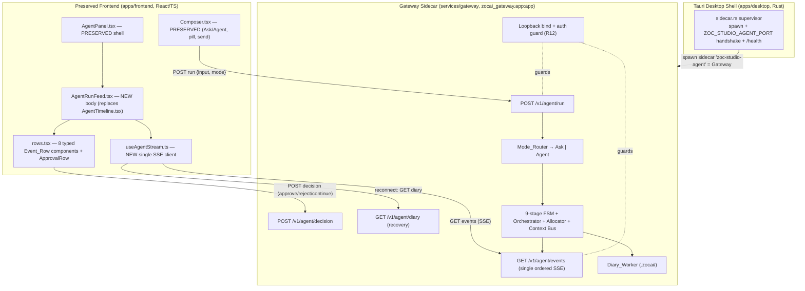
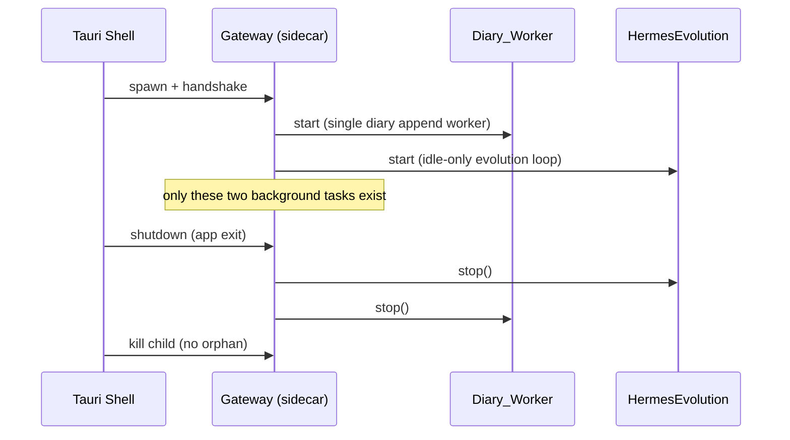

# Design Document

## Overview

This design merges two codebases that already coexist in this repository — **zoc-studio** (branch `main`, the current working tree) and **zocai-ecosystem-rebuild** (branch `zocai-ecosystem-rebuild`) — into one clean Tauri desktop application. The merge keeps zoc-studio's polished Agent Panel **chrome** (the "green" shell: header + model selector + Composer with the Ask/Agent toggle, priority pill, and send button) and replaces the agent **run area plus its entire background brain** (the "red" engine) with the new ecosystem: the FastAPI **Gateway** sidecar (`services/gateway`, `zocai_gateway.app:app`), the Mode_Router, Model_Allocator, the 9-stage FSM, the Context Bus, the three-tier Memory Matrix under `.zocai/`, the single ordered SSE stream with eight typed event rows, the Diary worker, the evolution engine (`python/zocai_evolution`), and model hot-swap.

The central engineering challenge is that **both codebases ship same-named directories** (`services/`, `packages/shared-types`, `apps/`, event/SSE modules, agent run loops). The working tree currently contains *both* implementations side by side (`services/agent` and `services/gateway`; `apps/frontend`, `apps/desktop`, and `apps/workbench`; `crates/hotpath` and `crates/hardware-probe`; two `AgentEvent` types in `packages/shared-types`). This design therefore treats the merge as a **deduplication and cleanup** effort with a concrete, file-by-file collision-resolution map and a single declared source of truth for every shared concern.

The authoritative architecture of the new brain is defined in `.kiro/specs/zocai-ecosystem-rebuild/design.md` (referenced here as "Rebuild design"); this document reuses that architecture unchanged for the backend internals and focuses on the **integration seam** between the preserved frontend shell and the new Gateway, the **collision/dead-code resolution**, **packaging**, **process model**, and **security**. Rebuild acceptance criteria are cited as "Rebuild-RX.Y"; this spec's own criteria are cited as "RX.Y".

### Requirements Coverage Map

| Design Section | Requirements |
| --- | --- |
| Architecture / Integration Topology | 1, 2, 3, 6, 10 |
| Frontend Integration (preserve shell, replace body) | 1, 3, 4, 5 |
| Backend Integration (Gateway as single backend) | 2, 6, 12 |
| Deduplication & Collision-Resolution Map | 6, 7, 11 |
| Dead-Code Removal Plan | 8 |
| Background Process Model | 9 |
| Packaging (Tauri sidecar) | 10 |
| Naming | 11 |
| Security (loopback / auth) | 12 |
| Correctness Properties | 3, 4, 6, 7 |

### Key Design Decisions and Rationale

- **The preserved frontend is `apps/frontend`, not `apps/workbench`.** The Rebuild design's migration table replaced `apps/frontend` with `apps/workbench`. This merge *overrides* that decision: the product UI/UX to preserve (R1) lives in `apps/frontend`. `apps/workbench` is a minimal reference scaffold of the new stream layer; its three useful modules (`useAgentStream.ts`, `AgentFeed.tsx`, `rows.tsx`) are **ported into** `apps/frontend` and `apps/workbench` is then deleted. This is the single most important divergence from the Rebuild migration plan and is reflected throughout the collision map.
- **The Gateway is the single live sidecar process** (R6.6, R10.2). The legacy `zoc_studio_agent` agent backend is retired. See "Scope boundary: legacy editor-support endpoints" for the one consequential dependency this creates.
- **The Event_Contract in `packages/shared-types` is the single source of truth** for SSE events (R6.2). The new `agent-events.ts` wins; the legacy `AgentEvent` union in the generated `index.ts` is removed.
- **Naming normalizes to the `zoc-studio` / `@zoc-studio` product forms** (R11). The Rebuild branch's `@llama-studio/shared-types` imports are a naming inconsistency that is corrected to `@zoc-studio/shared-types` on merge. The new ecosystem's own `zocai_*` Python namespaces are retained as-is (they are product-consistent and are named verbatim in the requirements glossary). `llama.cpp` / `llamacpp` external references are left untouched.

### Scope boundary: legacy editor-support endpoints (explicit assumption)

The legacy sidecar (`zoc_studio_agent`) served two distinct families of endpoints: (a) the **agent brain** — `agent/run`, `agent/events`, approvals, run apply/restore — which the Gateway fully replaces; and (b) **editor-support** endpoints the surrounding IDE shell uses — terminal pty, workspace indexer, providers/settings, sessions, inline-edit, code-review. Because R6.6 mandates **exactly one** backend process and R6.1 makes the Gateway **the** single live agent backend, this design launches only the Gateway sidecar and retires the legacy agent backend in full.

This design treats family (b) as **out of scope for the agent merge** and assumes those editor-support features are either already independent of the agent sidecar or are addressed by a separate follow-up. Where a surviving `apps/frontend` feature calls a removed legacy endpoint, that call site is part of the dead-code/rewire work in R8.3 (no frontend module may reference a removed legacy endpoint). This boundary is called out again in the Dead-Code Removal Plan; it is the one area a reviewer should confirm before implementation.

---

## Architecture

### Integration Topology

The preserved Panel_Shell (header + Composer) stays mounted exactly as today. Only the **run-feed body** of `AgentPanel.tsx` changes: `AgentTimeline.tsx` is replaced by a thin feed that renders the eight typed Event_Rows from the new Event_Contract, fed by a single new SSE client. The legacy `agent-client.ts` / `sse.ts` / run-machine ingestion path is removed. On the backend, the bundled Tauri sidecar is swapped from the legacy agent to the Gateway.



### What is preserved, replaced, and removed

| Concern | Pre-merge (zoc-studio) | Post-merge | Disposition |
| --- | --- | --- | --- |
| Panel header + model selector | `AgentPanel.tsx` top bar, `ModelPicker` | unchanged | **Preserve** (R1.1) |
| Composer (input, Ask/Agent, pill, send) | `Composer.tsx` | unchanged markup/classes; submit rewired to Gateway | **Preserve chrome, rewire submit** (R1.2, R4) |
| Run feed body | `AgentTimeline.tsx` (+ `DiffCard`, run-machine items) | `AgentRunFeed.tsx` renders 8 Event_Rows | **Replace** (R3) |
| SSE consumption | `lib/sse.ts` + `lib/agent-client.ts` event stream | `useAgentStream.ts` (single client) | **Replace** (R6.3) |
| Backend | `services/agent` (`zoc_studio_agent`) sidecar | `services/gateway` (`zocai_gateway`) sidecar | **Replace** (R2, R6) |
| SSE event schema | legacy `AgentEvent` in `index.ts` | `agent-events.ts` Event_Contract | **Replace** (R6.2) |

### Communication channels (canonical endpoint paths)

The Gateway's actual routes are the canonical paths. The requirements use shorthand for two of them; they refer to the same endpoints:

| Requirements shorthand (R2.6) | Canonical Gateway route (authoritative `app.py`) | Purpose |
| --- | --- | --- |
| `/v1/agent/run` | `POST /v1/agent/run` | Control: start a run with `{input, mode}` → `{runId}` |
| `/decision` | `POST /v1/agent/decision` | Control: approve / reject / budget-continuation |
| `/v1/agent/events` | `GET /v1/agent/events?runId=…` | Telemetry: single ordered SSE stream |
| `/diary` | `GET /v1/agent/diary?runId=…` | Recovery: trailing diary entries for reconnect |

The frontend SSE client targets the canonical `/v1/agent/*` paths. This path reconciliation is recorded so no module is built against the shorthand.

---

## Components and Interfaces

### Frontend Integration (Layer 1)

#### Preserved: `AgentPanel.tsx` shell and `Composer.tsx`

`AgentPanel.tsx` keeps its four-row grid (`grid-rows-[auto_auto_minmax(0,1fr)_auto]`), its header (Zap icon, "Zoc Agent"/"Zoc Ask" title, subtitle, status pill, `ModelPicker`, `AgentMenu`), the active-execution control bar (pause/resume/stop, elapsed timer, autonomy pill, model chip), and `ContextBar`. The only change is **row 3**: the `<AgentTimeline />` inside `AgentPanelBoundary` is replaced with `<AgentRunFeed />`. The error boundary, CSS classes, color tokens (`--zoc-ember`, `--zoc-info`, `#101014`, …), and spacing are retained verbatim (R1.1, R1.5, R1.6).

`Composer.tsx` keeps its entire markup tree — the textarea, attachment chips, slash/mention autocompletes, the Ask/Agent pill toggle, the autonomy/Read-only pill, and the send/stop buttons (R1.2–R1.4). Its **submit path** is rewired (below) to post to the Gateway instead of `store.sendUserMessage` → `agent-client.ts`.

#### New: single SSE client `useAgentStream.ts` (ported from `apps/workbench`)

The authoritative SSE consumer is `apps/workbench/src/useAgentStream.ts`, ported into `apps/frontend/src/features/agent/useAgentStream.ts`. It is the **single** frontend SSE client (R6.3), replacing both `lib/sse.ts` and the bespoke `eventStream`/`pumpSse`/`resilientEventStream` machinery in `lib/agent-client.ts`. It:

- subscribes to `GET /v1/agent/events` on mount (R3.1),
- maintains an **append-only, seq-ordered** feed via `mergeEventBySeq` — a duplicate `seq` is dropped, never mutated (R3.4),
- on a dropped stream, rebuilds from `GET /v1/agent/diary` trailing entries before resuming live (recovery; carries over Rebuild-R10.2),
- parses each frame and ignores non-conforming frames while keeping the stream open (R3.5).

The hook is transport-injectable (`createStream`, `recoverFromDiary`), which the existing Tauri port-resolution (`agentPort()` / `agentStatus()` from `tauri-bridge.ts`) plugs into: the events URL is built from the resolved loopback port, reusing the existing readiness wait.

#### New: run-feed body `AgentRunFeed.tsx` and `rows.tsx`

`AgentRunFeed.tsx` (adapted from `apps/workbench/src/AgentFeed.tsx`) renders the ordered feed. For each event it selects exactly one row component from the `ROW_COMPONENTS` registry in `rows.tsx` (R3.2, R3.3), appends in emission order without altering prior rows (R3.4), discards unrecognized event types without touching the feed (R3.5), and keeps the 100 ms render budget with the skip-or-late-with-warning fallback (carries over Rebuild-R7.2). `rows.tsx` provides the eight components — `IntentRow`, `ThinkingRow`, `ReadFilesRow`, `EditFileRow`, `CommandRow`, `SummaryBlock`, `ApprovalRow`, `DoneRow` — rendered **inside** the existing run region so the Panel_Shell is untouched (R3.7).

The ported components carry plain `feed-row` class names. To honor "same look and feel" (R1.5) the rows are restyled with the existing zoc-studio tokens (`--zoc-ember`, `--zoc-info`, `--zoc-row-bg`, `--zoc-row-border`) so the new feed visually matches the panel, while remaining one-component-per-type.

#### Ask vs Agent mode mapping

The preserved Composer already holds `agentMode: "ask" | "agent"` in the store. On submit, the rewired handler builds the Gateway request `{ input, mode }` where `mode` is the current toggle value (R4.1, R4.2). Empty/whitespace-only input is rejected before any request is sent — the existing `validateMessage`/`isSendableInput` guard is retained and is the single validation point (R4.5). The feed renders text chunks while Ask is active and structured Event_Rows while Agent is active, matching the Gateway's mode-scoped channel discipline (R4.3, R4.4; Rebuild-R6.6/R6.7).

#### Approval flow wired to `/decision`

`ApprovalRow` (in `rows.tsx`) presents approve/reject actions for an `approval` Event_Row (R5.1). Selecting either disables **both** actions on that row and posts to `POST /v1/agent/decision` with `{ runId, decision }` (R5.2, R5.3). The Gateway's budget-exceeded pause is delivered as an `approval` Event_Row (with a budget-continuation prompt), so the same ApprovalRow renders it and the same `/decision` path resolves it with a `continue`/`stop` verdict (R5.4). The decision transport is the single decision client; the legacy `resolveApproval`/`retryApproval` in `agent-client.ts` are removed.

#### Frontend submit/ingest rewire (single path)

```ts
// apps/frontend/src/features/agent/gateway-client.ts  (NEW — the only agent transport)
export async function postAgentRun(req: { input: string; mode: "ask" | "agent" }): Promise<{ runId: string }> { /* POST /v1/agent/run */ }
export async function postAgentDecision(req: { runId: string; decision: "approve" | "reject" | "continue" | "stop" }): Promise<void> { /* POST /v1/agent/decision */ }
// SSE consumption is useAgentStream.ts; there is no second event-stream implementation (R6.3).
```

The store's `sendUserMessage` is reduced to: validate → `postAgentRun` → let `useAgentStream` drive the feed. The legacy run-machine ingestion (`seq-cursor`, `reconnect`, `pumpSse`, legacy-body fallback) is deleted (R6.4 — one run loop on the client).

### Backend Integration (Layer 2)

The Gateway is used **as-is** from `services/gateway/src/zocai_gateway` — its `create_app()` factory, emit gate, Mode_Router, FSM/Orchestrator, Allocator, Context Bus, Memory Matrix, Diary_Worker, and Hermes idle loop are the authoritative implementations (see Rebuild design). This merge does not re-implement them; it (1) makes the Gateway the launched sidecar, (2) adds the loopback/auth startup guard (R12), and (3) adds a launch entrypoint that performs the port handshake the Tauri supervisor expects.

#### New: Gateway launch entrypoint with readiness handshake

The Tauri supervisor (`sidecar.rs`) reads a `ZOC_STUDIO_AGENT_PORT=<port>` line from the sidecar's stdout, then polls `/health` (R10.3). The Gateway gains a launch module mirroring the legacy `scripts/launch.py` contract:

```python
# services/gateway/src/zocai_gateway/scripts/launch.py  (NEW)
def main() -> int:
    settings = GatewaySettings.from_env()          # host, port, auth token (R12)
    settings.enforce_bind_policy()                 # refuse non-loopback w/o auth (R12.2)
    sock = bind_loopback_or_configured(settings)   # OS-assigned port if 0
    print(f"ZOC_STUDIO_AGENT_PORT={sock.port}", flush=True)   # handshake (R10.3)
    uvicorn.run(create_app(workspace_root=settings.workspace_root), ...)
```

`/health` already exists on the Gateway, so the supervisor's existing health-poll loop works unchanged.

#### New: loopback binding + auth guard (R12)

A small `GatewaySettings` + startup guard implements R12 without touching the route handlers' logic:

- Default bind is `127.0.0.1` (loopback) (R12.1).
- If configured to bind a non-loopback interface **without** an auth credential, `enforce_bind_policy()` raises a configuration error and the process refuses to start (R12.2).
- A FastAPI dependency rejects requests on a non-loopback binding that lack a valid credential with `401` and does not execute the operation (R12.3).
- On loopback, requests are accepted with or without a credential (R12.4).
- The loopback-no-auth posture is documented as a known constraint (R12.5) in `services/gateway/README.md`.

```python
class GatewaySettings(BaseModel):
    host: str = "127.0.0.1"
    port: int = 0
    auth_token: str | None = None
    def is_loopback(self) -> bool: return self.host in {"127.0.0.1", "::1", "localhost"}
    def enforce_bind_policy(self) -> None:
        if not self.is_loopback() and not self.auth_token:
            raise ConfigError("non-loopback bind requires ZOC_STUDIO_GATEWAY_TOKEN")  # R12.2
```

### Desktop Shell (Layer 0 — Tauri)

`apps/desktop` is retained. The supervisor in `sidecar.rs` is unchanged in structure (spawn → handshake → health-poll → backoff restart, status on `agent://status`, logs to `~/.zoc-studio/logs/agent.log`). The only change is **what `sidecar("zoc-studio-agent")` resolves to**: the bundled binary is now the Gateway (see Packaging). Because the handshake prefix (`ZOC_STUDIO_AGENT_PORT=`) and `/health` contract are preserved by the new Gateway launch entrypoint, the Rust supervisor and the frontend's `waitForDesktopAgentPort`/`waitForAgentHealth` readiness logic require **no behavioral change** (R10.2, R10.3). Connection failure after readiness remains a fatal, surfaced startup error (R10.4); readiness-timeout remains a surfaced error (R10.5).

---

## Deduplication and Collision-Resolution Map

This is the core of the merge. For every shared concern, exactly one implementation is declared the Single_Source_Of_Truth; the other is deleted, moved, or merged. "Bring from branch" means the file is sourced from `zocai-ecosystem-rebuild` (via `git checkout zocai-ecosystem-rebuild -- <path>` or equivalent) into `main` without creating a duplicate.

### A. Shared event schema — `packages/shared-types`

Both the old generated `index.ts` and the new `agent-events.ts` define an `AgentEvent`. They are different concepts: the legacy one is the old run/tool-call event union; the new one is the eight-row SSE Event_Contract.

| File | Origin | Decision |
| --- | --- | --- |
| `packages/shared-types/typescript/src/agent-events.ts` | branch | **WIN** — single SSE Event_Contract (R6.2, R6.6) |
| `packages/shared-types/python/shared_schema/agent_events.py` | branch | **WIN** — generated Python mirror |
| `packages/shared-types/typescript/src/index.ts` | main (generated) | **Edit**: remove the legacy `AgentEvent` agent-run union and any types used only by retired agent modules; re-export `agent-events.ts`; retain types still used by surviving UI (editor/terminal/settings) until those features are separately addressed |
| `packages/shared-types/python/shared_schema/models.py` | main (generated) | **Edit**: same treatment on the Python side |
| package name | — | normalize to `@zoc-studio/shared-types`; the branch's `@llama-studio/shared-types` imports are rewritten (R11.1, R11.3) |

Single source of truth for SSE event types: `agent-events.ts` (+ generated `agent_events.py`). `index.ts` re-exports it so consumers have one import surface (R6.2, R6.6).

### B. Agent backend — `services/`

| Path | Origin | Decision |
| --- | --- | --- |
| `services/gateway/**` (`zocai_gateway`) | branch | **WIN** — the single live agent backend (R6.1, R6.4) |
| `services/agent/**` (`zoc_studio_agent`) — `runs.py`, `events/bus.py`, `agent/orchestrator.py`, `agent/zoc_run.py`, `approvals.py`, `reconcile.py`, `state.py`, `modes/`, `v1/` agent routes | main | **DELETE** — superseded agent run/event/approval/reconcile modules (R8.1, R8.2) |
| `services/agent/src/.../scripts/launch.py` | main | **DELETE**; replaced by `zocai_gateway/scripts/launch.py` |

Single source of truth for the agent run loop: `zocai_gateway` FSM/Orchestrator. There must be **no two modules implementing the SSE stream or the run loop** (R7.3, R7.4) — `events/bus.py` and `runs.py` are removed so only the Gateway's emit gate + FSM remain.

### C. Frontend apps — `apps/`

| Path | Origin | Decision |
| --- | --- | --- |
| `apps/frontend/**` | main | **KEEP** — the product UI (overrides Rebuild migration which retired it) |
| `apps/frontend/src/features/agent/useAgentStream.ts`, `AgentRunFeed.tsx`, `rows.tsx` | ported from `apps/workbench` | **MOVE/IN** — the new stream layer grafted into the preserved app |
| `apps/frontend/src/features/agent/AgentTimeline.tsx` | main | **DELETE** — replaced by `AgentRunFeed.tsx` (R3) |
| `apps/frontend/src/lib/sse.ts` | main | **DELETE** — replaced by `useAgentStream.ts` (R6.3) |
| `apps/frontend/src/lib/agent-client.ts` | main | **DELETE/strip** — agent run/event/approval transport removed; only `postAgentRun`/`postAgentDecision` + `useAgentStream` remain |
| `apps/frontend/src/lib/{seq-cursor,reconnect}.ts` | main | **DELETE** — legacy stream-resume machinery, now handled by `useAgentStream` diary recovery |
| `apps/workbench/**` | branch | **DELETE** after the three modules are ported (reference scaffold, not the product) |
| `apps/desktop/**` | main | **KEEP** — Tauri shell (sidecar target re-pointed) |

Single frontend app: `apps/frontend`. Exactly one SSE client (`useAgentStream.ts`) and one run feed (`AgentRunFeed.tsx`).

### D. Rust crates — `crates/`

| Path | Origin | Decision |
| --- | --- | --- |
| `crates/hardware-probe/**` | branch | **KEEP** — optional PyO3 acceleration for the Allocator's hardware probe |
| `crates/hotpath/**` (`zoc-studio-hotpath`) | main | **Conditional**: retire if no surviving live path references it after the legacy agent is removed; otherwise retain only for editor-support features (search/index/pty). Verified by build + reference scan (see Dead-Code Plan). The Tauri `externalBin` entry for `zoc-studio-hotpath` is removed if the crate is retired. |

### E. Evolution / migration — `python/`

| Path | Origin | Decision |
| --- | --- | --- |
| `python/zocai_evolution/**` | branch | **KEEP** — Layer 5 engine used by the Gateway (R2 brain) |
| `python/zocai_migration/**` | branch | **KEEP** as the migration tooling that executes this very plan (preservation-branch-first, replace-before-delete) |
| `python/llama_studio_neural/**` (if present on main) | main | **DELETE** — superseded by `zocai_evolution` |

### Bringing branch source into `main` without duplicates

Because the working tree already contains both trees, the merge is primarily **deletion + rewire**, not re-import. The sequence (executed by `python/zocai_migration` and mirrored by hand where needed):

1. Confirm the committed **legacy preservation branch** exists (the `legacy-preservation` branch is already present) before deleting anything (Rebuild-R13.2/R13.3/R13.8).
2. Port the three workbench modules into `apps/frontend`, restyle to zoc-studio tokens, and rewire `AgentPanel.tsx` row 3 + the Composer submit path.
3. Add the Gateway launch entrypoint and the R12 bind/auth guard.
4. Delete the superseded files listed in tables A–E.
5. Normalize naming (`@llama-studio` → `@zoc-studio`; any `llama_studio_*` product identifiers → `zoc_studio_*`), leaving `llama.cpp`/`llamacpp` untouched.
6. Verify per-language builds are green (replace-before-delete gate, Rebuild-R13.4/R13.6).

---

## Dead-Code Removal Plan

Once the Gateway is the live backend, the following become unreachable and are removed (R8.1–R8.3):

| Removed | Why unreachable |
| --- | --- |
| `services/agent` agent run/event/approval/reconcile modules | Gateway is the single agent backend; no caller routes to them (R6.1, R6.5) |
| `apps/frontend/src/features/agent/AgentTimeline.tsx` | Run feed replaced by `AgentRunFeed.tsx` |
| `apps/frontend/src/lib/sse.ts`, `agent-client.ts` (agent paths), `seq-cursor.ts`, `reconnect.ts` | SSE + run loop consolidated into `useAgentStream.ts` |
| `apps/workbench` | Reference scaffold superseded by the ported modules |
| legacy `AgentEvent` types in `index.ts` / `models.py` | Superseded by the Event_Contract |
| `crates/hotpath` (conditional) + its `externalBin` entry | Only if no surviving live path references it |

**Verification of removal (R8.5, R8.4):** removal is confirmed by (1) a repository reference scan showing zero imports of each removed module from any live entrypoint, and (2) a green per-language build with a **zero exit code**:

- TypeScript: `pnpm -w build` / `tsc -b` resolves every import to the retained implementation (R7.5).
- Python: `uv run python -c "import zocai_gateway.app"` and the Gateway test suite collect/import cleanly; no import of `zoc_studio_agent` run/event modules remains.
- Rust: `cargo build` succeeds with the (possibly removed) `crates/hotpath` and the updated `externalBin` list.

A removed legacy endpoint referenced by any surviving frontend module is a build/lint failure that must be resolved before the dead-code task is considered done (R8.3). This is the checkpoint where the "legacy editor-support endpoints" scope boundary is enforced: each such reference is either repointed to a retained module or the dependent feature is explicitly disabled.

---

## Background Process Model

Per R9 and Rebuild-R9.3, the Merged_App runs **exactly one** background diary process and no legacy workers:

- The Gateway's `create_app(workspace_root=…)` starts a single `Diary_Worker` (Tier 1 append) and the Tier 3 `HermesEvolution` idle loop; both are stopped on FastAPI `lifespan` shutdown (R9.1, R9.5).
- The legacy agent's background tasks — the `reconcile.py` reconciler, the indexer/file-watcher service, and the per-session run/event bus tasks — are removed with `services/agent` (R9.2). No legacy watcher/reconciler/run task is started after the merge.
- If any superseded background task is still wired at startup, the migration's reference scan fails the build, so the app will not start until it is removed (R9.3).
- No two background tasks perform the same concern concurrently — there is one diary worker and one idle-evolution loop (R9.4).
- On shutdown, the Tauri supervisor sends SIGTERM/kill to the single sidecar child and the Gateway lifespan stops its workers, leaving no orphaned process (R9.5).



---

## Packaging

The delivery model is unchanged: a Tauri desktop app with a bundled Python sidecar (R10.1, R10.6). The sidecar bundled under the existing `externalBin` name **`zoc-studio-agent`** is re-pointed from the legacy agent to the Gateway, so `sidecar.rs` (which calls `shell.sidecar("zoc-studio-agent")`) needs no code change.

`tauri.conf.json` — `externalBin` keeps `binaries/zoc-studio-agent` (now the Gateway) and keeps or drops `binaries/zoc-studio-hotpath` per the `crates/hotpath` decision (Dead-Code Plan):

```jsonc
"externalBin": [
  "binaries/zoc-studio-agent"          // now the Gateway sidecar
  // , "binaries/zoc-studio-hotpath"   // retained only if crates/hotpath survives
]
```

`scripts/bundle_sidecar.py` — re-point the PyInstaller entry and collected package from the legacy agent to the Gateway, keeping the output binary name `zoc-studio-agent-<triple>` so the Tauri externalBin layout is stable:

| Field | Before | After |
| --- | --- | --- |
| `SERVICE` | `services/agent` | `services/gateway` |
| `ENTRY` | `.../zoc_studio_agent/scripts/launch.py` | `.../zocai_gateway/scripts/launch.py` |
| `--collect-submodules` | `zoc_studio_agent` | `zocai_gateway` (+ `zocai_evolution`, `shared_schema`) |
| output name | `zoc-studio-agent` | `zoc-studio-agent` (unchanged) |

`scripts/prepare_tauri_build.sh` (Tauri `beforeBuildCommand`) — step [1/3] frontend build is unchanged; step [2/3] hotpath staging is removed if `crates/hotpath` is retired; step [3/3] sidecar bundling now bundles the Gateway. The "clean by default" PyInstaller behavior is kept so a stale sidecar is never shipped. The installer therefore bundles the Gateway as the sidecar (R10.6).

---

## Naming

Per R11 the product identifiers normalize to `zoc-studio`, `zoc_studio`, `ZOC_STUDIO`, and `@zoc-studio`:

- Frontend package and imports use `@zoc-studio/...`. The branch's `@llama-studio/shared-types` imports (in `useAgentStream.ts`, `AgentFeed.tsx`, `rows.tsx`) are rewritten to `@zoc-studio/shared-types` during the port (R11.1, R11.3).
- Any remaining `llama_studio_*` Python product identifiers (e.g. `llama_studio_neural`) are renamed to the `zoc_studio_*` / `zocai_*` forms used by the surviving code.
- The new ecosystem's `zocai_gateway` / `zocai_evolution` / `zocai_migration` namespaces are **retained as-is** — they are product-consistent and are named verbatim in the requirements glossary (`zocai_gateway.app:app`).
- Every `llama.cpp` / `llamacpp` reference is an **External_Llama_Reference** and is left unchanged (R11.2): the `providers/llamacpp.py` provider, the `ZOC_STUDIO_LLAMACPP_STATE_PATH` env var, `llamacpp-runtime.json`, the `EmbeddingProvider = "llamacpp"` enum value, and the Tauri `longDescription` "llama.cpp-powered" text all stay.
- After renames, the build must resolve with a zero exit code (R11.3), verified by the same per-language builds used for dead-code removal.

---

## Data Models

The merged app reuses the Rebuild data models unchanged for the backend (Allocation, HardwareProfile, RunState, StateWrapper, Trajectory, Session Diary entry — see Rebuild design "Data Models"). The integration-relevant models are the **Event_Contract** (the wire contract between Gateway and the preserved frontend) and the **control-channel requests**.

### Event_Contract (single source of truth, `packages/shared-types`)

The eight row kinds, each with `type`, `seq` (monotonic, defines order), `runId`, `ts`, plus type-specific fields:

```typescript
export type EventType =
  | "intent" | "thinking" | "read-files" | "edit-file"
  | "command" | "summary" | "approval" | "done";

export interface BaseEvent { type: EventType; seq: number; runId: string; ts: string; }
export interface IntentEvent  extends BaseEvent { type: "intent"; text: string; modelTier: "local-slm"|"edge"|"cloud"; contextWindowTokens: number; fallbackReason?: string; }
export interface ThinkingEvent extends BaseEvent { type: "thinking"; text: string; collapsible: true; }
export interface ReadFilesEvent extends BaseEvent { type: "read-files"; files: { path: string; span?: [number, number] }[]; }
export interface EditFileEvent extends BaseEvent { type: "edit-file"; path: string; diff: string; }
export interface CommandEvent extends BaseEvent { type: "command"; command: string; exitCode?: number; errorTag?: string; }
export interface SummaryEvent extends BaseEvent { type: "summary"; text: string; }
export interface ApprovalEvent extends BaseEvent { type: "approval"; prompt: string; decision?: "approve"|"reject"; }
export interface DoneEvent extends BaseEvent { type: "done"; ok: boolean; reason?: string; }
export type AgentEvent = IntentEvent | ThinkingEvent | ReadFilesEvent | EditFileEvent | CommandEvent | SummaryEvent | ApprovalEvent | DoneEvent;
```

### Control-channel requests (frontend ⇄ Gateway)

```typescript
interface AgentRunRequest { input: string; mode: "ask" | "agent"; }     // POST /v1/agent/run  → { runId }
interface AgentDecisionRequest { runId: string; decision: "approve" | "reject" | "continue" | "stop"; } // POST /v1/agent/decision
```

In Ask Mode the SSE stream additionally carries raw `{ type: "token", text }` frames (text-only channel); the feed renders these as streamed markdown rather than structured rows (R4.3).

---

## Correctness Properties

*A property is a characteristic or behavior that should hold true across all valid executions of a system — essentially, a formal statement about what the system should do. Properties serve as the bridge between human-readable specifications and machine-verifiable correctness guarantees.*

This merge applies property-based testing to a focused slice: the **new frontend feed/contract dispatch logic** (pure functions over generated event sequences), the **Composer mode/validation mapping**, the **ApprovalRow decision**, and the **Gateway bind/auth policy** (a pure decision function). Most of the merge is structural deduplication, packaging, naming, and process wiring — those are verified by reference scans, snapshot tests, build-exit-0 checks, and integration tests (see Testing Strategy), not by universal properties.

The backend brain's universal behaviors (Mode_Router dispatch, 9-stage FSM ordering, Allocator tier/window, channel discipline, diary FIFO ordering) are **carried over unchanged** from the Rebuild design and are validated by its existing property suite (Rebuild Properties 1–2, 8, 10–12, 28). The merge does not re-implement or duplicate those tests; the properties below are the merge's own new obligations at the integration seam.

### Property 1: Feed is append-only and seq-ordered

*For any* sequence of contract events (including duplicates and out-of-order arrivals), folding them through `mergeEventBySeq`/`mergeEvents` yields a feed whose entries are strictly ascending by `seq`, contain each `seq` at most once, and in which merging a new event never mutates or replaces any previously present entry.

**Validates: Requirements 3.4**

### Property 2: Each event type maps to exactly one row component

*For any* of the eight Event_Contract types, the `ROW_COMPONENTS` registry selects exactly one distinct row component, the registry is total over `EventType`, and it has exactly eight entries; rendering a recognized event uses the component mapped to its discriminator.

**Validates: Requirements 3.2, 3.3**

### Property 3: Unrecognized event types leave the feed unaltered

*For any* payload whose `type` is not one of the eight recognized kinds, `isRecognizedEvent` is false and the rendered feed is identical to the feed before the payload was received (the payload is discarded).

**Validates: Requirements 3.5**

### Property 4: Composer rejects empty input and otherwise sends the selected mode

*For any* input string and any toggle value in {ask, agent}, when the trimmed input is empty no run request is produced or sent, and when the trimmed input is non-empty exactly one run request is produced carrying the trimmed input and a `mode` equal to the toggle value.

**Validates: Requirements 4.1, 4.2, 4.5**

### Property 5: ApprovalRow decision disables both actions and posts the matching verdict

*For any* approval Event_Row and any selected choice in {approve, reject}, selecting that choice posts exactly one decision to `/v1/agent/decision` carrying that verdict and the row's `runId`, disables both the approve and reject actions, and ignores any subsequent selection.

**Validates: Requirements 5.2, 5.3**

### Property 6: Gateway startup bind policy

*For any* configured (host, credential) pair, the startup bind-policy check refuses to start (raising a configuration error that identifies the missing credential) if and only if the host is a non-loopback interface and no authentication credential is configured; otherwise startup proceeds.

**Validates: Requirements 12.2**

### Property 7: Gateway request admission policy

*For any* binding (loopback or non-loopback) and any credential presented (absent, invalid, or valid), a control/telemetry request is admitted if and only if the binding is loopback or the presented credential is valid; a non-admitted request is rejected with an authorization error and the requested operation does not execute.

**Validates: Requirements 12.3, 12.4**

---

## Error Handling

- **Sidecar readiness failure (R10.5):** if the Gateway does not print the `ZOC_STUDIO_AGENT_PORT=` handshake and pass `/health` within the startup timeout, the existing supervisor records `last_error` and the frontend's `waitForDesktopAgentPort` throws a surfaced startup error identifying the readiness failure.
- **Post-readiness connection failure (R10.4):** if the frontend cannot connect after the sidecar is ready, this is treated as a fatal startup error and surfaced to the Developer (the existing `AgentPanelBoundary` and startup error path render it), rather than silently retried forever.
- **Non-conforming SSE frame (R3.5):** `useAgentStream.parseFrame` returns `null` for malformed/unrecognized frames; the feed is left unchanged and the stream stays open. The Gateway's emit gate independently discards non-conforming payloads server-side (Rebuild-R6.4).
- **Unknown run on `/decision`:** the Gateway returns `404` for an unknown `runId`; the ApprovalRow surfaces the failure and re-enables its actions only on a transport error (so a genuine decision is not lost), while a successful post keeps both disabled (R5.2, R5.3).
- **Non-loopback without credential (R12.2):** the bind-policy guard raises a configuration error at startup naming the missing credential; the process does not start, so no telemetry/control surface is ever exposed unauthenticated on a non-loopback interface.
- **Invalid/absent credential on non-loopback (R12.3):** the auth dependency returns `401` before the handler runs, so the operation does not execute.
- **Dead-reference at build time (R8.3, R8.5):** a surviving frontend reference to a removed legacy endpoint, or a residual import of a deleted legacy module, fails the per-language build; the migration halts on a non-zero build exit and the offending reference must be repointed or removed before the task completes.
- **Stale sidecar bundle:** `prepare_tauri_build.sh` bundles the sidecar clean by default, so a source change cannot ship a stale Gateway binary; CI fails loud on a missing/bad binary.
- **Background worker shutdown (R9.5):** the Gateway `lifespan` stops the Diary_Worker and Hermes loop; the Tauri supervisor kills the single sidecar child, leaving no orphaned process.

All backend error events conform to the Event_Contract and are mirrored to the Session_Diary like any other event (Rebuild "Error Handling").

---

## Testing Strategy

The merge uses a dual approach: **property-based tests** for the small set of pure integration-seam functions with universal invariants, and **example / snapshot / integration / smoke / reference-scan** tests for UI preservation, deduplication, packaging, naming, process model, and wiring — the bulk of this merge.

### Property-Based Testing (applies to the integration seam only)

PBT applies to the pure functions that carry universal invariants: the feed merge (`mergeEventBySeq`/`mergeEvents`), the discriminator→row mapping (`ROW_COMPONENTS`/`isRecognizedEvent`), the Composer decision (`prepareAgentRun`), the ApprovalRow decision reducer, and the Gateway bind/auth policy functions.

- **Libraries:** TypeScript uses **fast-check**; Python uses **Hypothesis** (already present in the workspace `.hypothesis/`). Do **not** implement PBT from scratch.
- **Iterations:** each property test runs a minimum of **100 iterations**.
- **Tagging:** each property test is tagged with a comment in the format
  `Feature: zoc-agent-ecosystem-merge, Property {number}: {property_text}`.
- **Implementation:** each of Properties 1–7 is implemented by a **single** property-based test.
- **Coverage map:** Properties 1–5 → TypeScript/fast-check in `apps/frontend` (feed ordering, row mapping, unrecognized discard, Composer mode/validation, ApprovalRow decision); Properties 6–7 → Python/Hypothesis in `services/gateway` (bind policy, request admission).
- **Carried-over backend properties:** the backend brain's universal behaviors (Mode_Router, FSM order, Allocator, channel discipline, diary FIFO) are validated by the Rebuild suite (Rebuild Properties 1–2, 8, 10–12, 28) and are **not** duplicated here.

### Example-Based Unit Tests

- Composer input echo and Ask/Agent toggle indicator (R1.3, R1.4).
- Run_Feed subscribes once on mount (R3.1); `done` marks complete while keeping the stream open (R3.6).
- Ask renders token-frame markdown; Agent renders structured rows (R4.3, R4.4).
- ApprovalRow renders approve+reject for an approval event (R5.1); a budget-continuation approval resolves via `/decision` (R5.4).
- Submit targets the Gateway `/v1/agent/run` and no legacy transport (R2.1, R6.5).

### Snapshot Tests (UI preservation)

- DOM-structure and class-list snapshots of `AgentPanel.tsx` header/control-bar and `Composer.tsx`, asserting preserved layout, CSS classes, color tokens, spacing, and the full set of controls (R1.1, R1.2, R1.5, R1.6).
- Snapshot that the new rows mount inside the run region (grid row 3) and the Panel_Shell DOM is unchanged (R3.7).

### Integration Tests (1–3 examples each)

- Gateway endpoint surface: the four routes exist and stream the expected content-types (R2.6); SSE endpoint content-type and ordered streaming (Rebuild-R6.1).
- Mode/FSM/allocator/context dispatch wired end to end through the Gateway (R2.2–R2.5), exercising the carried-over Rebuild behavior once at the seam.
- Tauri sidecar lifecycle: handshake success → ready; post-ready connection failure is fatal and surfaced (R10.4); readiness timeout is surfaced (R10.5); supervisor spawns exactly one sidecar (R6.6).
- Background process inventory: exactly one Diary_Worker and one idle loop start; both stop cleanly on shutdown with no orphan (R9.1, R9.4, R9.5).

### Smoke Tests (one-shot setup/config)

- Default Gateway settings bind to loopback (R12.1); README documents the loopback no-auth constraint (R12.5).
- The installer/build bundles the Gateway as the `zoc-studio-agent` sidecar (R10.1, R10.6).
- `.zocai/` stores are created on first run (Rebuild-R9.1/R9.2).

### Reference Scans + Build Gates (deduplication, dead code, naming)

These verify the structural invariants that define a clean merge; they are not input-varying properties.

- **Single source of truth (R6.2–R6.4, R7.1–R7.4):** scans assert exactly one SSE Event_Contract definition (`agent-events.ts`), exactly one SSE client (`useAgentStream.ts`), and exactly one agent run loop (Gateway FSM/Orchestrator) — with no residual `events/bus.py`, `runs.py`, `lib/sse.ts`, or `AgentTimeline.tsx`.
- **Dead-code removal (R8.1–R8.3):** scans assert no live import of any removed legacy agent module and no frontend reference to a removed legacy endpoint.
- **Naming (R11.1–R11.3):** scans assert no `@llama-studio` product import remains and that every `llama.cpp`/`llamacpp` External_Llama_Reference is preserved against an allowlist.
- **Build gates (R7.5, R8.5, R11.3):** per-language builds (`pnpm -w build` / `tsc -b`; Gateway import + test collection; `cargo build`) must each return a **zero exit code** with every import resolving to the retained implementation. The migration tooling (`python/zocai_migration`) enforces preservation-branch-first and replace-before-delete (cross-reference Rebuild migration Properties 49–53).

### Performance / Timing Checks

- Row render within the 100 ms budget with the skip-or-late-with-warning fallback under load (carried over Rebuild-R7.2), paired with an example check that an over-budget row is either skipped or carries the delayed-render warning indicator.
- Sidecar readiness within the startup timeout and `/health` responsiveness (R10.3, R10.5).
